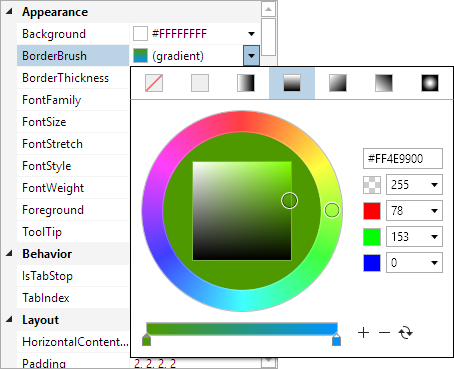

# Property Editors

Property editors are configured to tell the property grid how to choose a user interface for displaying/editing each property.  For instance, boolean properties show a check box in the value cell by default.  But a custom property editor could be used to change this to a toggle switch control instead.

Property editors have the ability to match properties based on object type, property name, and property type.  When a match is made, the property editor gives the user interface (via `DataTemplate` objects) for the property.  Both the name and value cells can have a custom `DataTemplate` applied.

A number of built-in property editors are included with property grid, and these can be extended with any number of custom property editors.  The Actipro Editors can even be easily [integrated with property grid](../../editors/interoperability/propertygrid.md) through the use of property editors, providing advanced editing features for common .NET types like numbers, dates, enums, colors, etc.

## Name/Value Cells

`DataTemplate` objects can be used to customize the display of the name and/or value cells for one or more properties.  Typically, only the value cell is customized, but this is not a requirement.  Cell customization is accomplished by assigning a `DataTemplate` to a property-related cell through property models or the use of [PropertyEditor](xref:@ActiproUIRoot.Controls.Grids.PropertyEditors.PropertyEditor) objects.

Property editors can be defined in several locations, which are discussed in detail below.

## Mapping UI to Properties

Whenever the [PropertyGrid](xref:@ActiproUIRoot.Controls.Grids.PropertyGrid) control goes to generate a name or value cell for a property, it uses its [NameTemplateSelector](xref:@ActiproUIRoot.Controls.Grids.PropertyGrid.NameTemplateSelector) and [ValueTemplateSelector](xref:@ActiproUIRoot.Controls.Grids.PropertyGrid.ValueTemplateSelector) objects respectively.  The [NameTemplateSelector](xref:@ActiproUIRoot.Controls.Grids.PropertyGrid.NameTemplateSelector) property is pre-assigned with a [PropertyGridNameTemplateSelector](xref:@ActiproUIRoot.Controls.Grids.PropertyGridNameTemplateSelector) instance that has logic for matching property editors to a property and selecting a `DataTemplate` to use in the name cell.  Likewise the [ValueTemplateSelector](xref:@ActiproUIRoot.Controls.Grids.PropertyGrid.ValueTemplateSelector) property is pre-assigned with a [PropertyGridValueTemplateSelector](xref:@ActiproUIRoot.Controls.Grids.PropertyGridValueTemplateSelector) instance that has logic for matching property editors to a property and selecting a `DataTemplate` to use in the value cell.

Both template selectors use the following general prioritization for selecting a `DataTemplate` for an [IPropertyModel](xref:@ActiproUIRoot.Controls.Grids.PropertyData.IPropertyModel).  The steps are followed in order until a valid `DataTemplate` is found.

1. [IPropertyModel](xref:@ActiproUIRoot.Controls.Grids.PropertyData.IPropertyModel).[NameTemplate](xref:@ActiproUIRoot.Controls.Grids.PropertyData.IPropertyModel.NameTemplate) / [ValueTemplate](xref:@ActiproUIRoot.Controls.Grids.PropertyData.IPropertyModel.ValueTemplate)

1. [IPropertyModel](xref:@ActiproUIRoot.Controls.Grids.PropertyData.IPropertyModel).[NameTemplateSelector](xref:@ActiproUIRoot.Controls.Grids.PropertyData.IPropertyModel.NameTemplateSelector) / [ValueTemplateSelector](xref:@ActiproUIRoot.Controls.Grids.PropertyData.IPropertyModel.ValueTemplateSelector)

1. [IPropertyModel](xref:@ActiproUIRoot.Controls.Grids.PropertyData.IPropertyModel).[NameTemplateKey](xref:@ActiproUIRoot.Controls.Grids.PropertyData.IPropertyModel.NameTemplateKey) / [ValueTemplateKey](xref:@ActiproUIRoot.Controls.Grids.PropertyData.IPropertyModel.ValueTemplateKey) - Attempts to locate a `DataTemplate` resource with the supplied `x:Key`.

1. [IPropertyModel](xref:@ActiproUIRoot.Controls.Grids.PropertyData.IPropertyModel).[ValueTemplateKind](xref:@ActiproUIRoot.Controls.Grids.PropertyData.IPropertyModel.ValueTemplateKind) (value cells only) - If a kind other than `DefaultValueTemplateKind.None`, uses a specified built-in template.

1. Find the best [PropertyEditor](xref:@ActiproUIRoot.Controls.Grids.PropertyEditors.PropertyEditor) to use for subsequent logic.  If a [IPropertyModel](xref:@ActiproUIRoot.Controls.Grids.PropertyData.IPropertyModel).[NamePropertyEditor](xref:@ActiproUIRoot.Controls.Grids.PropertyData.IPropertyModel.NamePropertyEditor) / [ValuePropertyEditor](xref:@ActiproUIRoot.Controls.Grids.PropertyData.IPropertyModel.ValuePropertyEditor) is specified, which can be done using `EditorAttribute` as described below, use it.  Otherwise, use property editor matching logic described below to try and locate a property editor.

1. [PropertyEditor](xref:@ActiproUIRoot.Controls.Grids.PropertyEditors.PropertyEditor).[NameTemplate](xref:@ActiproUIRoot.Controls.Grids.PropertyEditors.PropertyEditor.NameTemplate) / [ValueTemplate](xref:@ActiproUIRoot.Controls.Grids.PropertyEditors.PropertyEditor.ValueTemplate)

1. [PropertyEditor](xref:@ActiproUIRoot.Controls.Grids.PropertyEditors.PropertyEditor).[NameTemplateSelector](xref:@ActiproUIRoot.Controls.Grids.PropertyEditors.PropertyEditor.NameTemplateSelector) / [ValueTemplateSelector](xref:@ActiproUIRoot.Controls.Grids.PropertyEditors.PropertyEditor.ValueTemplateSelector)

1. [PropertyEditor](xref:@ActiproUIRoot.Controls.Grids.PropertyEditors.PropertyEditor).[NameTemplateKey](xref:@ActiproUIRoot.Controls.Grids.PropertyEditors.PropertyEditor.NameTemplateKey) / [ValueTemplateKey](xref:@ActiproUIRoot.Controls.Grids.PropertyEditors.PropertyEditor.ValueTemplateKey) - Attempts to locate a `DataTemplate` resource with the supplied `x:Key`.

1. [PropertyEditor](xref:@ActiproUIRoot.Controls.Grids.PropertyEditors.PropertyEditor).[ValueTemplateKind](xref:@ActiproUIRoot.Controls.Grids.PropertyEditors.PropertyEditor.ValueTemplateKind) (value cells only) - If a kind other than `DefaultValueTemplateKind.None`, uses a specified built-in template.

If none of the above steps supply a `DataTemplate` for a name cell, the fallback [PropertyGrid](xref:@ActiproUIRoot.Controls.Grids.PropertyGrid).[DefaultStringNameTemplate](xref:@ActiproUIRoot.Controls.Grids.PropertyGrid.DefaultStringNameTemplate) object will be used.

If none of the above steps supply a `DataTemplate` for a value cell, one of the following templates will be selected as fallback:

- For property models with [HasStandardValues](xref:@ActiproUIRoot.Controls.Grids.PropertyData.IPropertyModel.HasStandardValues) and string-based [IsLimitedToStandardValues](xref:@ActiproUIRoot.Controls.Grids.PropertyData.IPropertyModel.IsLimitedToStandardValues), the [PropertyGrid](xref:@ActiproUIRoot.Controls.Grids.PropertyGrid).[DefaultLimitedStringValueTemplate](xref:@ActiproUIRoot.Controls.Grids.PropertyGrid.DefaultLimitedStringValueTemplate) object will be used.

- For property models with [HasStandardValues](xref:@ActiproUIRoot.Controls.Grids.PropertyData.IPropertyModel.HasStandardValues) and non-string-based [IsLimitedToStandardValues](xref:@ActiproUIRoot.Controls.Grids.PropertyData.IPropertyModel.IsLimitedToStandardValues), the [PropertyGrid](xref:@ActiproUIRoot.Controls.Grids.PropertyGrid).[DefaultLimitedObjectValueTemplate](xref:@ActiproUIRoot.Controls.Grids.PropertyGrid.DefaultLimitedObjectValueTemplate) object will be used.

- For property models with [HasStandardValues](xref:@ActiproUIRoot.Controls.Grids.PropertyData.IPropertyModel.HasStandardValues) that aren't limited, the [PropertyGrid](xref:@ActiproUIRoot.Controls.Grids.PropertyGrid).[DefaultSuggestedStringValueTemplate](xref:@ActiproUIRoot.Controls.Grids.PropertyGrid.DefaultSuggestedStringValueTemplate) object will be used.

- Otherwise the [PropertyGrid](xref:@ActiproUIRoot.Controls.Grids.PropertyGrid).[DefaultStringValueTemplate](xref:@ActiproUIRoot.Controls.Grids.PropertyGrid.DefaultStringValueTemplate) object will be used.

## Property Editor Selection Process

As mentioned in the template selection process flow above, there are scenarios where an attempt is made to locate the property editor that best matches a property.  The [IPropertyModel](xref:@ActiproUIRoot.Controls.Grids.PropertyData.IPropertyModel).[NamePropertyEditor](xref:@ActiproUIRoot.Controls.Grids.PropertyData.IPropertyModel.NamePropertyEditor) and The [ValuePropertyEditor](xref:@ActiproUIRoot.Controls.Grids.PropertyData.IPropertyModel.ValuePropertyEditor) properties are first examined to see if a property editor is already available.  If not, the property editors defined in the [PropertyGrid](xref:@ActiproUIRoot.Controls.Grids.PropertyGrid).[PropertyEditors](xref:@ActiproUIRoot.Controls.Grids.PropertyGrid.PropertyEditors) and [PropertyGrid](xref:@ActiproUIRoot.Controls.Grids.PropertyGrid).[DefaultPropertyEditors](xref:@ActiproUIRoot.Controls.Grids.PropertyGrid.DefaultPropertyEditors) collections are the ones that are examined next.

The [PropertyGrid](xref:@ActiproUIRoot.Controls.Grids.PropertyGrid).[PropertyEditors](xref:@ActiproUIRoot.Controls.Grids.PropertyGrid.PropertyEditors) collection contains property editors that should only be used by that particular property grid control instance.  The [PropertyGrid](xref:@ActiproUIRoot.Controls.Grids.PropertyGrid).[DefaultPropertyEditors](xref:@ActiproUIRoot.Controls.Grids.PropertyGrid.DefaultPropertyEditors) collection on the other hand is a global collection that is shared by all property grid controls and has a number of pre-defined property editors built-in.  This collection is where property editors should be defined that apply to all property grid controls in an application.  Any number of custom property editors can be added to either collection.

Each [PropertyEditor](xref:@ActiproUIRoot.Controls.Grids.PropertyEditors.PropertyEditor) object has several properties that are used to determine the best match: [ObjectType](xref:@ActiproUIRoot.Controls.Grids.PropertyEditors.PropertyEditor.ObjectType), [PropertyName](xref:@ActiproUIRoot.Controls.Grids.PropertyEditors.PropertyEditor.PropertyName), and [PropertyType](xref:@ActiproUIRoot.Controls.Grids.PropertyEditors.PropertyEditor.PropertyType).  Property names must match exactly, while types offer a few more comparison options.  In addition to exact matches, types can match if one of their base classes is specified in the property editor, or if it (or one of its base classes) implements a specified interface.

This table defines the precedence of property editor defintions, with the highest priority at the top (`-` indicates the given property is `null` or undefined):

| Source | Object Type | Property Name | Property Type |
|-----|-----|-----|-----|
| *PropertyEditor defined directly on the property via EditorAttribute* |
| Instance PropertyEditors | Exact Match | Exact Match | Exact Match |
| Global DefaultPropertyEditors | Exact Match | Exact Match | Exact Match |
| Instance PropertyEditors | Exact Match | Exact Match | Sub-class Match |
| Global DefaultPropertyEditors | Exact Match | Exact Match | Sub-class Match |
| Instance PropertyEditors | Exact Match | Exact Match | Interface Match |
| Global DefaultPropertyEditors | Exact Match | Exact Match | Interface Match |
| Instance PropertyEditors | Exact Match | Exact Match | Generic Interface Match |
| Global DefaultPropertyEditors | Exact Match | Exact Match | Generic Interface Match |
| Instance PropertyEditors | Sub-class Match | Exact Match | Exact Match |
| Global DefaultPropertyEditors | Sub-class Match | Exact Match | Exact Match |
| Instance PropertyEditors | Sub-class Match | Exact Match | Sub-class Match |
| Global DefaultPropertyEditors | Sub-class Match | Exact Match | Sub-class Match |
| Instance PropertyEditors | Sub-class Match | Exact Match | Interface Match |
| Global DefaultPropertyEditors | Sub-class Match | Exact Match | Interface Match |
| Instance PropertyEditors | Sub-class Match | Exact Match | Generic Interface Match |
| Global DefaultPropertyEditors | Sub-class Match | Exact Match | Generic Interface Match |
| Instance PropertyEditors | Interface Match | Exact Match | Exact Match |
| Global DefaultPropertyEditors | Interface Match | Exact Match | Exact Match |
| Instance PropertyEditors | Interface Match | Exact Match | Sub-class Match |
| Global DefaultPropertyEditors | Interface Match | Exact Match | Sub-class Match |
| Instance PropertyEditors | Interface Match | Exact Match | Interface Match |
| Global DefaultPropertyEditors | Interface Match | Exact Match | Interface Match |
| Instance PropertyEditors | Interface Match | Exact Match | Generic Interface Match |
| Global DefaultPropertyEditors | Interface Match | Exact Match | Generic Interface Match |
| Instance PropertyEditors | Generic Interface Match | Exact Match | Exact Match |
| Global DefaultPropertyEditors | Generic Interface Match | Exact Match | Exact Match |
| Instance PropertyEditors | Generic Interface Match | Exact Match | Sub-class Match |
| Global DefaultPropertyEditors | Generic Interface Match | Exact Match | Sub-class Match |
| Instance PropertyEditors | Generic Interface Match | Exact Match | Interface Match |
| Global DefaultPropertyEditors | Generic Interface Match | Exact Match | Interface Match |
| Instance PropertyEditors | Generic Interface Match | Exact Match | Generic Interface Match |
| Global DefaultPropertyEditors | Generic Interface Match | Exact Match | Generic Interface Match |
| Instance PropertyEditors | -   | Exact Match | Exact Match |
| Global DefaultPropertyEditors | -   | Exact Match | Exact Match |
| Instance PropertyEditors | -   | Exact Match | Sub-class Match |
| Global DefaultPropertyEditors | -   | Exact Match | Sub-class Match |
| Instance PropertyEditors | -   | Exact Match | Interface Match |
| Global DefaultPropertyEditors | -   | Exact Match | Interface Match |
| Instance PropertyEditors | -   | Exact Match | Generic Interface Match |
| Global DefaultPropertyEditors | -   | Exact Match | Generic Interface Match |
| Instance PropertyEditors | -   | Exact Match | -   |
| Global DefaultPropertyEditors | -   | Exact Match | -   |
| Instance PropertyEditors | -   | -   | Exact Match |
| Global DefaultPropertyEditors | -   | -   | Exact Match |
| Instance PropertyEditors | -   | -   | Sub-class Match |
| Global DefaultPropertyEditors | -   | -   | Sub-class Match |
| Instance PropertyEditors | -   | -   | Interface Match |
| Global DefaultPropertyEditors | -   | -   | Interface Match |
| Instance PropertyEditors | -   | -   | Generic Interface Match |
| Global DefaultPropertyEditors | -   | -   | Generic Interface Match |
| Instance PropertyEditors | -   | -   | -   |
| Global DefaultPropertyEditors | -   | -   | -   |

> [!IMPORTANT]
> The search through the [PropertyEditors](xref:@ActiproUIRoot.Controls.Grids.PropertyGrid.PropertyEditors) and [PropertyGrid](xref:@ActiproUIRoot.Controls.Grids.PropertyGrid).[DefaultPropertyEditors](xref:@ActiproUIRoot.Controls.Grids.PropertyGrid.DefaultPropertyEditors) collections will take the best match per the table above.  If two or more matches are made with the same precedence level, the last one in the collection is chosen.  This ensures that any user-defined property editors have a higher priority than built-in ones.

## Built-in DataTemplates and Property Editors

The property grid comes with several built-in `DataTemplate` objects based on native controls and property editors that reference them.  Each of the built-in `DataTemplate` objects is a property on [PropertyGrid](xref:@ActiproUIRoot.Controls.Grids.PropertyGrid), such as [DefaultStringValueTemplate](xref:@ActiproUIRoot.Controls.Grids.PropertyGrid.DefaultStringValueTemplate).  This way, it's easy to alter the built-in `DataTemplate` objects as needed.

The following table lists the built-in `DataTemplate` object for use in name cells:

| Property | Description |
|-----|-----|
| [DefaultStringNameTemplate](xref:@ActiproUIRoot.Controls.Grids.PropertyGrid.DefaultStringNameTemplate) | A `DataTemplate` with a read-only `TextBlock` that can be used for name column cells.  This is used by default for all name cells. |

The following table lists the built-in `DataTemplate` objects and property editors for use in value cells:

| Property | Description |
|-----|-----|
| [DefaultBooleanValueTemplate](xref:@ActiproUIRoot.Controls.Grids.PropertyGrid.DefaultBooleanValueTemplate) | A `DataTemplate` for editing a `Boolean` value with a two-state `CheckBox`.  The [PropertyGridValueTemplateSelector](xref:@ActiproUIRoot.Controls.Grids.PropertyGridValueTemplateSelector) selects this template when `DefaultValueTemplateKind.Boolean` is used.  The [BooleanPropertyEditor](xref:@ActiproUIRoot.Controls.Grids.PropertyEditors.BooleanPropertyEditor) class also selects this template. |
| [DefaultBrushValueTemplate](xref:@ActiproUIRoot.Controls.Grids.PropertyGrid.DefaultBrushValueTemplate) | A `DataTemplate` for editing a `Brush` value with a swatch that renders the value, and a `TextBox` for editing the value.  The [PropertyGridValueTemplateSelector](xref:@ActiproUIRoot.Controls.Grids.PropertyGridValueTemplateSelector) selects this template when `DefaultValueTemplateKind.Brush` is used.  The [BrushPropertyEditor](xref:@ActiproUIRoot.Controls.Grids.PropertyEditors.BrushPropertyEditor) class also selects this template. |
| [DefaultColorValueTemplate](xref:@ActiproUIRoot.Controls.Grids.PropertyGrid.DefaultColorValueTemplate) | A `DataTemplate` for editing a `Color` value with a swatch that renders the value, and a `TextBox` for editing the value.  The [PropertyGridValueTemplateSelector](xref:@ActiproUIRoot.Controls.Grids.PropertyGridValueTemplateSelector) selects this template when `DefaultValueTemplateKind.Color` is used.  The [ColorPropertyEditor](xref:@ActiproUIRoot.Controls.Grids.PropertyEditors.ColorPropertyEditor) class also selects this template. |
| [DefaultExtendedStringValueTemplate](xref:@ActiproUIRoot.Controls.Grids.PropertyGrid.DefaultExtendedStringValueTemplate) | A `DataTemplate` for editing a `String` value (or `Object` value via `ValueAsString`) with a `TextBox` and `...` (ellipses) button.  The [PropertyGridValueTemplateSelector](xref:@ActiproUIRoot.Controls.Grids.PropertyGridValueTemplateSelector) selects this template when `DefaultValueTemplateKind.ExtendedString` is used.  The [ExtendedStringPropertyEditor](xref:@ActiproUIRoot.Controls.Grids.PropertyEditors.ExtendedStringPropertyEditor) class also selects this template. |
| [DefaultFontFamilyValueTemplate](xref:@ActiproUIRoot.Controls.Grids.PropertyGrid.DefaultFontFamilyValueTemplate) | A `DataTemplate` for editing a `FontFamily` value with a `ComboBox` that contains system font families.  The [PropertyGridValueTemplateSelector](xref:@ActiproUIRoot.Controls.Grids.PropertyGridValueTemplateSelector) selects this template when `DefaultValueTemplateKind.FontFamily` is used.  The [FontFamilyPropertyEditor](xref:@ActiproUIRoot.Controls.Grids.PropertyEditors.FontFamilyPropertyEditor) class also selects this template. |
| [DefaultFontStretchValueTemplate](xref:@ActiproUIRoot.Controls.Grids.PropertyGrid.DefaultFontStretchValueTemplate) | A `DataTemplate` for editing a `FontStretch` value with a `ComboBox` that contains font stretch options.  The [PropertyGridValueTemplateSelector](xref:@ActiproUIRoot.Controls.Grids.PropertyGridValueTemplateSelector) selects this template when `DefaultValueTemplateKind.FontStretch` is used.  The [FontStretchPropertyEditor](xref:@ActiproUIRoot.Controls.Grids.PropertyEditors.FontStretchPropertyEditor) class also selects this template. |
| [DefaultFontStyleValueTemplate](xref:@ActiproUIRoot.Controls.Grids.PropertyGrid.DefaultFontStyleValueTemplate) | A `DataTemplate` for editing a `FontStyle` value with a `ComboBox` that contains font style options.  The [PropertyGridValueTemplateSelector](xref:@ActiproUIRoot.Controls.Grids.PropertyGridValueTemplateSelector) selects this template when `DefaultValueTemplateKind.FontStyle` is used.  The [FontStylePropertyEditor](xref:@ActiproUIRoot.Controls.Grids.PropertyEditors.FontStylePropertyEditor) class also selects this template. |
| [DefaultFontWeightValueTemplate](xref:@ActiproUIRoot.Controls.Grids.PropertyGrid.DefaultFontWeightValueTemplate) | A `DataTemplate` for editing a `FontWeight` value with a `ComboBox` that contains font weight options.  The [PropertyGridValueTemplateSelector](xref:@ActiproUIRoot.Controls.Grids.PropertyGridValueTemplateSelector) selects this template when `DefaultValueTemplateKind.FontWeight` is used.  The [FontWeightPropertyEditor](xref:@ActiproUIRoot.Controls.Grids.PropertyEditors.FontWeightPropertyEditor) class also selects this template. |
| [DefaultLimitedObjectValueTemplate](xref:@ActiproUIRoot.Controls.Grids.PropertyGrid.DefaultLimitedObjectValueTemplate) | A `DataTemplate` for editing an `Object` value with a non-editable `ComboBox` (drop-down only) that contains suggested options.  The [PropertyGridValueTemplateSelector](xref:@ActiproUIRoot.Controls.Grids.PropertyGridValueTemplateSelector) selects this template when `DefaultValueTemplateKind.LimitedObject` is used.  The [LimitedObjectPropertyEditor](xref:@ActiproUIRoot.Controls.Grids.PropertyEditors.LimitedObjectPropertyEditor) class also selects this template. |
| [DefaultLimitedStringValueTemplate](xref:@ActiproUIRoot.Controls.Grids.PropertyGrid.DefaultLimitedStringValueTemplate) | A `DataTemplate` for editing a `String` value (or `Object` value via `ValueAsString`) with a non-editable `ComboBox` (drop-down only) that contains suggested options.  The [PropertyGridValueTemplateSelector](xref:@ActiproUIRoot.Controls.Grids.PropertyGridValueTemplateSelector) selects this template when `DefaultValueTemplateKind.LimitedString` is used.  The [LimitedStringPropertyEditor](xref:@ActiproUIRoot.Controls.Grids.PropertyEditors.LimitedStringPropertyEditor) class also selects this template. |
| [DefaultNullableBooleanValueTemplate](xref:@ActiproUIRoot.Controls.Grids.PropertyGrid.DefaultNullableBooleanValueTemplate) | A `DataTemplate` for editing a nullable `Boolean` with a three-state `CheckBox`.  The [PropertyGridValueTemplateSelector](xref:@ActiproUIRoot.Controls.Grids.PropertyGridValueTemplateSelector) selects this template when `DefaultValueTemplateKind.NullableBoolean` is used.  The [NullableBooleanPropertyEditor](xref:@ActiproUIRoot.Controls.Grids.PropertyEditors.NullableBooleanPropertyEditor) class also selects this template. |
| [DefaultStringValueTemplate](xref:@ActiproUIRoot.Controls.Grids.PropertyGrid.DefaultStringValueTemplate) | A `DataTemplate` for editing a `String` value (or `Object` value via `ValueAsString`) with a `TextBox`.  The [PropertyGridValueTemplateSelector](xref:@ActiproUIRoot.Controls.Grids.PropertyGridValueTemplateSelector) selects this template when `DefaultValueTemplateKind.String` is used.  The [StringPropertyEditor](xref:@ActiproUIRoot.Controls.Grids.PropertyEditors.StringPropertyEditor) class also selects this template. |
| [DefaultSuggestedStringValueTemplate](xref:@ActiproUIRoot.Controls.Grids.PropertyGrid.DefaultSuggestedStringValueTemplate) | A `DataTemplate` for editing a `String` value (or `Object` value via `ValueAsString`) with an editable `ComboBox` that contains suggested options.  The [PropertyGridValueTemplateSelector](xref:@ActiproUIRoot.Controls.Grids.PropertyGridValueTemplateSelector) selects this template when `DefaultValueTemplateKind.SuggestedString` is used.  The [SuggestedStringPropertyEditor](xref:@ActiproUIRoot.Controls.Grids.PropertyEditors.SuggestedStringPropertyEditor) class also selects this template. |
| [ImmediateStringValueTemplate](xref:@ActiproUIRoot.Controls.Grids.PropertyGrid.ImmediateStringValueTemplate) | A `DataTemplate` that is the same as [DefaultStringValueTemplate](xref:@ActiproUIRoot.Controls.Grids.PropertyGrid.DefaultStringValueTemplate), but the edited string value is immediately updated as text is typed instead of only on focus loss. |

## Integrating with Actipro Editors

The powerful edit box controls in the Actipro Editors product (sold separately from Grids) can be easily integrated with the property grid for handling advanced editing of numeric types, enumerations, and more.  Often this functionality is enabled by adding one line of code.



See the [Actipro Editors / PropertyGrid Interoperability](../../editors/interoperability/propertygrid.md) topic for details.

## Creating DataTemplates

The data context passed to each `DataTemplate` is the [IPropertyModel](xref:@ActiproUIRoot.Controls.Grids.PropertyData.IPropertyModel) for which the `DataTemplate` was selected.  This means that any UI controls in the value cell template should generally two-way bind to properties like [Value](xref:@ActiproUIRoot.Controls.Grids.PropertyData.IPropertyModel.Value) or [ValueAsString](xref:@ActiproUIRoot.Controls.Grids.PropertyData.IPropertyModel.ValueAsString) if the UI control requires a string value.  Properties like [IsReadOnly](xref:@ActiproUIRoot.Controls.Grids.PropertyData.IPropertyModel.IsReadOnly) can also be used to ensure that the UI control is read-only when appropriate.

@if (winrt) {

This code shows the default `DataTemplate` used in [PropertyGrid](xref:@ActiproUIRoot.Controls.Grids.PropertyGrid).[DefaultStringValueTemplate](xref:@ActiproUIRoot.Controls.Grids.PropertyGrid.DefaultStringValueTemplate) (`EmbeddedTextBoxStyle` is a special style we have that removes the border, etc.):

```xaml
<DataTemplate>
	<TextBox Text="{Binding ValueAsString, Mode=TwoWay}" IsReadOnly="{Binding IsReadOnly, Mode=OneWay}" Style="{StaticResource EmbeddedTextBoxStyle}" />
</DataTemplate>
```

}

@if (wpf) {

This code shows the default `DataTemplate` used in [PropertyGrid](xref:@ActiproUIRoot.Controls.Grids.PropertyGrid).[DefaultStringValueTemplate](xref:@ActiproUIRoot.Controls.Grids.PropertyGrid.DefaultStringValueTemplate):

```xaml
<shared:NoOpConverter x:Key="NoOpConverter" />
<DataTemplate>
	<TextBox Text="{Binding ValueAsString, Mode=TwoWay, ValidatesOnExceptions=True, ValidatesOnDataErrors=True, NotifyOnValidationError=True, Converter={StaticResource NoOpConverter}}"
		IsReadOnly="{Binding IsReadOnly}"
		Style="{StaticResource {x:Static themes:SharedResourceKeys.EmbeddedTextBoxStyleKey}}"
		/>
</DataTemplate>
```

}

@if (wpf) {

> [!WARNING]
> There is an issue when binding the `ValueAsString` property to a `string` property, such as the `TextBox.Text`.  When setting `ValueAsString`, if the underlying object or `TypeConverter` modifies the value such that the `ValueAsString` value is updated then the bound control will not update accordingly. The problem arises from an optimization present in the WPF binding system, and can be corrected by using a no-op (no operation) converter, such as [NoOpConverter](xref:@ActiproUIRoot.Data.NoOpConverter).  The use of the converter on the binding statement, regardless of whether it actually converts the value, forces the control to update itself appropriately.

}

When [ValueAsString](xref:@ActiproUIRoot.Controls.Grids.PropertyData.IPropertyModel.ValueAsString) is used, the [Value](xref:@ActiproUIRoot.Controls.Grids.PropertyData.IPropertyModel.Value) is converted to a string representation with the virtual [PropertyModelBase](xref:@ActiproUIRoot.Controls.Grids.PropertyData.PropertyModelBase).[ConvertToString](xref:@ActiproUIRoot.Controls.Grids.PropertyData.PropertyModelBase.ConvertToString*) method.  Likewise, the string value can be converted back to an appropriate object with the virtual [ConvertFromString](xref:@ActiproUIRoot.Controls.Grids.PropertyData.PropertyModelBase.ConvertFromString*) method.  The logic of these methods can be overridden in custom property model classes.

@if (wpf) {

Additionally, a `TypeConverter` can be defined on the value class/struct/enum and can be used to convert the object to and from a string (e.g., for editing in a `TextBox`).  Many .NET primitives have built-in type converters that support string conversion.

}

@if (winrt) {

This code shows the default `DataTemplate` used in [PropertyGrid](xref:@ActiproUIRoot.Controls.Grids.PropertyGrid).[DefaultLimitedObjectValueTemplate](xref:@ActiproUIRoot.Controls.Grids.PropertyGrid.DefaultLimitedObjectValueTemplate):

```xaml
<shared:BooleanNotConverter x:Key="BooleanNotConverter" />
<DataTemplate>
	<ComboBox BorderThickness="0" Padding="{ThemeResource TextControlThemePadding}" HorizontalAlignment="Stretch"
				ItemsSource="{Binding StandardValues, Mode=OneWay}" IsEnabled="{Binding IsReadOnly, Mode=OneWay, Converter={StaticResource BooleanNotConverter}}"
				SelectedItem="{Binding Value, Mode=TwoWay}"
				/>
</DataTemplate>
```

}

@if (wpf) {

This code shows the default `DataTemplate` used in [PropertyGrid](xref:@ActiproUIRoot.Controls.Grids.PropertyGrid).[DefaultLimitedObjectValueTemplate](xref:@ActiproUIRoot.Controls.Grids.PropertyGrid.DefaultLimitedObjectValueTemplate):

```xaml
<shared:NoOpConverter x:Key="NoOpConverter" />
<DataTemplate>
	<ComboBox SelectedItem="{Binding Value, Mode=TwoWay, ValidatesOnExceptions=True, ValidatesOnDataErrors=True, NotifyOnValidationError=True}"
		ItemsSource="{Binding StandardValues}" IsEditable="False" IsReadOnly="{Binding IsReadOnly}"
		Style="{StaticResource {x:Static themes:SharedResourceKeys.EmbeddedComboBoxStyleKey}}"
		/>
</DataTemplate>
```

}

If a [PropertyEditor](xref:@ActiproUIRoot.Controls.Grids.PropertyEditors.PropertyEditor) is used to select the `DataTemplate`, it will be available in the [IPropertyModel](xref:@ActiproUIRoot.Controls.Grids.PropertyData.IPropertyModel).[NamePropertyEditor](xref:@ActiproUIRoot.Controls.Grids.PropertyData.IPropertyModel.NamePropertyEditor) or [ValuePropertyEditor](xref:@ActiproUIRoot.Controls.Grids.PropertyData.IPropertyModel.ValuePropertyEditor) properties.  Sometimes custom property editors may have additional option properties set on them.  As an example, the `DataTemplate` could bind to a `Format` property on a custom value property editor with this sort of binding syntax: `{Binding ValuePropertyEditor.Format}`.  Since the [IPropertyModel](xref:@ActiproUIRoot.Controls.Grids.PropertyData.IPropertyModel) itself is the binding context, the property editor and its options can be accessed in this way.

## Specifying a Property Editor in XAML

It's very easy to define custom property editors in XAML, both at instance and global levels.

This example shows how a custom property editor can be applied to a property named `Foo` via the [PropertyGrid](xref:@ActiproUIRoot.Controls.Grids.PropertyGrid).[PropertyEditors](xref:@ActiproUIRoot.Controls.Grids.PropertyGrid.PropertyEditors) property, but only on the single property grid instance upon which the property editor is defined.

@if (winrt) {

```xaml
<grids:PropertyGrid DataObject="{Binding}">
	<grids:PropertyGrid.PropertyEditors>
		<gridsPropertyEditors:PropertyEditor PropertyName="Foo">
			<gridsPropertyEditors:PropertyEditor.ValueTemplate>
				<DataTemplate>
					<!-- NOTE: Put your UI here -->
				</DataTemplate>
			</gridsPropertyEditors:PropertyEditor.ValueTemplate>
		</gridsPropertyEditors:PropertyEditor>
	</grids:PropertyGrid.PropertyEditors>
</grids:PropertyGrid>
```

}

@if (wpf) {

```xaml
<grids:PropertyGrid DataObject="{Binding}">
	<grids:PropertyGrid.PropertyEditors>
		<grids:PropertyEditor PropertyName="Foo">
			<grids:PropertyEditor.ValueTemplate>
				<DataTemplate>
					<!-- NOTE: Put your UI here -->
				</DataTemplate>
			</grids:PropertyEditor.ValueTemplate>
		</grids:PropertyEditor>
	</grids:PropertyGrid.PropertyEditors>
</grids:PropertyGrid>
```

}

This example shows how a custom property editor can be applied to a property named `Foo` via a [PropertyGridPropertyEditorsModifier](xref:@ActiproUIRoot.Controls.Grids.PropertyEditors.PropertyGridPropertyEditorsModifier), which is a mechanism used to alter the global [PropertyGrid](xref:@ActiproUIRoot.Controls.Grids.PropertyGrid).[DefaultPropertyEditors](xref:@ActiproUIRoot.Controls.Grids.PropertyGrid.DefaultPropertyEditors) collection (applies to all property grid instances in the application).  The [PropertyGridPropertyEditorsModifier](xref:@ActiproUIRoot.Controls.Grids.PropertyEditors.PropertyGridPropertyEditorsModifier).[Clear](xref:@ActiproUIRoot.Controls.Grids.PropertyEditors.PropertyGridPropertyEditorsModifier.Clear) property can be set to `true` to force the built-in default property editors collection to first clear.  Then any property editors added to the modifier are added to the collection.

@if (winrt) {

```xaml
<gridsPropertyEditors:PropertyGridPropertyEditorsModifier x:Key="PropertyGridPropertyEditorsModifierKey">
	<gridsPropertyEditors:PropertyEditor PropertyName="Foo">
		<gridsPropertyEditors:PropertyEditor.ValueTemplate>
			<DataTemplate>
				<!-- NOTE: Put your UI here -->
			</DataTemplate>
		</gridsPropertyEditors:PropertyEditor.ValueTemplate>
	</gridsPropertyEditors:PropertyEditor>
</gridsPropertyEditors:PropertyGridPropertyEditorsModifier>
```

}

@if (wpf) {

```xaml
<grids:PropertyGridPropertyEditorsModifier x:Key="{x:Static grids:PropertyGrid.PropertyEditorsModifierKey}">
	<grids:PropertyEditor PropertyName="Foo">
		<grids:PropertyEditor.ValueTemplate>
			<DataTemplate>
				<!-- NOTE: Put your UI here -->
			</DataTemplate>
		</grids:PropertyEditor.ValueTemplate>
	</grids:PropertyEditor>
</grids:PropertyGridPropertyEditorsModifier>
```

}

> [!IMPORTANT]
> The [PropertyGridPropertyEditorsModifier](xref:@ActiproUIRoot.Controls.Grids.PropertyEditors.PropertyGridPropertyEditorsModifier) needs to be placed in your app's `Application.Resources` using the `x:Key` specified above, or it will not be applied properly.

## Specifying a Property Editor at the Property Level

As described above, the [IPropertyModel](xref:@ActiproUIRoot.Controls.Grids.PropertyData.IPropertyModel).[NamePropertyEditor](xref:@ActiproUIRoot.Controls.Grids.PropertyData.IPropertyModel.NamePropertyEditor) or [ValuePropertyEditor](xref:@ActiproUIRoot.Controls.Grids.PropertyData.IPropertyModel.ValuePropertyEditor) properties can provide a specific [PropertyEditor](xref:@ActiproUIRoot.Controls.Grids.PropertyEditors.PropertyEditor) to use for a property model.  These properties or even the `DataTemplate`-related selection properties on [IPropertyModel](xref:@ActiproUIRoot.Controls.Grids.PropertyData.IPropertyModel) can be set in a [data factory](data-models.md) or in the case of the [PropertyModel](xref:@ActiproUIRoot.Controls.Grids.PropertyData.PropertyModel), set directly in XAML.

`EditorAttribute` can be used to designate a [PropertyEditor](xref:@ActiproUIRoot.Controls.Grids.PropertyEditors.PropertyEditor)-based type as the property editor for a property.

@if (winrt) {

> [!NOTE]
> `EditorAttribute` doesn't exist natively in the @@PlatformName platform, but a special implementation of it is included in the [ActiproSoftware.Compatibility](xref:ActiproSoftware.Compatibility) namespace.

}

For instance, if [integrating with Actipro Editors](../../editors/interoperability/propertygrid.md) and a date-only property editor should be used on a `DateTime`-based property, you can apply a [DatePropertyEditor](xref:@ActiproUIRoot.Controls.Editors.Interop.Grids.PropertyEditors.DatePropertyEditor) to the property like this:

```csharp
[Editor(typeof(DatePropertyEditor), typeof(PropertyEditor))]
public DateTime MyProperty {
	...
}
```

Since `EditorAttribute` only allows a `Type` to be specified, if you wish to have any non-default options set on a property editor or if you are building a custom property editor, you need to make a class that directly or indirectly inherits [PropertyEditor](xref:@ActiproUIRoot.Controls.Grids.PropertyEditors.PropertyEditor) and updates/sets those options in its constructor.  Then reference that derived type in the `EditorAttribute`.

## Starting Property Value Editing

[PropertyGridItem](xref:@ActiproUIRoot.Controls.Grids.PropertyGridItem) is the "container" UI control for each row in a [PropertyGrid](xref:@ActiproUIRoot.Controls.Grids.PropertyGrid).  When a [PropertyGridItem](xref:@ActiproUIRoot.Controls.Grids.PropertyGridItem) has keyboard focus, any text input can be forwarded to the first focusable control.  The first focusable control is typically located in the associated value cell.  This makes it easier to start to input data for a given property.

This behavior is controlled by the static [PropertyGrid](xref:@ActiproUIRoot.Controls.Grids.PropertyGrid).[StartPropertyValueEditHandlers](xref:@ActiproUIRoot.Controls.Grids.PropertyGrid.StartPropertyValueEditHandlers) dictionary.  This dictionary maps a `Type` to a [PropertyGridItemActionHandler](xref:@ActiproUIRoot.Controls.Grids.PropertyGridItemActionHandler) delegate.  Using the type of the first focusable control, the property grid will search for an associated delegate to execute.  The search will start with the concrete type, then search up the base class types until a delegate is found or until no more base types are available.

Once a delegate is found, it will be executed.  The delegate is responsible for moving the focus and/or passing the text input.  The dictionary is initialized with several entries to support `TextBox`, `ToggleButton`, and `UIElement`.

## Committing Property Value Changes

When the property grid receives a key down event for the <kbd>Enter</kbd> key, it will attempt to find an appropriate action to perform.  The action would generally commit any pending changes for controls like `TextBox` that don't push changes to binding sources immediately.  For other control types, such as `CheckBox`, the value is always immediately committed back, and custom actions aren't needed.  After the action is executed, focus is automatically moved back to the parent [PropertyGridItem](xref:@ActiproUIRoot.Controls.Grids.PropertyGridItem) if focus was within a property editor.

This behavior is control by the static [PropertyGrid](xref:@ActiproUIRoot.Controls.Grids.PropertyGrid).[CommitPropertyValueEditHandlers](xref:@ActiproUIRoot.Controls.Grids.PropertyGrid.CommitPropertyValueEditHandlers) dictionary.  This dictionary maps a `Type` to a [PropertyGridItemActionHandler](xref:@ActiproUIRoot.Controls.Grids.PropertyGridItemActionHandler) delegate.  Using the type of the focused control, the property grid will search for an associated delegate to execute.  The search will start with the concrete type, then search up the base class types until a delegate is found or until no more base types are available.

Once a delegate is found, it will be executed.  The delegate is responsible for committing any changes.  The dictionary is initialized with two entries to support `TextBox` and `ComboBox`.

@if (wpf) {

This sample code shows the default handler for `TextBox`, which can be used as a basis for how to handle custom controls:

```csharp
private bool CommitForTextBox(PropertyGridItemActionRequest request) {
	if (request == null)
		return false;

	var control = request.Element as TextBox;
	if ((control == null) || (!control.IsEnabled) || (control.IsReadOnly))
		return false;

	var bindingExpression = control.GetBindingExpression(TextBox.TextProperty);
	if (bindingExpression != null) {
		bindingExpression.UpdateSource();
		return true;
	}

	return false;
}
```

}

@if (wpf) {

This behavior can be disabled by setting `KeyboardNavigation.AcceptsReturn` to `false` on the property grid.

}

## Canceling Property Value Changes

When the property grid receives a key down event for the <kbd>Esc</kbd> key, it will attempt to find an appropriate action to perform.  The action would generally cancel any pending changes.  After the action is executed, focus is automatically moved back to the parent [PropertyGridItem](xref:@ActiproUIRoot.Controls.Grids.PropertyGridItem) if focus was within a property editor.

This behavior is control by the static [PropertyGrid](xref:@ActiproUIRoot.Controls.Grids.PropertyGrid).[CancelPropertyValueEditHandlers](xref:@ActiproUIRoot.Controls.Grids.PropertyGrid.CancelPropertyValueEditHandlers) dictionary.  This dictionary maps a `Type` to a [PropertyGridItemActionHandler](xref:@ActiproUIRoot.Controls.Grids.PropertyGridItemActionHandler) delegate.  Using the type of the focused control, the property grid will search for an associated delegate to execute.  The search will start with the concrete type, then search up the base class types until a delegate is found or until no more base types are available.

Once a delegate is found, it will be executed.  The delegate is responsible for cancelling any changes.  The dictionary is initialized with two entries to support `TextBox` and `ComboBox`.

@if (wpf) {

This sample code shows the default handler for `TextBox`, which can be used as a basis for how to handle custom controls:

```csharp
private bool CancelForTextBox(PropertyGridItemActionRequest request) {
	if (request == null)
		return false;

	var control = request.Element as TextBox;
	if ((control == null) || (!control.IsEnabled) || (control.IsReadOnly))
		return false;

	var bindingExpression = control.GetBindingExpression(TextBox.TextProperty);
	if (bindingExpression != null) {
		bindingExpression.UpdateTarget();
		return true;
	}

	return false;
}
```

}

## Property Dialogs (ExtendedStringPropertyEditor)

The [ExtendedStringPropertyEditor](xref:@ActiproUIRoot.Controls.Grids.PropertyEditors.ExtendedStringPropertyEditor) class activates a value `DataTemplate` for editing a `String` value (or `Object` value via `ValueAsString`) with a `TextBox` and `...` (ellipses) button.  A common use of this UI is to allow the end user to show a dialog or popup that allows extended input by clicking the ellipses button.

The button's `Command` property is bound to the [ExtendedStringPropertyEditor](xref:@ActiproUIRoot.Controls.Grids.PropertyEditors.ExtendedStringPropertyEditor).[ButtonCommand](xref:@ActiproUIRoot.Controls.Grids.PropertyEditors.ExtendedStringPropertyEditor.ButtonCommand) property, which must be set in your code to an `ICommand` that shows appropriate UI such as a dialog in response.  The related [IPropertyModel](xref:@ActiproUIRoot.Controls.Grids.PropertyData.IPropertyModel) is passed as a parameter to the command.

@if (winrt) {

This sample code uses the [ExtendedStringPropertyEditor](xref:@ActiproUIRoot.Controls.Grids.PropertyEditors.ExtendedStringPropertyEditor) for a property named `Path`:

```xaml
<grids:PropertyGrid x:Name="propGrid" DataObject="{Binding}">
	<grids:PropertyGrid.PropertyEditors>
		<gridsPropertyEditors:ExtendedStringPropertyEditor x:Name="dialogEditor" PropertyName="Path" />
	</grids:PropertyGrid.PropertyEditors>
</grids:PropertyGrid>
```

}

@if (wpf) {

This sample code uses the [ExtendedStringPropertyEditor](xref:@ActiproUIRoot.Controls.Grids.PropertyEditors.ExtendedStringPropertyEditor) for a property named `Path`:

```xaml
<grids:PropertyGrid x:Name="propGrid" DataObject="{Binding}">
	<grids:PropertyGrid.PropertyEditors>
		<grids:ExtendedStringPropertyEditor x:Name="dialogEditor" PropertyName="Path" />
	</grids:PropertyGrid.PropertyEditors>
</grids:PropertyGrid>
```

}

This sample code wires up the command to the property editor:

```csharp
private void InitializeDialogEditorButtonCommand() {
	dialogEditor.ButtonCommand = new DelegateCommand<object>(p => {
		var propertyModel = p as IPropertyModel;
		if (propertyModel != null) {
			// NOTE: Show a dialog or popup here and update propertyModel.Value after
		}
	});
}
```

@if (wpf) {

### TextBox and Button Enabled States

The `TextBox` and ellipses `Button` will both be disabled by default when [IPropertyModel](xref:@ActiproUIRoot.Controls.Grids.PropertyData.IPropertyModel).[IsReadOnly](xref:@ActiproUIRoot.Controls.Grids.PropertyData.IPropertyModel.IsReadOnly) is `true`.  This can be a problem in various scenarios though.

A common scenario is where a collection property only has a getter, and thus the property model thinks it's read-only.  In this scenario, the `TextBox` and ellipses `Button` will be disabled.  There is a [ExtendedStringPropertyEditor](xref:@ActiproUIRoot.Controls.Grids.PropertyEditors.ExtendedStringPropertyEditor).[Behavior](xref:@ActiproUIRoot.Controls.Grids.PropertyEditors.ExtendedStringPropertyEditor.Behavior) property that can be set to a [ExtendedStringPropertyEditorBehavior](xref:@ActiproUIRoot.Controls.Grids.PropertyEditors.ExtendedStringPropertyEditorBehavior) value to better control read-only/enabled states of controls in the template.  Set the [Behavior](xref:@ActiproUIRoot.Controls.Grids.PropertyEditors.ExtendedStringPropertyEditor.Behavior) property to `ButtonEnabled` to ensure the button is enabled for collection properties.

@if (winrt) {

This sample code uses the [ExtendedStringPropertyEditor](xref:@ActiproUIRoot.Controls.Grids.PropertyEditors.ExtendedStringPropertyEditor) for a collection property named `Items` that only has a getter, allowing the end user to show a dialog for editing the collection:

```xaml
<grids:PropertyGrid x:Name="propGrid" DataObject="{Binding}">
	<grids:PropertyGrid.PropertyEditors>
		<gridsPropertyEditors:ExtendedStringPropertyEditor x:Name="collectionEditor" PropertyName="Items" Behavior="ButtonEnabled" />
	</grids:PropertyGrid.PropertyEditors>
</grids:PropertyGrid>
```

}

@if (wpf) {

This sample code uses the [ExtendedStringPropertyEditor](xref:@ActiproUIRoot.Controls.Grids.PropertyEditors.ExtendedStringPropertyEditor) for a collection property named `Items` that only has a getter, allowing the end user to show a dialog for editing the collection:

```xaml
<grids:PropertyGrid x:Name="propGrid" DataObject="{Binding}">
	<grids:PropertyGrid.PropertyEditors>
		<grids:ExtendedStringPropertyEditor x:Name="collectionEditor" PropertyName="Items" Behavior="ButtonEnabled" />
	</grids:PropertyGrid.PropertyEditors>
</grids:PropertyGrid>
```

}

In other scenarios where you have a get/set property and want the ellipses `Button` to remain enabled but don't want the `TextBox` editable, set the [Behavior](xref:@ActiproUIRoot.Controls.Grids.PropertyEditors.ExtendedStringPropertyEditor.Behavior) property to `TextReadOnly`.

Note that when [IPropertyModel](xref:@ActiproUIRoot.Controls.Grids.PropertyData.IPropertyModel).[IsHostReadOnly](xref:@ActiproUIRoot.Controls.Grids.PropertyData.IPropertyModel.IsHostReadOnly) is `true` (meaning the [PropertyGrid](xref:@ActiproUIRoot.Controls.Grids.PropertyGrid).[IsReadOnly](xref:@ActiproUIRoot.Controls.Grids.PropertyGrid.IsReadOnly) property is set), both the `TextBox` and ellipses `Button` will both be disabled, even if a behavior described above says otherwise.

}
