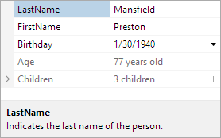

# Summary Area

The summary area is optionally displayed at the bottom of the property grid and displays information about the currently selected property grid item, which could be a category or property.

*A property grid with the summary area visible*

## Visibility

The visibility of the summary area can be controlled using the [IsSummaryVisible](xref:@ActiproUIRoot.Controls.Grids.PropertyGrid.IsSummaryVisible) property.  By default, the summary area is visible.

The end user has the ability to toggle the visibility via a **Description** [context menu](contextmenu-customization.md) item.  This ability can be disabled by setting the [IsSummaryToggleAllowed](xref:@ActiproUIRoot.Controls.Grids.PropertyGrid.IsSummaryToggleAllowed) property to `false`.

## Height and Resizing

When the summary area is visible, it can be resized by the end-user with the mouse.  This allows the end-user to show more or less of the summary area as desired.  Additionally, the height of the summary area can be set programmatically using the [SummaryHeight](xref:@ActiproUIRoot.Controls.Grids.PropertyGrid.SummaryHeight) property.

By setting the [IsSummaryResizable](xref:@ActiproUIRoot.Controls.Grids.PropertyGrid.IsSummaryResizable) property to `false`, the summary will not be resizable by the end-user.

The summary area includes an "auto-size" feature, in which the summary area is dynamically sized to fit its content.  When [CanSummaryAutoSize](xref:@ActiproUIRoot.Controls.Grids.PropertyGrid.CanSummaryAutoSize) is set to `true`, the end-user can double click the summary area splitter to enter the auto-size mode.  If the end-user resizes the summary area, then the new explicit size is used and it is no longer in the auto-size mode.  The summary area can be set to auto-size programmatically by setting the [SummaryHeight](xref:@ActiproUIRoot.Controls.Grids.PropertyGrid.SummaryHeight) property to `Double.NaN` (or `"Auto"` if defining in XAML).

## Customizing the DataTemplate

The default `DataTemplate` used by the summary area includes the display name and description of the currently selected, similar to how the Windows Forms PropertyGrid control displayed information.  The template also include support for scrolling content that is too large to be displayed.

A custom `DataTemplate` can be used by setting the [SummaryTemplate](xref:@ActiproUIRoot.Controls.Grids.PropertyGrid.SummaryTemplate) or [SummaryTemplateSelector](xref:@ActiproUIRoot.Controls.Grids.PropertyGrid.SummaryTemplateSelector) properties.
