# Welcome

The Actipro WPF Controls are a vast set of UI controls and components for building beautiful Windows Presentation Foundation (WPF) desktop apps.

## WPF Control Products

### SyntaxEditor

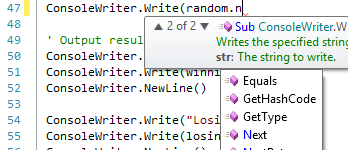

[Actipro SyntaxEditor](syntaxeditor/index.md) is a powerful text editing control that is packed with features for efficient code editing, including syntax highlighting, line numbers, block selection, IntelliPrompt UI, code outlining, parsing, split views, zooming, bi-di support, and much more.  It has many of the same code editing features found in the Visual Studio code editor.

SyntaxEditor is built on top of our next-generation extensible text/parsing framework.  While over 20 free sample languages are available to get you started (such as C#, VB, XML, and more), custom language definitions can be developed and distributed with your applications as well.  SyntaxEditor is designed for use in IDE (integrated development environment) applications, however there are many other applications out there that can take advantage of such a control.

These free add-ons are included with SyntaxEditor:

- [LL(*) Parser Framework](syntaxeditor/ll-parser-framework/index.md) - Easily build advanced parsers using EBNF-like notation
- [ANTLR](syntaxeditor/antlr-addon/index.md) parser integration
- [Irony](syntaxeditor/irony-addon/index.md) parser integration

These optional premium add-ons for advanced syntax language implementations are shipped and demoed with the WPF controls, but are sold separately:

- [.NET Languages Add-on](syntaxeditor/dotnet-languages-addon/index.md) - Advanced C# and Visual Basic
- [Python Language Add-on](syntaxeditor/python-language-addon/index.md) - Advanced Python
- [Web Languages Add-on](syntaxeditor/web-languages-addon/index.md) - Advanced XML, JavaScript, and JSON

### Docking & MDI

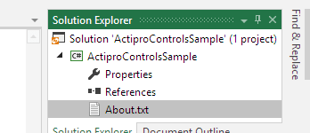

[Actipro Docking & MDI](docking/index.md) is a complete solution for easily adding a docking tool window and/or multiple document interface to your WPF applications.

Docking & MDI has been implemented with flexibility in mind.  It has more options than nearly any other competitive product out there.  While it supports all the types of standard layouts you find in most docking window products, it also supports some extended functionality such as: floating document windows, nested dock sites (a self-contained set of docking windows within another docking window), side-by-side dock sites (two or more self-contained sets of docking windows next to each other), tool window inner fill (no workspace area), tabbed and standard MDI styles, custom workspace content, total control over docking window capabilities and appearance, animated transitions, and much more.

### Editors

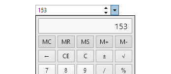

[Actipro Editors](editors/index.md) is a set of part-based and masked editors, for everything from date/time to currency entry.  They can easily be integrated into the Actipro PropertyGrid.

Edit box controls for common .NET data types such as dates, times, numbers, brushes, colors, enumerations, sizes, and many more.  Other controls include a regex-based masked textbox, auto-complete box, calculator, month calendar, star rating, gradient stop slider, and various color component pickers.

Each control has unique designs, specifically crafted to support input by keyboard, mouse, touch, and pen.

### Grids

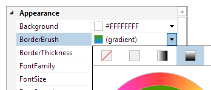

[Actipro Grids](grids/index.md) is a product that includes our PropertyGrid and custom tree structure (TreeListBox and TreeListView) controls.

PropertyGrid allows for all the properties of one or more objects to be displayed, optionally using categories.  Pre-defined editors for modifying properties are auto-generated based on property type, and custom property/category editors can be easily created, allowing for total customization of the property editing experience.

PropertyGrid can also optionally harness our advanced data editing controls found in our Editors product (sold separately) when appropriate.  Many editing features are driven using standard .NET attributes like BrowsableAttribute, CategoryAttribute, DisplayNameAttribute, etc.  Support for sorting, filtering, collections, read-only display, nested properties, and deep customization are all included.

TreeListBox is a single-column tree control similar to the Visual Studio Solution Explorer tree control.  TreeListView is a multi-column variant of TreeListBox that renders similar to a standard ListView but has additional features.

### Ribbon

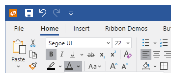

[Actipro Ribbon](ribbon/index.md) is a control suite that implements an Office-like user interface for WPF and meets 100% of the required AND optional Microsoft licensing requirements for implementation of a ribbon user interface.

Features include unrivaled ribbon resizing capabilities, backstage / application menu, QAT, many built-in control types, multiple layout options, key tips, screen tips, usage of the WPF command model, mini-toolbar, contextual tabs, fluent animations, and much more.

### Shell

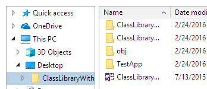

[Actipro Shell](shell/index.md) controls allow for easy folder and file browsing.  While the product comes packed with a pre-built implementation for the Windows shell that mimics Windows Explorer, the controls are fully customizable, allowing you to filter or change the folders/files presented.  Or build your own shell service to support other files systems, such the remote side for a FTP client.

The ShellTreeListBox control presents a shell folder hierarchy in a tree structure.  It is often paired with a ShellListView control, which shows the contents of a selected folder using column-based property display.  Both controls are constructed of pure WPF UI and support tool tips, context menus, and renaming.

### Gauge

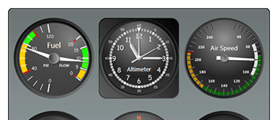

[Actipro Gauge](gauge/index.md) provides a complete set of circular, linear, and digital gauge controls, along with LED lights and toggle switches.  Each control is fully customizable and is packed with features.

The circular and linear gauge controls include support for tick marks, labels, pointers, ranges, and much more.  The digital gauge control can be used to display text using segmented or matrix characters.  The LED control mimics an LED light and presents simple states.  The toggle switch can be used in place of a WPF CheckBox, while providing the look and feel of a real-life switch.

### Charts

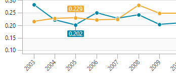

[Actipro Charts](charts/index.md) is a set of charts that are designed to provide rich visualization for complex, quantitative data.

Chart types include area, bar, line, pie, donut, and scatter, as well as stacked area and stacked bar.  Visualization features include legends, axis ticks and labels, data point labels, grid lines and stripes, as well as customization, styling, and templating support.

### Micro Charts

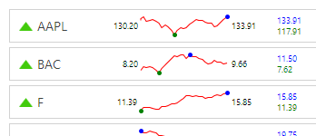

[Actipro Micro Charts](microcharts/index.md) is a set of charts that visualize quantitative data and are designed to render clearly in compact spaces.  Common usage scenarios for micro charts are within dashboards, reports, and grids.

Many chart types are supported, from basic line and bar charts to stacked area charts.  The sparkline chart controls include numerous useful features such as multiple series, stacking, hot tracking, customizable palettes, and data aggregation.

Other included controls are box plots, bullet graphs, candlestick charts, heat maps, segment charts, and trend indicators.  Basically everything you need to create enhanced compact data displays.

### Navigation

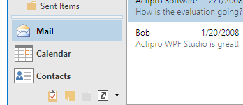

[Actipro Navigation](navigation/index.md) is a control suite that includes NavigationBar, ExplorerBar, Breadcrumb, and ZoomContentControl controls, along with styles for animated Expander controls.

NavigationBar is a control that fully implements all features found in Outlook 2007, such as complete end user customization, layout save/load, minimization to both left and right sides, and much more.

Explorer bar is an implementation of the task bar that was introduced in Windows XP's explorer.  Each expander pane uses smooth animation to fade in and slide down its contents when expanded.

Breadcrumb is an implementation of the breadcrumb that was introduced in Windows Vista's explorer.  The control can be used to select a single item from hierarchical data, much like a TreeView but requiring less screen real estate.

ZoomContentControl allows any content to be interactively zoomed and scrolled using customizable mouse and keyboard behaviors.

### Wizard

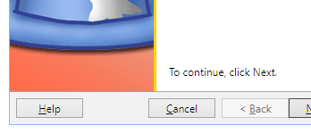

[Actipro Wizard](wizard/index.md) is the premiere control for building wizard dialogs in WPF.

Wizard dialogs simplify the user experience of applications by taking complex tasks and breaking them up into a series of simple steps.  Actipro Wizard is a lightweight control for building these wizard dialogs, while conforming to standard specifications.

Features include multiple page types, easy page sequencing, selection change processing, full control over button states, page titles that update the containing Window, theming, templating, animated page transitions, automatic layout, and much more.

### Views

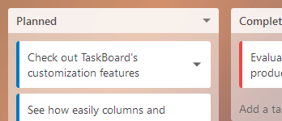

[Actipro Views](views/index.md) is a suite of controls and panels that supports fluid animations of the child elements arrangement.  Different animations can be applied to elements entering or leaving the panel, as well as elements simply moving to a new location or changing size.  Several built-in animations are provided that allow elements to be smoothly moved, sized, faded, scaled, rotated, or translated.

Actipro Views also includes a TaskBoard control that makes it easy to add interactive task scheduling and prioritization to your apps, a Book control with page turning presentations, and an InertiaScrollViewer that adds inertia animations to a ScrollViewer.

### Bar Code

[Actipro Bar Code](barcode/index.md) is the first bar code generation product natively written for WPF.

All the most common bar code symbologies are supported.  There are many configurable display options and each bar code is rendered using vector-based drawing so that it scales crisp and clean to any zoom level and on any sort of media.

### DataGrid Add-on

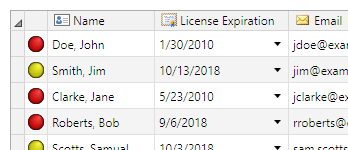

The Microsoft WPF DataGrid can be used to display various data in a grid of rows and columns, with several options available to customize the behavior and appearance.  Actipro is giving back to the community by providing two add-ons that make using the WPF DataGrid easier than ever.

The [Actipro WPF DataGrid Add-on](datagrid/index.md) offers reusable extension methods, attached behaviors, and commands.  It also provides theming that matches other Actipro controls.

The Actipro Editors/DataGrid Interop add-on allows controls from the Actipro Editors product to be quickly and easily integrated into the DataGrid.  This allows the cells in a DataGrid to leverage parts-based and masked text editors, which make data entry faster and more intuitive.

### Themes

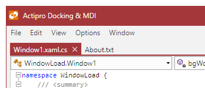

[Actipro Themes](themes/index.md) ensures that a great consistent visual appearance is applied to all controls within your application, regardless of whether they are Actipro control products or native WPF controls.  Pre-defined themes include numerous modern, Metro, and Office variations.

Themes are generated from extremely configurable theme definitions that can be edited using our Theme Designer application.

All of these features are built right into the Actipro Shared Library, which means they may be freely used by any developer who has a license for one of our WPF control products.

### Shared Library

The [Actipro Shared Library](shared/index.md) is a common control library referenced by all of our WPF controls.  It contains a number of very useful controls and components that can be used in your projects.

The Shared Library components are free for use by any licensed customers of our WPF control products.

## The WPF Studio Bundle

WPF Studio is a bundled suite of all Actipro's WPF control products listed above.

While the WPF Studio suite provides enormous **price discounts of almost 60%** over ordering all of our WPF products separately, you are free to purchase licenses for individual WPF control products if you don't require the entire suite.

In addition to great savings, having licenses for WPF Studio also enables you to immediately be **licensed for any new WPF control products** that are released and added to WPF Studio while your year of free upgrades is active.

## About Actipro Software

Actipro Software has been making top-notch Windows Forms controls since .NET was first introduced, and was the very **first** control vendor to release a commercial WPF control.

Today Actipro Software is a leader in the WPF control market with their numerous WPF control offerings.  Many products found in Actipro's Universal Windows Controls share codebases with their WPF Control counterparts, thereby allowing for a high degree of **code compatibility** between WPF and UWP.

## Commitment to WPF

Actipro firmly believes that **WPF is the best platform** for Microsoft-oriented Windows desktop development, and is committed to enhancing and expanding its WPF product offerings going forward.  As mentioned above, a license of Actipro WPF Studio enables you to use **all** of Actipro's current WPF products, along with any new products or features that are implemented in the future during your license subscription period.

## Sample Browser

The Sample Browser is the main sample project that ships with the WPF Controls.

It is an application with full source code that is designed to provide information, demos, and QuickStarts for all of Actipro's WPF control products.  This source code is invaluable for learning how to use the various WPF control products.

The Sample Browser project can be opened with Visual Studio.
