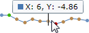
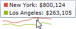

# Hot Tracking

Hot tracking displays a customizable tooltip which contains the values of the data point closest to the end-user's mouse cursor.

## Enabling Hot-Tracking

Hot-tracking can be enabled by setting the [MicroXYChart](xref:@ActiproUIRoot.Controls.MicroCharts.MicroXYChart).[IsHotTrackingEnabled](xref:@ActiproUIRoot.Controls.MicroCharts.MicroXYChart.IsHotTrackingEnabled) property to `true`.  It is set to `false` by default.

Once enabled, as the end user's mouse moves over the chart, values nearest the mouse will display in a tooltip.  The tooltip's contents can be completely customized via the various series-oriented legend settings discussed below.

## Legend String Format

The legend's string format is the easiest way to customize what is displayed in a tooltip for a series.  The series-specific string format is set via the [MicroXYSeriesBase](xref:@ActiproUIRoot.Controls.MicroCharts.Primitives.MicroXYSeriesBase).[LegendStringFormat](xref:@ActiproUIRoot.Controls.MicroCharts.Primitives.MicroXYSeriesBase.LegendStringFormat) property.  By default the value of the primary axis is displayed.

| Format Parameter | Description |
|-----|-----|
| \{0} | The value of the primary axis, generally the Y value. |
| \{1} | The value of the secondary axis, generally the X value. |
| \{2} | The X value. |
| \{3} | The Y value. |
| \{4} | Reserved for future use. |
| \{5} | The series description, as indicated in the [MicroXYSeriesBase](xref:@ActiproUIRoot.Controls.MicroCharts.Primitives.MicroXYSeriesBase).[Description](xref:@ActiproUIRoot.Controls.MicroCharts.Primitives.MicroXYSeriesBase.Description) property. |



This example shows the display of both X and Y values.  Note how numeric formatting is used on the Y value.

```xaml
<microcharts:MicroLineSeries ... LegendStringFormat="{}X: {2}, Y: {3:F2}" />
```



This example shows two series in the same chart, and each indicates its own description and value.

```xaml
<microcharts:MicroLineSeries ... Description="{Binding DataSet[0].Name}" LegendStringFormat="{}{5}: {0:C0}" />
<microcharts:MicroLineSeries ... Description="{Binding DataSet[1].Name}" LegendStringFormat="{}{5}: {0:C0}" />
```

## Legend Marker Style

The legend markers, used to render a series' base color in front of its string formatted display value within the tooltip, use a square shape by default.  This shape renders using the style assigned to the [MicroXYSeriesBase](xref:@ActiproUIRoot.Controls.MicroCharts.Primitives.MicroXYSeriesBase).[LegendMarkerStyle](xref:@ActiproUIRoot.Controls.MicroCharts.Primitives.MicroXYSeriesBase.LegendMarkerStyle) property.

By setting that property to another `Style` that targets the [MicroChartMarker](xref:@ActiproUIRoot.Controls.MicroCharts.MicroChartMarker) type, the shape used in the tooltip can be customized.  Properties such as `Fill`, `Stroke`, `StrokeThickness`, and `ShapeKind` can be set.

See the [Scatter](../chart-types/scatter.md) chart type topic for more information on available shape kinds.

## Legend Item Template

The default legend item template renders the legend marker to the left of the string formatted display value.  This can be customized if a different layout is preferred, by setting the [MicroXYSeriesBase](xref:@ActiproUIRoot.Controls.MicroCharts.Primitives.MicroXYSeriesBase).[LegendItemTemplate](xref:@ActiproUIRoot.Controls.MicroCharts.Primitives.MicroXYSeriesBase.LegendItemTemplate) property with an alternate `DataTemplate`.

This example shows the default `DataTemplate` used:

```xaml
<DataTemplate>
	<Grid>
		<Grid.ColumnDefinitions>
			<ColumnDefinition Width="Auto" />
			<ColumnDefinition Width="*" />
		</Grid.ColumnDefinitions>
		<microcharts:MicroChartMarker Width="8" Height="8" Style="{Binding MarkerStyle}" VerticalAlignment="Center" />
		<TextBlock Grid.Column="1" Margin="3,0,0,0" Text="{Binding Text}" />
	</Grid>
</DataTemplate>
```
