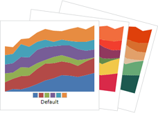

# Palettes

There are an enormous number of configuration options related to palettes.  The various brushes used by the chart can be easily customized using a palette of colors or the styles can be completely overridden.

## Introduction

When any series is being rendered within a chart, it uses the chart's [MicroChartBase](xref:@ActiproUIRoot.Controls.MicroCharts.Primitives.MicroChartBase).[SeriesStyleSelector](xref:@ActiproUIRoot.Controls.MicroCharts.Primitives.MicroChartBase.SeriesStyleSelector) to determine which styles to apply to the various shapes displayed.  These shapes include the basic shapes representing lines, areas, bars, markers, etc.

For instance, by default a line series that shows all markers will render the markers in the same color.  An option can be set to apply highlight effects (different brushes) to certain markers such as the first/last, high/low, or negative ones.  Similar options are available where appropriate for lines, areas, and bars.  These highlight effects are achieved by the series style selector telling the chart which style to use.  Normal markers get their style from a [MicroSeriesStyleSelector](xref:@ActiproUIRoot.Controls.MicroCharts.MicroSeriesStyleSelector).[SelectMarkerStyle](xref:@ActiproUIRoot.Controls.MicroCharts.MicroSeriesStyleSelector.SelectMarkerStyle*) call.  If the series has indicated it wants negative value markers to be rendered differently, the negative value markers get their style from a [MicroSeriesStyleSelector](xref:@ActiproUIRoot.Controls.MicroCharts.MicroSeriesStyleSelector).[SelectMarkerNegativeStyle](xref:@ActiproUIRoot.Controls.MicroCharts.MicroSeriesStyleSelector.SelectMarkerNegativeStyle*) call, and so on for other highlight effects.

The [MicroSeriesPaletteStyleSelector](xref:@ActiproUIRoot.Controls.MicroCharts.Palettes.MicroSeriesPaletteStyleSelector) class inherits [MicroSeriesStyleSelector](xref:@ActiproUIRoot.Controls.MicroCharts.MicroSeriesStyleSelector) and provides many settings that can be used to completely customize how a chart renders its series.

An important thing to note is that the [MicroSeriesPaletteStyleSelector](xref:@ActiproUIRoot.Controls.MicroCharts.Palettes.MicroSeriesPaletteStyleSelector) builds shape styles based on colors defined in a [MicroPalette](xref:@ActiproUIRoot.Controls.MicroCharts.Palettes.MicroPalette) that has been assigned to its [Palette](xref:@ActiproUIRoot.Controls.MicroCharts.Palettes.MicroSeriesPaletteStyleSelector.Palette) property.  The palette contains multiple colors so that when more than one series is used in a chart, each series will cycle to use a different palette color.

## Built-In Palettes



Numerous built-in palettes are included with the product, each named via a value within the [MicroPaletteKind](xref:@ActiproUIRoot.Controls.MicroCharts.Palettes.MicroPaletteKind) enumeration.

A built-in palette can be assigned to a chart like this (in this case the `Roman` palette):

```xaml
<microcharts:MicroXYChart Width="100" Height="18">
	<microcharts:MicroXYChart.SeriesStyleSelector>
		<microcharts:MicroSeriesPaletteStyleSelector>
			<microcharts:MicroPalette Kind="Roman" />
		</microcharts:MicroSeriesPaletteStyleSelector>
	</microcharts:MicroXYChart.SeriesStyleSelector>
	...
</microcharts:MicroXYChart>
```

For simple cases where no other customization is needed on the [MicroSeriesPaletteStyleSelector](xref:@ActiproUIRoot.Controls.MicroCharts.Palettes.MicroSeriesPaletteStyleSelector), the palette kind can simply be set as an attribute value as well, where the text specified matches one of the [MicroPaletteKind](xref:@ActiproUIRoot.Controls.MicroCharts.Palettes.MicroPaletteKind) values:

```xaml
<microcharts:MicroXYChart Width="100" Height="18" SeriesStyleSelector="Roman">
	...
</microcharts:MicroXYChart>
```

## Palette Color Selection

Each palette has two mode options for how colors will be assigned to series in a chart.  The mode is set by specifying a [MicroColorSelectionHint](xref:@ActiproUIRoot.Controls.MicroCharts.Palettes.MicroColorSelectionHint) value on the [MicroPalette](xref:@ActiproUIRoot.Controls.MicroCharts.Palettes.MicroPalette).[ColorSelectionHint](xref:@ActiproUIRoot.Controls.MicroCharts.Palettes.MicroPalette.ColorSelectionHint) property.

| Mode | Description |
|-----|-----|
| Sequential | Pick palette colors sequentially.  The first series gets the first palette color.  The second series gets the second palette color, and so on. |
| UniformDistribution | Pick palette colors based on a uniform distribution.  If the palette consists of nine base colors and the chart being rendered has three series, the first series gets one of the first three colors in the palette.  The second series gets one of the middle three colors in the palette.  And the third series gets one of the last three colors in the palette.  If there are more series being rendered than base colors in the palette, fallback is to Sequential mode. |

The default is to use `UniformDistribution` mode on the built-in palettes, and `Sequential` mode on custom palettes.

## Palette Shade Generation

Each palette has a list of base colors used directly as the core color for each series in a chart.  Most palettes define six colors.  But what happens when there are more than six series in a chart?

If shade generation is enabled on a palette, via its [MicroPalette](xref:@ActiproUIRoot.Controls.MicroCharts.Palettes.MicroPalette).[IsShadeGenerationEnabled](xref:@ActiproUIRoot.Controls.MicroCharts.Palettes.MicroPalette.IsShadeGenerationEnabled) property, additional darker and lighter shades of the base colors will be generated and used for the other series.  By default, this feature is enabled.

If this feature is disabled, the color assignments will recycle and the seventh series will simply use the first base color again, and so on.

## Custom Palette Colors

It's very easy to create custom palettes.  Simply create a [MicroPalette](xref:@ActiproUIRoot.Controls.MicroCharts.Palettes.MicroPalette) and assign the custom colors to its [BaseColors](xref:@ActiproUIRoot.Controls.MicroCharts.Palettes.MicroPalette.BaseColors) collection.

This sample shows the creation of a palette that contains two custom colors:

```xaml
<microcharts:MicroXYChart Width="100" Height="18">
	<microcharts:MicroXYChart.SeriesStyleSelector>
		<microcharts:MicroSeriesPaletteStyleSelector>
			<microcharts:MicroPalette>
				<Color>#46bff7</Color>
				<Color>#06226b</Color>
			</microcharts:MicroPalette>
		</microcharts:MicroSeriesPaletteStyleSelector>
	</microcharts:MicroXYChart.SeriesStyleSelector>
	...
</microcharts:MicroXYChart>
```

> [!IMPORTANT]
> When multiple series are used in a chart, make sure that your palette has enough base color entries to match or exceed your series count.  Or ensure that the shade generation feature (described above) is active.

## Customizing Highlight Effect Brushes

As described in the introduction above, there are many ways certain data points (and related markers, bars, etc.) can be highlighted.  The [MicroSeriesPaletteStyleSelector](xref:@ActiproUIRoot.Controls.MicroCharts.Palettes.MicroSeriesPaletteStyleSelector) class has an enormous number of property-based options for customizing highlight effects:

- Area (also used for bars) - Normal, high, low, negative
- Line - Normal, negative
- Marker - Normal, first, last, high, low, negative

Each of these options generally has three properties on [MicroSeriesPaletteStyleSelector](xref:@ActiproUIRoot.Controls.MicroCharts.Palettes.MicroSeriesPaletteStyleSelector), such as these for normal areas:

- [AreaBrushCustom](xref:@ActiproUIRoot.Controls.MicroCharts.Palettes.MicroSeriesPaletteStyleSelector.AreaBrushCustom)
- [AreaBrushKind](xref:@ActiproUIRoot.Controls.MicroCharts.Palettes.MicroSeriesPaletteStyleSelector.AreaBrushKind)
- [AreaTintColor](xref:@ActiproUIRoot.Controls.MicroCharts.Palettes.MicroSeriesPaletteStyleSelector.AreaTintColor)

### Custom Brush

A custom `Brush`, if specified via properties like [AreaBrushCustom](xref:@ActiproUIRoot.Controls.MicroCharts.Palettes.MicroSeriesPaletteStyleSelector.AreaBrushCustom), will cause the related shape (in this case, a normal area) to directly use that brush for rendering.

### Brush Kind

A brush kind can be specified via properties like [AreaBrushKind](xref:@ActiproUIRoot.Controls.MicroCharts.Palettes.MicroSeriesPaletteStyleSelector.AreaBrushKind).  This kind is of type [MicroSeriesBrushKind](xref:@ActiproUIRoot.Controls.MicroCharts.Palettes.MicroSeriesBrushKind) and has many values that can "modify" the palette color assigned to the series:

- `Default` - Use the exact palette color.
- `Light` - Use a slightly lighter version of the palette color.
- `Dark` - Use a slightly darker version of the palette color.
- `SemiTransparent` - Use a semi-transparent version of the palette color.
- `DarkToLightGradient` - Use a gradient, from the `Dark` to `Light` color.
- `LightToDarkGradient` - Use a gradient, from the `Light` to `Dark` color.
- `Complement` - Use a complement of the `Default` color.
- `ComplementLight` - Use a complement of the `Light` color.
- `ComplementDark` - Use a complement of the `Dark` color.
- `ComplementSemiTransparent` - Use a semi-transparent version of the `Default` color.
- `ComplementDarkToLightGradient` - Use a gradient, from the `ComplementDark` to `ComplementLight` color.
- `ComplementLightToDarkGradient` - Use a gradient, from the `ComplementLight` to `ComplementDark` color.

By using a brush kind setting instead of specifying an exact custom brush, the brush used for each series will be relative to the palette color assigned to that series.

### Tint Color

A tint color can be set via properties like [AreaTintColor](xref:@ActiproUIRoot.Controls.MicroCharts.Palettes.MicroSeriesPaletteStyleSelector.AreaTintColor).  If specified, the tint will be applied to the resulting brush from the brush kind setting.  The tint color is not used if a custom brush is directly set.

The default usage of tint colors is for high areas/markers to tint towards green, and low areas/markers to tint towards red.
