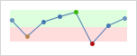
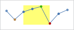
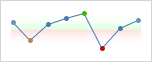

# Ranges

Specific value ranges of the chart can be highlighted to convey additional information to the end-user.



*A line chart with a green and red range for positive and negative values, respectively*

## Orientation

By default, ranges will be aligned horizontally, which means they highlight value ranges along the Y-axis.  A vertical range can be created by setting the [Orientation](xref:@ActiproUIRoot.Controls.MicroCharts.MicroXYRange.Orientation) property to `Vertical`.  Vertical ranges highlight value ranges along the X-axis.



*A line chart with a yellow range between the X values 2 and 5*

In this example, the line series is set to a collection of doubles. Therefore, the X values will range from 0 to 7 (since there are 8 entries) and the actual values shown will be used along the Y axis:

```xaml
<microcharts:MicroXYChart Width="130" Height="40">
	<microcharts:MicroLineSeries ItemsSource="4;-5;3;6;9;-9;1;5" MarkerVisibility="All" MarkerStyleKinds="All" />
	<microcharts:MicroXYChart.Ranges>
		<microcharts:MicroXYRange Background="#88FFFF00" Minimum="2" Maximum="5" Orientation="Vertical"/>
	</microcharts:MicroXYChart.Ranges>
</microcharts:MicroXYChart>
```

## Minimum and Maximum Values

The values of a range are specified using the [Maximum](xref:@ActiproUIRoot.Controls.MicroCharts.MicroXYRange.Maximum) and [Minimum](xref:@ActiproUIRoot.Controls.MicroCharts.MicroXYRange.Minimum) properties.

If either of these properties is unset (or set to `null`), then its value will be auto-calculated based on the data points from all series.  The `Maximum` will run to the highest value and likewise the `Minimum` will run to the lowest value.

For example, we can produce two ranges that run up (green) and down (red) from 0 using the following code:

```xaml
<microcharts:MicroXYChart Width="130" Height="40">
	<microcharts:MicroLineSeries ItemsSource="4;-5;3;6;9;-9;1;5" MarkerVisibility="All" MarkerStyleKinds="All" />
	<microcharts:MicroXYChart.Ranges>
		<microcharts:MicroXYRange Minimum="0">
			<microcharts:MicroXYRange.Background>
				<LinearGradientBrush StartPoint="0,0" EndPoint="0,1">
					<GradientStop Color="Transparent" Offset="0" />
					<GradientStop Color="#2200FF00" Offset="1" />
				</LinearGradientBrush>
			</microcharts:MicroXYRange.Background>
		</microcharts:MicroXYRange>
		<microcharts:MicroXYRange Maximum="0">
			<microcharts:MicroXYRange.Background>
				<LinearGradientBrush StartPoint="0,0" EndPoint="0,1">
					<GradientStop Color="#22FF0000" Offset="0" />
					<GradientStop Color="Transparent" Offset="1" />
				</LinearGradientBrush>
			</microcharts:MicroXYRange.Background>
		</microcharts:MicroXYRange>
	</microcharts:MicroXYChart.Ranges>
</microcharts:MicroXYChart>
```

This produces the following chart:


