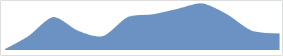

# Area

An area chart is a derivative of a line chart where the area between the line and axis is filled in.

## Baseline Value

The area series will pivot it's polygon based on the chart's baseline value, as specified by the [MicroXYChart](xref:@ActiproUIRoot.Controls.MicroCharts.MicroXYChart).[AxisBaselineValue](xref:@ActiproUIRoot.Controls.MicroCharts.MicroXYChart.AxisBaselineValue) property.  The default baseline for numeric values is `0`, and for date/time values it is `DateTime.MinValue`.

In the following examples, the data rendered by the chart uses the index position along the X-axis and the fixed values `10, 20, 10, 20, 10, 20, 10` for the Y-axis.  The first image shows the series using `10` as the minimum value along the Y-axis, and `20` for the maximum.  Since our baseline is `0` (the default), the polygon is not pivoted.

If we explicitly set our baseline value to `15`, then any values below the baseline will be considered "negative" and the polygon will appear to pivot around the baseline.

## Style Kinds

The negative areas can be rendered using a distinct style and brush to highlight them.  This is done using the [AreaStyleKinds](xref:@ActiproUIRoot.Controls.MicroCharts.MicroAreaSeries.AreaStyleKinds) property, which is used to specify which style kinds should be used.  If we explicitly set this to `Negative`, then we can see the bottom area is rendered using a contrasting brush.

The normal style can be customized using the [AreaStyle](xref:@ActiproUIRoot.Controls.MicroCharts.MicroAreaSeries.AreaStyle) property, and negative style can be customized using the [AreaNegativeStyle](xref:@ActiproUIRoot.Controls.MicroCharts.MicroAreaSeries.AreaNegativeStyle) property.  The associated `Style` should target the `Shape` type, which includes properties such as `Fill`, `Stroke`, and `StrokeThickness`.

## Line Kind

The area series supports three kinds of lines specified by the [LineKind](xref:@ActiproUIRoot.Controls.MicroCharts.Primitives.MicroLineSeriesBase.LineKind), which also determines how the area is rendered.  By default, the `Normal` kind of line is used which simply draws a line to connect the data points when determining the area's polygon.

*An area series using a normal line kind, zoomed 400%*

The `Spline` line kind builds a canonical spline that runs through the data points, producing a smooth line.

*An area series using a spline line kind, zoomed 400%*

The `Step` line kind creates a polygon that only uses horizontal and vertical lines to connect the data points, producing a step look.

*An area series using a step line kind, zoomed 400%*

## Line

The area series can render an actual line along the top of the area to distinguish it better.  By default, the line is not rendered, but it can be shown by setting [LineVisibility](xref:@ActiproUIRoot.Controls.MicroCharts.MicroAreaSeries.LineVisibility) to a value other than `None`.  The area series has the same configuration properties available as the line series, with regards to line rendering.

See the [Line](line.md) topic for more information on the options available.

## Markers

The area series can render a marker at each data point to highlight the actual location.  By default, the markers are not rendered, but they can be shown by setting [MarkerVisibility](xref:@ActiproUIRoot.Controls.MicroCharts.Primitives.MicroLineSeriesBase.MarkerVisibility) to a value other than `None`.  The area series has the same configuration properties available as the scatter series, with regards to marker rendering.

See the [Scatter](scatter.md) topic for more information on the options available.
