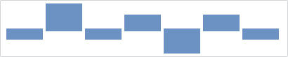

# Bar

A bar chart displays rectangular bars with lengths proportional to the values they represent.

## Baseline Value

The bar series will pivot it's bars based on the chart's baseline value, as specified by the [MicroXYChart](xref:@ActiproUIRoot.Controls.MicroCharts.MicroXYChart).[AxisBaselineValue](xref:@ActiproUIRoot.Controls.MicroCharts.MicroXYChart.AxisBaselineValue) property.  The default baseline for numeric values is `0`, and for date/time values it is `DateTime.MinValue`.

In the following example, the data rendered by the chart uses the index position along the X-axis and the fixed values `10, 25, 10, 20, 5, 20, 10` for the Y-axis.  The first image shows the series using `5` as the minimum value along the Y-axis, and `25` for the maximum.  Since our baseline is `0` (the default), the bars are not pivoted.

If we explicitly set our baseline value to `15`, then any values below the baseline will be considered "negative" and the bars will appear to "grow" down instead of up.

## Style Kinds

The bar series can render various bars differently, which is specified using the [BarStyleKinds](xref:@ActiproUIRoot.Controls.MicroCharts.Primitives.MicroBarSeriesBase.BarStyleKinds) property.  Supported options include `High`, `Low`, `Negative`, or any combination of those values.

If we include the `High` and `Low` flags, then the bars associated with the data points with the highest and lowest value will render using a distinct style/brush.

If we include the `Negative` flags, then the bar associated with the data points whose value is less than `15` will render using a distinct style/brush.

The normal style can be customized using the [BarStyle](xref:@ActiproUIRoot.Controls.MicroCharts.Primitives.MicroBarSeriesBase.BarStyle) property, and negative style can be customized using the [BarNegativeStyle](xref:@ActiproUIRoot.Controls.MicroCharts.Primitives.MicroBarSeriesBase.BarNegativeStyle) property.  Similarly, the high and low bars can be styled using the [BarHighStyle](xref:@ActiproUIRoot.Controls.MicroCharts.Primitives.MicroBarSeriesBase.BarHighStyle) and [BarLowStyle](xref:@ActiproUIRoot.Controls.MicroCharts.Primitives.MicroBarSeriesBase.BarLowStyle), respectively.  The associated `Style` should target the `Shape` type, which includes properties such as `Fill`, `Stroke`, and `StrokeThickness`.

## Orientation

The bar chart can be oriented horizontally (the default) or vertically by setting the [Orientation](xref:@ActiproUIRoot.Controls.MicroCharts.Primitives.MicroBarSeriesBase.Orientation) property.  When switching orientation, the values of the [XPath](xref:@ActiproUIRoot.Controls.MicroCharts.Primitives.MicroXYSeriesBase.XPath) and [YPath](xref:@ActiproUIRoot.Controls.MicroCharts.Primitives.MicroXYSeriesBase.YPath) properties may need to be swapped.

## Bar Spacing

The [BarSpacing](xref:@ActiproUIRoot.Controls.MicroCharts.Primitives.MicroBarSeriesBase.BarSpacing) property can be used to configure the space between the bars. The default value is `1px`, which indicates there should be a 1-pixel space between the bars.
