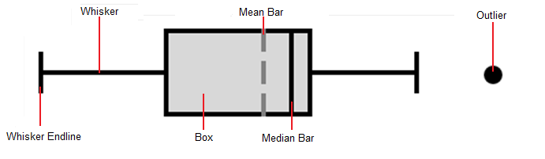

# Box Plot

A box plot is a chart that displays a set of data through five major values: the lower whisker value, the lower quartile value, the median, the upper quartile, and the upper whisker value.

The median is the value found directly in the center of the data when it is sorted, meaning half of the data lies above it, and half lies below it. The median is displayed as a perpendicular line to the chart.

The lower quartile is the median of the lower half of data, resulting in a quarter of the data being less than it, and three-quarters being greater.

The upper quartile is the median of the higher half of data, resulting in three-quarters of the data being less than it, and a quarter being greater.

The upper and lower quartiles define the edges of a box drawn on the chart, resulting in the middle half of the data being contained within the box. The difference between the upper and lower quartiles is known as the Interquartile Range (IQR). The product of the IQR and the IQR multiplier (normally a value of `1.5`) is then subtracted from the lower quartile value to get the lower whisker value and added to the upper quartile value to get the upper whisker value. The whiskers are displayed as "T" bars that extend from the edges of the box to their respective values.

The spacing between the different parts of the box plot help indicate the degree of spread in the data.  Box plots are particularly useful for displaying distributions of a group in a compact way. This is good for creating charts that compare a group of data such as the performance of salespeople, heights of a group of people, temperatures along a latitude, and more.

## Data Display

The [MicroBoxPlot](xref:@ActiproUIRoot.Controls.MicroCharts.MicroBoxPlot) control accepts a collection of data in its Values property, and then from that data it calculates the median value, which can optionally be displayed, the upper and lower quartile values (the 75th and 25th percentiles respectively), the upper and lower whisker values, and the minimum and maximum values. Outliers, values that fall outside the range between the whisker values, can be optionally displayed. If outliers are not displayed, they will not affect the minimum and maximum values. The mean, or average, value can also be displayed optionally. Below is an example of a [MicroBoxPlot](xref:@ActiproUIRoot.Controls.MicroCharts.MicroBoxPlot) with all parts displayed and labeled.



Note that the box's ends are defined by the upper and lower quartile values. The width of the box, equal to the difference between the upper and lower quartiles, is known as the Interquartile Range (IQR). The IQR is used to calculate the whisker values. The whiskers extend to the furthest data point from the edges of the box within a distance equal to the IQR multiplied by the [IqrMultiplier](xref:@ActiproUIRoot.Controls.MicroCharts.MicroBoxPlot.IqrMultiplier), which defaults to `1.5`. Not that if the [IqrMultiplier](xref:@ActiproUIRoot.Controls.MicroCharts.MicroBoxPlot.IqrMultiplier) is set to a number less than or equal to zero no whiskers	will be displayed. An example of populating the collection of values is shown below.

```xaml
<microcharts:MicroBoxPlot Values="1; 2; 3; 4; 5; 6" />
```

## Graph Minimum and Maximum

The [Minimum](xref:@ActiproUIRoot.Controls.MicroCharts.MicroBoxPlot.Minimum) and [Maximum](xref:@ActiproUIRoot.Controls.MicroCharts.MicroBoxPlot.Maximum) of the chart are auto-calculated if they are not given a value.  The minimum and maximum are set to the smallest and largest displayed values respectively.  The minimum and maximum can also be set to specific values. Note that any data values outside of the set range will be clipped and not displayed.

Setting the minimum and maximum chart values can be useful for putting group of box plots into the same context. This allows all the charts to display the same range and makes it easy to compare several data sets. The box plots could then be placed in a vertical column to produce a comprehensive report.

## Orientation

The [MicroBoxPlot](xref:@ActiproUIRoot.Controls.MicroCharts.MicroBoxPlot).[Orientation](xref:@ActiproUIRoot.Controls.MicroCharts.MicroBoxPlot.Orientation) property is `Horizontal` by default, but can be set to `Vertical` as well. Setting the chart's orientation to vertical effectively rotates the control 90 degrees counterclockwise, so the minimum value is on the bottom and the maximum is at the top of the control.

## Appearance Customization

Every part of the [MicroBoxPlot](xref:@ActiproUIRoot.Controls.MicroCharts.MicroBoxPlot) has a style that can be customized to change its color, size, and visual features. Below is a list of the different parts with what member can be accessed to change their style.  Note that the target type of the styles should be `Shape`.

| Part Name | Member Name |
|-----|-----|
| Box | [MicroBoxPlot](xref:@ActiproUIRoot.Controls.MicroCharts.MicroBoxPlot).[BoxStyle](xref:@ActiproUIRoot.Controls.MicroCharts.MicroBoxPlot.BoxStyle) |
| Mean Bar | [MicroBoxPlot](xref:@ActiproUIRoot.Controls.MicroCharts.MicroBoxPlot).[MeanStyle](xref:@ActiproUIRoot.Controls.MicroCharts.MicroBoxPlot.MeanStyle) |
| Median bar | [MicroBoxPlot](xref:@ActiproUIRoot.Controls.MicroCharts.MicroBoxPlot).[MedianStyle](xref:@ActiproUIRoot.Controls.MicroCharts.MicroBoxPlot.MedianStyle) |
| Outliers | [MicroBoxPlot](xref:@ActiproUIRoot.Controls.MicroCharts.MicroBoxPlot).[OutlierStyle](xref:@ActiproUIRoot.Controls.MicroCharts.MicroBoxPlot.OutlierStyle) |
| Whiskers | [MicroBoxPlot](xref:@ActiproUIRoot.Controls.MicroCharts.MicroBoxPlot).[WhiskerStyle](xref:@ActiproUIRoot.Controls.MicroCharts.MicroBoxPlot.WhiskerStyle) |

Styles can be used to set the brushes on the `Fill` and/or `Stroke` properties of the parts to change their color, and the `StrokeThickness` property can be set on the whiskers, mean, and median bars to alter their size. In addition, there is a [WhiskerAscent](xref:@ActiproUIRoot.Controls.MicroCharts.MicroBoxPlot.WhiskerAscent) property that controls the size of the whiskers' end lines. The ascent property takes a [Unit](xref:@ActiproUIRoot.Unit) value that is generally a pixel or percentage type. Note that setting the [WhiskerAscent](xref:@ActiproUIRoot.Controls.MicroCharts.MicroBoxPlot.WhiskerAscent) to zero will result in no end lines being rendered.

Since the outliers are [MicroChartMarker](xref:@ActiproUIRoot.Controls.MicroCharts.MicroChartMarker)s their [ShapeKind](xref:@ActiproUIRoot.Controls.MicroCharts.MicroChartMarker.ShapeKind) value can be set to any of the following shapes:

| Kind | Example |
|-----|-----|
| `Diamond` |  |
| `Ellipse` |  |
| `Hexagon` |  |
| `Pentagon` |  |
| `Octagon` |  |
| `Rectangle` |  |
| `RoundedRectangle` |  |
| `Star4Points` |  |
| `Star5Points` |  |
| `Star6Points` |  |
| `Star8Points` |  |
| `Triangle` |  |

```xaml
<microcharts:MicroBoxPlot Values="1; 2; 3; 4; 5; 6">
	<microcharts:MicroBoxPlot.Style>
		<Style TargetType="microcharts:MicroBoxPlot" BasedOn="{StaticResource MicroBoxPlotStyleBase}">
			<Setter Property="BoxStyle">
				<Setter.Value>
					<Style TargetType="Shape">
						<Setter Property="Fill" Value="#3b8525" />
					</Style>
				</Setter.Value>
			</Setter>
			<Setter Property="MedianStyle">
				<Setter.Value>
					<Style TargetType="Shape">
						<Setter Property="Stroke" Value="#ffffff" />
						<Setter Property="StrokeThickness" Value="3" />
					</Style>
				</Setter.Value>
			</Setter>
			<Setter Property="WhiskerStyle">
				<Setter.Value>
					<Style TargetType="Shape">
						<Setter Property="Stroke" Value="#3b8525" />
						<Setter Property="StrokeThickness" Value="3" />
					</Style>
				</Setter.Value>
			</Setter>
		</Style>
	</microcharts:MicroBoxPlot.Style>
</microcharts:MicroBoxPlot>
```


The above example shows how to set values for the different parts' styles and customize the size values.

## Tool Tips

[MicroBoxPlot](xref:@ActiproUIRoot.Controls.MicroCharts.MicroBoxPlot)s support tooltips that can be custom formatted and can display the values of the quartiles, whiskers and mean, as well as the minimum and maximum.

| Format Parameter | Description |
|-----|-----|
| `"{0}"` | The minimum value. |
| `"{1}"` | The lower whisker value. |
| `"{2}"` | The lower quartile value (Q1). |
| `"{3}"` | The median value (Q2). |
| `"{4}"` | The upper quartile value (Q3). |
| `"{5}"` | The upper whisker value. |
| `"{6}"` | The maximum value. |
| `"{7}"` | The mean value. |
| `"{8}"` | The number of values. |

This example displays the upper and lower quartile values as well as the mean value of the data.  Note how numeric formatting is used on the values.

```xaml
<microcharts:MicroBoxPlot ... LegendStringFormat="Lower Quartile: {2:F1}, Upper Quartile: {4:F1}, Average: {7:F1}">
```
