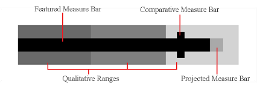
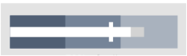

# Bullet Graph

Bullet graphs are used to simultaneously display and evaluate data. They show a single data value with contextual information to give the value further meaning. The actual value is represented by a featured measure bar, which is juxtaposed with a comparative value displayed as a bar perpendicular to it. The featured and comparative values are then placed in the context of specific ranges such as poor, average, and excellent.

Bullet graphs were originally designed to replace meters and gauges in a more compact way while still being informative. Bullet graphs are excellent to use as gauges or meters; however, they can also be used to display many other types of data very effectively. They are most suited to display a value that has other related values to be compared to, such as last year's mark, a goal or target, or a projected future value. Examples could include annual income or expenses data, sales data, and performance ratings data.

## Measure Display

The [MicroBulletGraph](xref:ActiproSoftware.Windows.Controls.MicroCharts.MicroBulletGraph) is capable of displaying a featured value, a comparative value, a projected value, and any number of ranges. The only required value is the featured value, all others default to `NaN`, in which case they will not be displayed. If all parts are present the order they are rendered from top to bottom is: featured, comparative, projected, then the ranges in order from the smallest value to	the largest value.



By default the featured and projected bars take up a third of the control and extend from zero to a length proportional to their respective values. The comparative bar is displayed perpendicular to the featured bar, with a default width of two and fills two thirds of the control. Ranges fill the entire control and extend to a length proportional to their value, any ranges that aren't given a value will fill to the end of the control. The [MicroBulletGraph](xref:ActiproSoftware.Windows.Controls.MicroCharts.MicroBulletGraph).[QualitativeRanges](xref:ActiproSoftware.Windows.Controls.MicroCharts.MicroBulletGraph.QualitativeRanges) member is used to set and access the collection of [MicroQualitativeRange](xref:ActiproSoftware.Windows.Controls.MicroCharts.MicroQualitativeRange)s displayed by the chart. An example of populating the collection is shown below.

```xaml
<bulletGraph:MicroBulletGraph Maximum="800" FeaturedMeasureValue="450" FeaturedMeasureBrush="Black">
	<bulletGraph:MicroBulletGraph.QualitativeRanges>
		<bulletGraph:MicroQualitativeRange Value="200" Background="DarkSlateGray"/>
		<bulletGraph:MicroQualitativeRange Value="350" Background="DimGray" />
		<bulletGraph:MicroQualitativeRange Value="500" Background="Gray" />
		<bulletGraph:MicroQualitativeRange Value="650" Background="DarkGray" />
		<bulletGraph:MicroQualitativeRange Background="LightGray" />
	</bulletGraph:MicroBulletGraph.QualitativeRanges>
</bulletGraph:MicroBulletGraph>

```

## Graphing Minimum and Maximum

The [Minimum](xref:ActiproSoftware.Windows.Controls.MicroCharts.MicroBulletGraph.Minimum) and [Maximum](xref:ActiproSoftware.Windows.Controls.MicroCharts.MicroBulletGraph.Maximum) of the graph are auto-calculated if they are not given a value. The minimum is set to zero, or the smallest part value less than zero if one exists. The maximum is set to the largest part value. The minimum and maximum can also be set, in which case the displayed values will be coerced into the range so all specified values will be displayed.

### Ellipses Display

If the [Minimum](xref:ActiproSoftware.Windows.Controls.MicroCharts.MicroBulletGraph.Minimum) is set to a value greater than zero, the featured value, and projected value if there is one, will be displayed as an ellipse centered on the value. The image below shows an example with the minimum set to one.


### Negative Values

Negative values are supported by the [MicroBulletGraph](xref:ActiproSoftware.Windows.Controls.MicroCharts.MicroBulletGraph) control. If the featured and/or projected bar is given a negative value they will start at zero and extend in the opposite direction to a length proportional to their value.

## Orientation

The [MicroBulletGraph](xref:ActiproSoftware.Windows.Controls.MicroCharts.MicroBulletGraph).[Orientation](xref:ActiproSoftware.Windows.Controls.MicroCharts.MicroBulletGraph.Orientation) property is `Horizontal` by default, but can be set to `Vertical` as well. Setting the chart's orientation to vertical effectively rotates the control 90 degrees counter-clockwise, so the minimum value is on the bottom and the maximum is at the top of the control.

## Appearance Customization

### Brushes

Every part of the graph has a brush that can be customized to display any color or gradient desired.  To specify the brush used on a range set its background property. Below is a list of the different parts and what member can be accessed to change their brush.

| Part Name | Member Name |
|-----|-----|
| Featured bar/ellipse | [MicroBulletGraph](xref:ActiproSoftware.Windows.Controls.MicroCharts.MicroBulletGraph).[FeaturedMeasureBrush](xref:ActiproSoftware.Windows.Controls.MicroCharts.MicroBulletGraph.FeaturedMeasureBrush) |
| Projected bar/ellipse | [MicroBulletGraph](xref:ActiproSoftware.Windows.Controls.MicroCharts.MicroBulletGraph).[ProjectedMeasureBrush](xref:ActiproSoftware.Windows.Controls.MicroCharts.MicroBulletGraph.ProjectedMeasureBrush) |
| Comparative bar | [MicroBulletGraph](xref:ActiproSoftware.Windows.Controls.MicroCharts.MicroBulletGraph).[ComparativeMeasureBrush](xref:ActiproSoftware.Windows.Controls.MicroCharts.MicroBulletGraph.ComparativeMeasureBrush) |
| Range(s) | [MicroQualitativeRange](xref:ActiproSoftware.Windows.Controls.MicroCharts.MicroQualitativeRange).`Background` |

### Sizes

The size of the featured, projected, and comparative bars can be customized using the [FeaturedMeasureAscent](xref:ActiproSoftware.Windows.Controls.MicroCharts.MicroBulletGraph.FeaturedMeasureAscent), [ComparativeMeasureAscent](xref:ActiproSoftware.Windows.Controls.MicroCharts.MicroBulletGraph.ComparativeMeasureAscent), and [ComparativeMeasureExtent](xref:ActiproSoftware.Windows.Controls.MicroCharts.MicroBulletGraph.ComparativeMeasureExtent) properties. The ascent properties are [Unit](xref:ActiproSoftware.Windows.Unit) values that specify the amount of the control that the part should fill (height for horizontal orientation and width for vertical). The [FeaturedMeasureAscent](xref:ActiproSoftware.Windows.Controls.MicroCharts.MicroBulletGraph.FeaturedMeasureAscent) property changes both the featured and projected bars and is commonly set as a percentage, but can also be a pixel value. The [ComparativeMeasureExtent](xref:ActiproSoftware.Windows.Controls.MicroCharts.MicroBulletGraph.ComparativeMeasureExtent) property represents the thickness, generally in pixels, of the comparative bar (width for horizontal orientation and height for vertical).

```xaml
<microcharts:MicroBulletGraph FeaturedMeasureValue="72" FeaturedMeasureBrush="White"
			ProjectedMeasureValue="80" ProjectedMeasureBrush="LightGray" ComparativeMeasureValue="60"
			Maximum="100" ComparativeMeasureBrush="White" FeaturedMeasureAscent="30%"
			ComparativeMeasureAscent="60%" ComparativeMeasureExtent="5">
	<microcharts:MicroBulletGraph.QualitativeRanges>
		<microcharts:MicroQualitativeRange Value="33" Background="#505f74" />
		<microcharts:MicroQualitativeRange Value="66" Background="#758498" />
		<microcharts:MicroQualitativeRange Background="#a9b2be" />
	</microcharts:MicroBulletGraph.QualitativeRanges>
</microcharts:MicroBulletGraph>
```



The above example shows how to set values for the different part brushes and customize the size values.

## Tooltips

[MicroBulletGraph](xref:ActiproSoftware.Windows.Controls.MicroCharts.MicroBulletGraph)s support tooltips that can be custom formatted and can display the values of the bars as well as of the ranges and the minimum and maximum.

| Format Parameter | Description |
|-----|-----|
| \{0} | The featured measure value. |
| \{1} | The projected measure value. |
| \{2} | The comparative measure value. |
| \{3} | The minimum value. |
| \{4} | The maximum value. |
| \{5} | The value of the first qualitative range. |
| \{6} | The value of the second qualitative range. |
| \{7} | The value of the third qualitative range. |
| \{8} | The value of the fourth qualitative range. |
| \{9} | The value of the fifth qualitative range. |

This example displays the featured value as well as the ranges from the minimum to the end of the third range. Note how numeric formatting is used on the featured value.

```xaml
<microcharts:MicroBulletGraph ... LegendStringFormat="Rating:{0:F2} (Poor:{3}-{5} Satisfactory:{5}-{6} Excellent:{6}-{7})">
```
