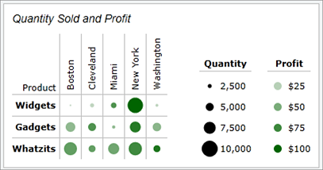

# Heat Map

A heat map is a grid where each cell renders color and/or size differences to reflect data values.  The [MicroHeatMapPresenter](xref:@ActiproUIRoot.Controls.MicroCharts.MicroHeatMapPresenter) control is the marker used in each heat map cell, and automatically handles the color and/or size rendering for its particular data value representation.

## What is a Heat Map?

Heat maps are charts made up of individual markers that use changing color and/or size to represent one or two pieces of data. Each marker has one or two values that are part of the set(s) of data represented by the chart. For each value the marker gets its size or color based on the position of that value within the range defined by the minimum and maximum values in the set.



In the example above the markers are changing color and size to represent their two values. The smaller the values represented by color are shown with lighter markers, and the smaller the values represented by size are shown with smaller markers. The two values are independent of one another, meaning a large marker can be very light and a small marker can be very dark.

The [MicroHeatMapPresenter](xref:@ActiproUIRoot.Controls.MicroCharts.MicroHeatMapPresenter) control provides this dynamic functionality for a single marker.  Multiple instances can be used to create a heat map. In the example, each single circle is one [MicroHeatMapPresenter](xref:@ActiproUIRoot.Controls.MicroCharts.MicroHeatMapPresenter) control, with its own color and size values.

## Reusing Styles

Generally a group of [MicroHeatMapPresenter](xref:@ActiproUIRoot.Controls.MicroCharts.MicroHeatMapPresenter) controls will all use the same values for their [GradientStops](xref:@ActiproUIRoot.Controls.MicroCharts.MicroHeatMapPresenter.GradientStops) property, minimum and maximum values, [LegendStringFormat](xref:@ActiproUIRoot.Controls.MicroCharts.MicroHeatMapPresenter.LegendStringFormat) (for tooltips) property, [IsSizingEnabled](xref:@ActiproUIRoot.Controls.MicroCharts.MicroHeatMapPresenter.IsSizingEnabled) property, and `Height` and `Width` properties. Instead of setting these properties for each individual control it is much more practical to set a style that the controls can inherit from. The style can be set in the `Resources` property of the container for the elements, such as a `Grid` or `Border`.

```xaml
<Border>
	<Border.Resources>
		<Style TargetType="microcharts:MicroHeatMapPresenter">
			<Setter Property="GradientStops">
				<Setter.Value>
					<GradientStopCollection>
						<GradientStop Color="WhiteSmoke" Offset="0" />
						<GradientStop Color="DarkGreen" Offset="1" />
					</GradientStopCollection>
				</Setter.Value>
			</Setter>

			<Setter Property="MarkerStyle">
				<Setter.Value>
					<Style TargetType="microcharts:MicroChartMarker">
						<Setter Property="ShapeKind" Value="Ellipse" />
					</Style>
				</Setter.Value>
			</Setter>

			<Setter Property="Height" Value="20" />
			<Setter Property="Width" Value="20" />
			<Setter Property="ColorMaximum" Value="100" />
			<Setter Property="SizeMaximum" Value="10000" />
			<Setter Property="Margin" Value="3" />
			<Setter Property="IsSizingEnabled" Value="True" />

			<Setter Property="LegendStringFormat" Value="Revenue per item: {0:C2}  Items sold: {3:N0}" />
		</Style>
	</Border.Resources>

	<StackPanel>
		<microcharts:MicroHeatMapPresenter ColorValue="15" SizeValue="1250" />
		<microcharts:MicroHeatMapPresenter ColorValue="21" SizeValue="2590" />
	</StackPanel>
</Border>
```

The sample code above sets the style used in the example from the "What is a Heat Map?" section. Note that the [ColorMaximum](xref:@ActiproUIRoot.Controls.MicroCharts.MicroHeatMapPresenter.ColorMaximum) and [SizeMaximum](xref:@ActiproUIRoot.Controls.MicroCharts.MicroHeatMapPresenter.SizeMaximum) properties are hard-coded in.  Generally, these values will come from data and not be set in the style, unless the range is known regardless of the data. This style is applied to each [MicroHeatMapPresenter](xref:@ActiproUIRoot.Controls.MicroCharts.MicroHeatMapPresenter) within the `Border`.  This can be repeated for several different containers on a page to create multiple charts, or the style can be put into the `App.Resources` to apply to all [MicroHeatMapPresenter](xref:@ActiproUIRoot.Controls.MicroCharts.MicroHeatMapPresenter) controls in the application.

## Color Changing Ability

The [MicroHeatMapPresenter](xref:@ActiproUIRoot.Controls.MicroCharts.MicroHeatMapPresenter).[GradientStops](xref:@ActiproUIRoot.Controls.MicroCharts.MicroHeatMapPresenter.GradientStops) property can be set to a `GradientStopsCollection` from which it will select a color based on its [ColorValue](xref:@ActiproUIRoot.Controls.MicroCharts.MicroHeatMapPresenter.ColorValue).  The control will select its color based on the `GradientStop`(s) with the offset value(s) closest to the percentage of the [ColorValue](xref:@ActiproUIRoot.Controls.MicroCharts.MicroHeatMapPresenter.ColorValue) from the [ColorMinimum](xref:@ActiproUIRoot.Controls.MicroCharts.MicroHeatMapPresenter.ColorMinimum) to the [ColorMaximum](xref:@ActiproUIRoot.Controls.MicroCharts.MicroHeatMapPresenter.ColorMaximum).  If the percentage lies within two offsets the control will find and use the color at the proper point between the two colors.  If the [GradientStops](xref:@ActiproUIRoot.Controls.MicroCharts.MicroHeatMapPresenter.GradientStops) property is not defined then the control will display black.

Below is an example of initializing the color variables so the control will find its place in the range between the min and max and render at a color selected from the gradient specified.

```xaml
<microcharts:MicroHeatMapPresenter ColorValue="21" ColorMinimum="10" ColorMaximum="70">
	<microcharts:MicroHeatMapPresenter.GradientStops>
		<GradientStopCollection>
			<GradientStop Color="#90bc0b" Offset="0.0" />
			<GradientStop Color="#c3d92e" Offset="0.2" />
			<GradientStop Color="#e0cc2e" Offset="0.4" />
			<GradientStop Color="#d79c36" Offset="0.6" />
			<GradientStop Color="#e07b3d" Offset="0.8" />
			<GradientStop Color="#da4d38" Offset="1.0" />
		</GradientStopCollection>
	</microcharts:MicroHeatMapPresenter.GradientStops>
</microcharts:MicroHeatMapPresenter>
```

## Sizing Ability

By default, the [MicroHeatMapPresenter](xref:@ActiproUIRoot.Controls.MicroCharts.MicroHeatMapPresenter) will size to fit its container. The control can be set to change size to reflect data by setting the [IsSizingEnabled](xref:@ActiproUIRoot.Controls.MicroCharts.MicroHeatMapPresenter.IsSizingEnabled) property to true. The marker will then render at a percentage of its normal size equal to the percentage of its [SizeValue](xref:@ActiproUIRoot.Controls.MicroCharts.MicroHeatMapPresenter.SizeValue) from the [SizeMinimum](xref:@ActiproUIRoot.Controls.MicroCharts.MicroHeatMapPresenter.SizeMinimum) to the [SizeMaximum](xref:@ActiproUIRoot.Controls.MicroCharts.MicroHeatMapPresenter.SizeMaximum).  If the [SizeValue](xref:@ActiproUIRoot.Controls.MicroCharts.MicroHeatMapPresenter.SizeValue) is equal to the maximum it will render at the full defined size, and if it is equal to the minimum it will not render visibly.

Below is an example of a [MicroHeatMapPresenter](xref:@ActiproUIRoot.Controls.MicroCharts.MicroHeatMapPresenter) with its [IsSizingEnabled](xref:@ActiproUIRoot.Controls.MicroCharts.MicroHeatMapPresenter.IsSizingEnabled) property set to true. Note that the [GradientStops](xref:@ActiproUIRoot.Controls.MicroCharts.MicroHeatMapPresenter.GradientStops) property is not set, so the control will render black for a sizing-only effect.

```xaml
<microcharts:MicroHeatMapPresenter SizeValue="1250" SizeMinimum="100" SizeMaximum="10000" Width="20" Height="20" IsSizingEnabled="True"/>
```

## Marker Shape Kinds

The marker of the control supports several built-in shape kinds, which include:

| Kind | Example |
|-----|-----|
| `Diamond` |  |
| `Ellipse` |  |
| `Hexagon` |  |
| `Pentagon` |  |
| `Octagon` |  |
| `Rectangle` |  |
| `RoundedRectangle` |  |
| `Star4Points` |  |
| `Star5Points` |  |
| `Star6Points` |  |
| `Star8Points` |  |
| `Triangle` |  |

## Tooltips

[MicroHeatMapPresenter](xref:@ActiproUIRoot.Controls.MicroCharts.MicroHeatMapPresenter)s support tooltips that can be custom formatted and can display the color and size value as well as the color and size minimums and maximums.

| Format Parameter | Description |
|-----|-----|
| `"{0}"` | The value represented by color. |
| `"{1}"` | The minimum color value. |
| `"{2}"` | The maximum color value. |
| `"{3}"` | The value represented by size. |
| `"{4}"` | The minimum size value. |
| `"{5}"` | The maximum size value. |

This example displays the [ColorValue](xref:@ActiproUIRoot.Controls.MicroCharts.MicroHeatMapPresenter.ColorValue) as well as the [ColorMinimum](xref:@ActiproUIRoot.Controls.MicroCharts.MicroHeatMapPresenter.ColorMinimum) and the [ColorMaximum](xref:@ActiproUIRoot.Controls.MicroCharts.MicroHeatMapPresenter.ColorMaximum) to show the range.  Note how numeric formatting is used on the [ColorValue](xref:@ActiproUIRoot.Controls.MicroCharts.MicroHeatMapPresenter.ColorValue).

```xaml
<microcharts:MicroHeatMapPresenter ... LegendStringFormat="Temperature: {0:F2}&#176;C  (Range: {1}-{2}&#176;C)" />
```
