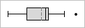
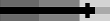
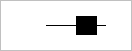
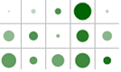

# Overview

Actipro Micro Charts includes a number of built-in chart types.

<table>
<thead>

<tr>
<th>Name</th>
<th>Description</th>
</tr>

</thead>
<tbody>

<tr>
<td>

[Area](area.md)

</td>
<td>

An area chart is a derivative of a line chart.  The area between the line and axis is filled in.  Markers and lines can optionally be displayed.

</td>
</tr>

<tr>
<td>

[Bar](bar.md)

</td>
<td>

A bar chart displays rectangular bars with lengths proportional to the values they represent.

</td>
</tr>

<tr>
<td>

[Line](line.md)

</td>
<td>

A line chart render quantitative data as a series of points connected by line segments.  Lines can be straight, curved, or stepped.  Markers can optionally be displayed.

</td>
</tr>

<tr>
<td>

[Scatter](scatter.md)

</td>
<td>

Scatter charts render data points where each point is represented by a marker.

</td>
</tr>

<tr>
<td>

[Win/Loss](winloss.md)

</td>
<td>

A win/loss chart is a special kind of bar chart where any positive value renders as a full-height upward bar, any negative value renders as a full-height downward bar, and zero values render as a line in the middle.

</td>
</tr>

<tr>
<td>

[Box Plot](box-plot.md)

</td>
<td>

A box plot is a chart that displays a list of data in a five number summary shown by the ends of the whiskers, ends of the box, and the median bar.

</td>
</tr>

<tr>
<td>

[Bullet Graph](bullet-graph.md)

</td>
<td>

A bullet graph is a special kind of bar chart used to display a single value in a context of one or more related values.

</td>
</tr>

<tr>
<td>

[Candlestick](candlestick.md)

</td>
<td>

Candlestick charts are used to visualize price movements over time, such as changing stock or currency values.

</td>
</tr>

<tr>
<td>

[Heat Map](heat-map.md)

</td>
<td>

A heat map is a grid where each cell renders color and/or size differences to reflect data values. The MicroHeatMapPresenter control is the marker used in each heat map cell, and automatically handles the color and/or size rendering for its particular data value representation.

</td>
</tr>

<tr>
<td>

[Segment](segment.md)

</td>
<td>

A segment chart provides a visual representation of an integer value in relation to a total number.  Each segment in the chart is rendered as highlighted or unhighlighted.  For instance, if the value is 3 of 10, there will be 10 total segments displayed, with the first 3 rendering as highlighted.  This sort of chart is great for use on dashboards, and also as an indicator of steps or progress achieved.

</td>
</tr>

<tr>
<td>

[Trend Indicator](trend-indicator.md)

</td>
<td>

The trend indicator is a three state control that is intended to reflect whether a numeric value is higher, the same as, or lower than an origin value.

</td>
</tr>

</tbody>
</table>
