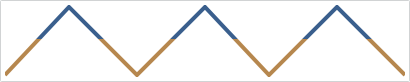
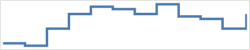

# Line

A line chart renders quantitative data as a series of points connected by line segments, which can be straight, curved, or stepped.

## Baseline Value

The chart's baseline value, as specified by the [MicroXYChart](xref:@ActiproUIRoot.Controls.MicroCharts.MicroXYChart).[AxisBaselineValue](xref:@ActiproUIRoot.Controls.MicroCharts.MicroXYChart.AxisBaselineValue) property, only determines which portion of the line is considered "negative" when using various style kinds.  The default baseline for numeric values is `0`, and for date/time values it is `DateTime.MinValue`.

In the following example, the data rendered by the chart uses the index position along the X-axis and the fixed values `10, 20, 10, 20, 10, 20, 10` for the Y-axis.  The first image shows the series using `10` as the minimum value along the Y-axis, and `20` for the maximum.

If we explicitly set our baseline value to `15`, then any values below the baseline will be considered "negative".  Visually nothing will change until the `Negative` flag is included in the [LineStyleKinds](xref:@ActiproUIRoot.Controls.MicroCharts.Primitives.MicroLineSeriesBase.LineStyleKinds) property.

## Style Kinds

The negative lines can be rendered using a distinct style and brush to highlight them.  This is done using the [LineStyleKinds](xref:@ActiproUIRoot.Controls.MicroCharts.Primitives.MicroLineSeriesBase.LineStyleKinds) property, which is used to specify which style kinds should be used.  If we explicitly set this to `Negative`, then we can see the bottom line is rendered using a contrasting brush.

The normal style can be customized using the [LineStyle](xref:@ActiproUIRoot.Controls.MicroCharts.Primitives.MicroLineSeriesBase.LineStyle) property, and negative style can be customized using the [LineNegativeStyle](xref:@ActiproUIRoot.Controls.MicroCharts.Primitives.MicroLineSeriesBase.LineNegativeStyle) property.  The associated `Style` should target the `Shape` type, which includes properties such as `Fill`, `Stroke`, and `StrokeThickness`.

## Line Kind

The line series supports three kinds of lines specified by the [LineKind](xref:@ActiproUIRoot.Controls.MicroCharts.Primitives.MicroLineSeriesBase.LineKind).  By default, the `Normal` kind of line is used which simply draws a line to connect the data points.

*An line series using a normal line kind, zoomed 400%*

The `Spline` line kind builds a canonical spline that runs through the data points, producing a smooth line.

*An line series using a spline line kind, zoomed 400%*

The `Step` line kind creates a line that only uses horizontal and vertical lines to connect the data points, producing a step look.

*An line series using a step line kind, zoomed 400%*

## Markers

The line series can render a marker at each data point to highlight the actual location.  By default, the markers are not rendered, but they can be shown by setting [MarkerVisibility](xref:@ActiproUIRoot.Controls.MicroCharts.Primitives.MicroLineSeriesBase.MarkerVisibility) to a value other than `None`.  The line series has the same configuration properties available as the scatter series, with regards to marker rendering.

See the [Scatter](scatter.md) topic for more information on the options available.
