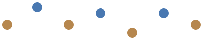

# Scatter

Scatter charts render data points where each point is represented by a marker.

## Baseline and Style Kinds

The scatter series can render various markers differently, which is specified using the [MarkerStyleKinds](xref:@ActiproUIRoot.Controls.MicroCharts.Primitives.MicroXYSeriesBase.MarkerStyleKinds) property.  Supported options include `First`, `Last`, `High`, `Low`, `Negative`, or any combination of those values.

In the following example, the data rendered by the chart uses the index postion along the X-axis and the fixed values `10, 25, 10, 20, 5, 20, 10` for the Y-axis.  The first image shows the series using `5` as the minimum value along the Y-axis, and `25` for the maximum.

If we include the `First` and `Last` flags, then the first and last markers will render slightly different from the other markers.

If we include the `High` and `Low` flags, then the markers associated with the data points with the highest and lowest value will render using a distinct style/brush.

The chart's baseline value, as specified by the [MicroXYChart](xref:@ActiproUIRoot.Controls.MicroCharts.MicroXYChart).[AxisBaselineValue](xref:@ActiproUIRoot.Controls.MicroCharts.MicroXYChart.AxisBaselineValue) property, can be used to indicate which markers are considered "negative".  If we explicitly set our baseline value to `15`, then any values below the baseline will be considered "negative".  The default baseline for numeric values is `0`, and for date/time values it is `DateTime.MinValue`.  If we include the `Negative` flags, then the markers associated with the data points whose value is less than `15` will render using a distinct style/brush.

The normal style can be customized using the [MarkerStyle](xref:@ActiproUIRoot.Controls.MicroCharts.Primitives.MicroXYSeriesBase.MarkerStyle) property, and negative style can be customized using the [MarkerNegativeStyle](xref:@ActiproUIRoot.Controls.MicroCharts.Primitives.MicroXYSeriesBase.MarkerNegativeStyle) property.  Similarly, the first, last, high, and low markers can be styled using the [MarkerFirstStyle](xref:@ActiproUIRoot.Controls.MicroCharts.Primitives.MicroXYSeriesBase.MarkerFirstStyle), [MarkerLastStyle](xref:@ActiproUIRoot.Controls.MicroCharts.Primitives.MicroXYSeriesBase.MarkerLastStyle), [MarkerHighStyle](xref:@ActiproUIRoot.Controls.MicroCharts.Primitives.MicroXYSeriesBase.MarkerHighStyle), and [MarkerLowStyle](xref:@ActiproUIRoot.Controls.MicroCharts.Primitives.MicroXYSeriesBase.MarkerLowStyle), respectively.  The associated `Style` should target the [MicroChartMarker](xref:@ActiproUIRoot.Controls.MicroCharts.MicroChartMarker) type, which includes properties such as `Fill`, `Stroke`, `StrokeThickness`, and `ShapeKind`.

## Marker Shape Kinds

Markers support several built in shape kinds, which include:

| Kind | Example |
|-----|-----|
| Diamond |  |
| Ellipse |  |
| Hexagon |  |
| Pentagon |  |
| Octagon |  |
| Rectangle |  |
| RoundedRectangle |  |
| Star4Points |  |
| Star5Points |  |
| Star6Points |  |
| Star8Points |  |
| Triangle |  |
