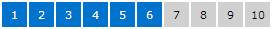

# Segment

A segment chart provides a visual representation of an integer value in relation to a total number.  Each segment in the chart is rendered as highlighted or unhighlighted.  For instance, if the value is 3 of 10, there will be 10 total segments displayed, with the first 3 rendering as highlighted.


This sort of chart is great for use on dashboards, and also as an indicator of steps or progress achieved.

The style for the segments can be customized, allowing for any sort of shape, size, or color combination.  The Panel used to render the chart can also be set, enabling wrapping and other layout scenarios.

Value converters can be used to further customize the brush or size of each segment to create some interesting effects.

## Basic Usage

It's easy to use the [MicroSegmentChart](xref:ActiproSoftware.Windows.Controls.MicroCharts.MicroSegmentChart) control.  Simply set its [Total](xref:ActiproSoftware.Windows.Controls.MicroCharts.MicroSegmentChart.Total) property to the total number of segments that should be displayed.  Then bind the [Value](xref:ActiproSoftware.Windows.Controls.MicroCharts.MicroSegmentChart.Value) property to a value indicating the number of segments that should be highlighted.  This value should be less than or equal to the total segment count.

```xaml
<microcharts:MicroSegmentChart Total="5" Value="{Binding CurrentValue}" />
```

## Appearance Customization

The [MicroSegmentChart](xref:ActiproSoftware.Windows.Controls.MicroCharts.MicroSegmentChart) control can easily be customized to render segments in many interesting ways.

### Size and Shape

This code shows how to make red 13x13 squares with a 1px margin:

```xaml
<microcharts:MicroSegmentChart Value="7" Total="10">
	<microcharts:MicroSegmentChart.ItemContainerStyle>
		<Style TargetType="microcharts:MicroSegmentChartItem">
			<Setter Property="HighlightedBackground" Value="#e73232" />
			<Setter Property="Margin" Value="1" />
			<Setter Property="MinHeight" Value="13" />
			<Setter Property="MinWidth" Value="13" />
		</Style>
	</microcharts:MicroSegmentChart.ItemContainerStyle>
</microcharts:MicroSegmentChart>
```


This code shows how to customize the chart template to create the purple circles seen above:

```xaml
<microcharts:MicroSegmentChart Value="5" Total="15" HorizontalAlignment="Left">
	<microcharts:MicroSegmentChart.ItemContainerStyle>
		<Style TargetType="microcharts:MicroSegmentChartItem">
			<Setter Property="Background" Value="#d0d0d0" />
			<Setter Property="HighlightedBackground" Value="#9e5aac" />
			<Setter Property="MinHeight" Value="15" />
			<Setter Property="MinWidth" Value="15" />
			<Setter Property="Template">
				<Setter.Value>
					<ControlTemplate TargetType="microcharts:MicroSegmentChartItem">

						<Ellipse x:Name="background" Fill="{TemplateBinding Background}" />
	
						<ControlTemplate.Triggers>
							<Trigger Property="IsHighlighted" Value="True">
								<Setter TargetName="background" Property="Fill" Value="{Binding RelativeSource={RelativeSource TemplatedParent}, Path=HighlightedBackground}" />
							</Trigger>
						</ControlTemplate.Triggers>
					</ControlTemplate>
				</Setter.Value>
			</Setter>
		</Style>
	</microcharts:MicroSegmentChart.ItemContainerStyle>
</microcharts:MicroSegmentChart>
```

### Segment Number Display



Each segment is passed its number as the data context.  This allows the segment number to be rendered in the segment via custom templates.

```xaml
<microcharts:MicroSegmentChart Value="6" Total="10" HorizontalAlignment="Left">
	<microcharts:MicroSegmentChart.ItemContainerStyle>
		<Style TargetType="microcharts:MicroSegmentChartItem">
			<Setter Property="Background" Value="#d0d0d0" />
			<Setter Property="Foreground" Value="#000000" />
			<Setter Property="HighlightedBackground" Value="#0073cd" />
			<Setter Property="MinHeight" Value="25" />
			<Setter Property="MinWidth" Value="25" />
			<Setter Property="Template">
				<Setter.Value>
					<ControlTemplate TargetType="microcharts:MicroSegmentChartItem">

						<Border x:Name="background" Background="{TemplateBinding Background}" BorderBrush="{TemplateBinding BorderBrush}"
								BorderThickness="{TemplateBinding BorderThickness}" Padding="{TemplateBinding Padding}">
							<TextBlock x:Name="text" Text="{Binding}" Foreground="{TemplateBinding Foreground}" HorizontalAlignment="Center" VerticalAlignment="Center" />
						</Border>
							
						<ControlTemplate.Triggers>
							<Trigger Property="IsHighlighted" Value="True">
								<Setter TargetName="background" Property="Background" Value="{Binding RelativeSource={RelativeSource TemplatedParent}, Path=HighlightedBackground}" />
								<Setter TargetName="text" Property="Foreground" Value="#ffffff" />
							</Trigger>
						</ControlTemplate.Triggers>
					</ControlTemplate>
				</Setter.Value>
			</Setter>
		</Style>
	</microcharts:MicroSegmentChart.ItemContainerStyle>
</microcharts:MicroSegmentChart>
```

### Alternate Panels


By setting a custom `ItemsPanel` property value, different backing `Panel` controls can be used.  In the screenshot above, we display 100 segments in a large square with this code:

```xaml
<microcharts:MicroSegmentChart Value="57" Total="100" HorizontalAlignment="Left">
	<microcharts:MicroSegmentChart.ItemContainerStyle>
		<Style TargetType="microcharts:MicroSegmentChartItem">
			<Setter Property="HighlightedBackground" Value="#26b106" />
			<Setter Property="Margin" Value="1" />
			<Setter Property="MinHeight" Value="8" />
			<Setter Property="MinWidth" Value="8" />
		</Style>
	</microcharts:MicroSegmentChart.ItemContainerStyle>
	<microcharts:MicroSegmentChart.ItemsPanel>
		<ItemsPanelTemplate>
			<toolkit:WrapPanel MaxWidth="100" />
		</ItemsPanelTemplate>
	</microcharts:MicroSegmentChart.ItemsPanel>
</microcharts:MicroSegmentChart>
```

### Changing Colors and Sizes Per Segment


Value converters can even be used to alter the color or size of individual segments, as in the screenshot above.  See the full sample in our samples project.

## Increment and Decrement Commands

The [MicroSegmentChart](xref:ActiproSoftware.Windows.Controls.MicroCharts.MicroSegmentChart) control has two `ICommand` properties that can be bound to any button to allow incrementing or decrementing of the [Value](xref:ActiproSoftware.Windows.Controls.MicroCharts.MicroSegmentChart.Value) property.

```xaml
<RepeatButton Margin="0,0,5,0" MinWidth="20" MinHeight="20" Content="-" Command="{Binding ElementName=commandedSegmentChart, Path=DecreaseCommand}" />
<microcharts:MicroSegmentChart x:Name="commandedSegmentChart" Value="3" Total="10" />
<RepeatButton Margin="5,0,0,0" MinWidth="20" MinHeight="20" Content="+" Command="{Binding ElementName=commandedSegmentChart, Path=IncreaseCommand}" />
```
