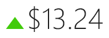

# Trend Indicator

The trend indicator is a three state control that is intended to reflect whether a numeric value is higher, the same as, or lower than an origin value.



This sort of element is commonly used in stock value display where the origin value is bound to the previous day's stock price, and the value is bound to the current price.  The trend indicator then renders an upward green triangle if there was positive movement, a gray line if no change, or a red triangle if there was negative movement.

If the values are updating live, the indicator changes use a pleasing animation that rotates and fades in the new indicator.  The template for each state's indicator can be customized as well.

## Basic Usage

Simply bind the control's [OriginValue](xref:@ActiproUIRoot.Controls.MicroCharts.MicroTrendIndicator.OriginValue) property to the original value (or previous value) and the [Value](xref:@ActiproUIRoot.Controls.MicroCharts.MicroTrendIndicator.Value) property to the current value.  The control will animate and display one of three indicator templates.

```xaml
<microcharts:MicroTrendIndicator OriginValue="{Binding OriginValue}" Value="{Binding CurrentValue}" />
```

## Appearance Customization

The [MicroTrendIndicator](xref:@ActiproUIRoot.Controls.MicroCharts.MicroTrendIndicator) control can display custom indicator templates for each of its three states.

This code alters the indicator templates to all use circles:

```xaml
<microcharts:MicroTrendIndicator OriginValue="7" Value="10">
	<microcharts:MicroTrendIndicator.HigherTemplate>
		<DataTemplate>
			<Ellipse Fill="#42cb0c" />
		</DataTemplate>
	</microcharts:MicroTrendIndicator.HigherTemplate>
	<microcharts:MicroTrendIndicator.NeutralTemplate>
		<DataTemplate>
			<Ellipse Fill="#808080" />
		</DataTemplate>
	</microcharts:MicroTrendIndicator.NeutralTemplate>
	<microcharts:MicroTrendIndicator.LowerTemplate>
		<DataTemplate>
			<Ellipse Fill="#cb0c0c" />
		</DataTemplate>
	</microcharts:MicroTrendIndicator.LowerTemplate>
</microcharts:MicroTrendIndicator>
```
