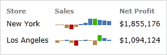

# Overview

Actipro Micro Charts are a special form of chart that are meant to be used in small spaces, to help visualize quantitative data.  Use micro charts to quickly convey data and trends in your custom dashboards, reports, and grids.

*Sample sales illustrated using two bar series*

Actipro Micro Charts makes it easy to generate charts based on any custom data source.  It will automatically calculate the best scales to fit the data into the control, or you can customize the scales as needed.  It includes support for aggregation of large data sets to improve performance and readability, highlighting ranges or key data points, and much more.

Several types of charts are supported, which include Area, Bar, Line, Scatter, Win/Loss, and Heat Map.  Stacked and 100% stacked variations of area and bar charts are available as well.

## Features

### Chart Types

- [Area](chart-types/area.md)
  
  - Includes support for spline curves and stepped lines.
  - Highlight values below the baseline using custom styles.
  - Optionally display a line along the series.
  - Optionally display markers to highlight data points.
  - Easily apply alternate marker styles for first, last, high, low, and negative data points.

- [Bar](chart-types/bar.md)
  
  - Quickly customize the spacing between the bars to fit your needs.
  - Easily apply alternate bar styles for high, low, and negative data points.

- [Line](chart-types/line.md)
  
  - Includes support for spline curves and stepped lines.
  - Highlight values below the baseline using custom styles.
  - Optionally display markers to highlight data points.
  - Easily apply alternate marker styles for first, last, high, low, and negative data points.

- [Scatter](chart-types/scatter.md)
  
  - Easily apply alternate marker styles for first, last, high, low, and negative data points.

- [Win/Loss](chart-types/winloss.md)
  
  - Quickly customize the spacing between the bars to fit your needs.
  - Easily apply alternate bar styles for high, low, and negative data points.

- [Bullet Graph](chart-types/bullet-graph.md)
  
  - Compare a data value to a target or goal and a future projection.
  - Put data into the context of several qualitative ranges.

- [Box Plot](chart-types/box-plot.md)
  
  - Display the distribution of a set of values.
  - Identify the outliers and extreme values of a data set.

- [Candlestick](chart-types/candlestick.md)
  
  - Visualize price movements over time.
  - Track the status of stocks, currency values, or securities.

- [Heat Map](chart-types/heat-map.md)
  
  - Use color and/or size changing markers to represent data.

- [Segment](chart-types/segment.md)
  
  - Visualizes an integer value in relation to a total number.
  - Use on dashboards, infographics, or as progress indicators.
  - Customizable color, size, shape, and layout.

- [Trend Indicator](chart-types/trend-indicator.md)
  
  - Uses three states to reflect whether a numeric value is higher, the same as, or lower than an origin value.

### Data Source Features

- Supports displaying any numeric and date/time values from custom data sources.
- Data can be automatically aggregated to reduce the number of data points rendered.

### Appearance Features

- Combine any number of different series into a single chart.
- Supports stacking multiple series, both normally and using 100% scale.
- Customizable baseline value, which dictates which values are considered 'negative', and optional display of baseline.
- Customizable minimum and maximum values of each axis for fixed scales.
- Add horizontal or vertical ranges, which are used to highlight specific data ranges.
- Support for a hot-tracking tool tip, which allows the end user to hover over the chart and read the associated value.
- Easily customize the various brushes used to render charts via palettes and palette selectors.
- Set the visibility of any series to dictate whether or not it is rendered on the chart.
- Over 10 built-in palettes.

*This product is written in 100% pure C#, and includes detailed documentation and samples.*
