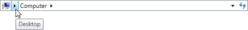

# Auto-Minimize

The [Breadcrumb](xref:@ActiproUIRoot.Controls.Navigation.Breadcrumb) control can be configured to automatically minimize any number of items, not including the selected item. By default, only the root item is minimized when it is no longer selected.

*The Breadcrumb control using the Aero theme with the Desktop item minimized*

## Setting Auto Minimize Count

The number of items automatically minimized is controlled by the [Breadcrumb](xref:@ActiproUIRoot.Controls.Navigation.Breadcrumb).[AutoMinimizeItemCount](xref:@ActiproUIRoot.Controls.Navigation.Breadcrumb.AutoMinimizeItemCount) property. This number counts down from the top of the hierarchy and can include [tail items](tail-items.md). The selected item is never minimized, but is counted. Therefore, this count can also be thought of as the level in the hierarchy tree.

For example, if [AutoMinimizeItemCount](xref:@ActiproUIRoot.Controls.Navigation.Breadcrumb.AutoMinimizeItemCount) is set to `2` then only the root item and its direct children are ever eligible for minimization.

## Customizing Minimized Items

By default, minimized items will only show the popup indicator button, but this look can be fully customized using the [Breadcrumb](xref:@ActiproUIRoot.Controls.Navigation.Breadcrumb).[ItemMinimizedTemplate](xref:@ActiproUIRoot.Controls.Navigation.Breadcrumb.ItemMinimizedTemplate) property.

Typically, all minimized items in the [Breadcrumb](xref:@ActiproUIRoot.Controls.Navigation.Breadcrumb) would use the template defined in [Breadcrumb](xref:@ActiproUIRoot.Controls.Navigation.Breadcrumb).[ItemMinimizedTemplate](xref:@ActiproUIRoot.Controls.Navigation.Breadcrumb.ItemMinimizedTemplate).  But, it is possible to override this template at various points in the hierarchy by setting the [BreadcrumbItem](xref:@ActiproUIRoot.Controls.Navigation.BreadcrumbItem).[ItemMinimizedTemplate](xref:@ActiproUIRoot.Controls.Navigation.BreadcrumbItem.ItemMinimizedTemplate) property to a different template.

## Associated Members

The following [Breadcrumb](xref:@ActiproUIRoot.Controls.Navigation.Breadcrumb) members are associated with auto-minimizing:

| Member | Description |
|-----|-----|
| [AutoMinimizeItemCount](xref:@ActiproUIRoot.Controls.Navigation.Breadcrumb.AutoMinimizeItemCount) Property | Gets or sets the number of items that will be automatically minimized, starting from root item. |
| [ItemMinimizedTemplate](xref:@ActiproUIRoot.Controls.Navigation.Breadcrumb.ItemMinimizedTemplate) Property | Gets or sets the `DataTemplate` used to display each minimized item in the trail. |
| [ItemMinimizedTemplateSelector](xref:@ActiproUIRoot.Controls.Navigation.Breadcrumb.ItemMinimizedTemplateSelector) Property | Gets or sets the custom logic for choosing a template used to display each minimized item in the trail. |

The following [BreadcrumbItem](xref:@ActiproUIRoot.Controls.Navigation.BreadcrumbItem) members are associated with auto-minimizing:

| Member | Description |
|-----|-----|
| [IsMinimized](xref:@ActiproUIRoot.Controls.Navigation.BreadcrumbItem.IsMinimized) Property | Gets a value indicating whether the item is minimized. |
| [ItemMinimizedTemplate](xref:@ActiproUIRoot.Controls.Navigation.BreadcrumbItem.ItemMinimizedTemplate) Property | Gets or sets the `DataTemplate` used to display each minimized item in the trail. |
| [ItemMinimizedTemplateSelector](xref:@ActiproUIRoot.Controls.Navigation.BreadcrumbItem.ItemMinimizedTemplateSelector) Property | Gets or sets the custom logic for choosing a template used to display each minimized item in the trail. |
