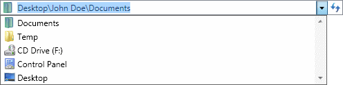

# Edit Mode

The [Breadcrumb](xref:@ActiproUIRoot.Controls.Navigation.Breadcrumb) control supports an edit mode, in which the user can manually type a new path or select an item from a drop-down list. The edit mode is supported using an embedded `ComboBox`, whose drop-down items can be fully customized. Typically, this list would include recently selected items and/or favorite items.

The user can enter edit mode by:

- Pressing the <kbd>Space</kbd> key when the breadcrumb has the keyboard focus

- Clicking on the icon on the left

- Clicking in the empty space on the right

- Opening the drop-down list

The user can exit edit mode by:

- Pressing the <kbd>Enter</kbd> key when the text box has the keyboard focus

- Pressing the <kbd>Esc</kbd> key when the text box has the keyboard focus (**any changes will be discarded**)

- Selecting an item from the drop-down list

- Moving focus away from the [Breadcrumb](xref:@ActiproUIRoot.Controls.Navigation.Breadcrumb) control (**any changes will be discarded**)

*The Breadcrumb control using the Aero theme in edit mode and drop-down list open*

## Disabling Edit Mode

The edit mode can be disabled by setting the [IsEditable](xref:@ActiproUIRoot.Controls.Navigation.Breadcrumb.IsEditable) property to `false`. When the edit mode is disabled, the drop-down list is hidden and the user cannot directly enter a path.

## Populating the Drop-Down List

The embedded combo box drop-down list is populated using the [ComboBoxItemsSource](xref:@ActiproUIRoot.Controls.Navigation.Breadcrumb.ComboBoxItemsSource) property. This property can be set in the same manner as the `ComboBox.ItemsSource` property.

> [!NOTE]
> Logic to convert a combo box item to a trail must be provided. See the [Item Conversion](item-conversion.md) topic for more information.

## Associated Members

The following [Breadcrumb](xref:@ActiproUIRoot.Controls.Navigation.Breadcrumb) members are associated with edit mode:

| Member | Description |
|-----|-----|
| [ComboBoxIsReadOnly](xref:@ActiproUIRoot.Controls.Navigation.Breadcrumb.ComboBoxIsReadOnly) Property | Gets or sets a value that enables selection-only mode, in which the contents of the embedded combo box are selectable but not editable.  The default value is `false`. |
| [ComboBoxItemContainerStyle](xref:@ActiproUIRoot.Controls.Navigation.Breadcrumb.ComboBoxItemContainerStyle) Property | Gets or sets the `Style` that is applied to the `ComboBoxItem` elements generated for items in the embedded combo box.  The default value is `null`. |
| [ComboBoxItemContainerStyleSelector](xref:@ActiproUIRoot.Controls.Navigation.Breadcrumb.ComboBoxItemContainerStyleSelector) Property | Gets or sets custom logic for choosing a `Style` that can be applied to `ComboBoxItem` elements generated by the embedded combo box.  The default value is `null`. |
| [ComboBoxItemsSource](xref:@ActiproUIRoot.Controls.Navigation.Breadcrumb.ComboBoxItemsSource) Property | Gets or sets a collection used to generate the content of the embedded combo box.  The default value is `null`. |
| [ComboBoxItemTemplate](xref:@ActiproUIRoot.Controls.Navigation.Breadcrumb.ComboBoxItemTemplate) Property | Gets or sets the `DataTemplate` used to display each item in the embedded combo box.  The default value is `null`. |
| [ComboBoxItemTemplateSelector](xref:@ActiproUIRoot.Controls.Navigation.Breadcrumb.ComboBoxItemTemplateSelector) Property | Gets or sets the custom logic for choosing a template used to display each item in the embedded combo box.  The default value is `null`. |
| [ComboBoxStaysOpenOnEdit](xref:@ActiproUIRoot.Controls.Navigation.Breadcrumb.ComboBoxStaysOpenOnEdit) Property | Gets or sets whether the drop-down control for the embedded combo box will remain open when a user clicks the text area.  The default value is `false`. |
| [IsEditable](xref:@ActiproUIRoot.Controls.Navigation.Breadcrumb.IsEditable) Property | Gets or sets a value indicating whether the breadcrumb control can enter edit mode.  The default value is `true`. |
| [IsEditing](xref:@ActiproUIRoot.Controls.Navigation.Breadcrumb.IsEditing) Property | Gets or sets a value indicating whether the breadcrumb control is currently in edit mode.  The default value is `false`. |
