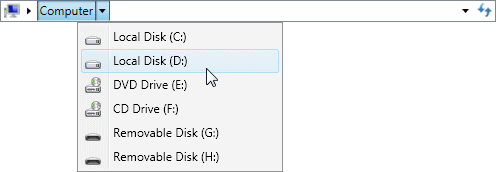
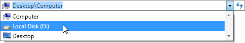

# Item Selection

The [Breadcrumb](xref:ActiproSoftware.Windows.Controls.Navigation.Breadcrumb) control allows a single item from a hierarchy of data to be selected. The selection can be change interactively using the keyboard or mouse, or programmtically by setting various properties.

## Interactive Selection

The user can navigate down the hierarchy using the drop-down menus provided by items with children. This menu can be opened using the mouse, or by pressing the `Down` key when the associated item has the keyboard focus.

*The Breadcrumb control using the Aero theme showing the menu for the Computer item*

The user can navigate directly to any visible item by clicking the associated item, or by pressing the `Enter` key when the associated item has the keyboard focus.

*The Breadcrumb control using the Aero theme showing Computer item*

The user can enter the path of an item to select when in [edit mode](edit-mode.md).

*The Breadcrumb control using the Aero theme in edit mode*

The user can select and item or path from the [drop-down list](edit-mode.md).

*The Breadcrumb control using the Aero theme showing the drop-down list*

## Programmatic Selection

The selected item can be changed by setting the [Breadcrumb](xref:ActiproSoftware.Windows.Controls.Navigation.Breadcrumb).[SelectedItem](xref:ActiproSoftware.Windows.Controls.Navigation.Breadcrumb.SelectedItem) or [Breadcrumb](xref:ActiproSoftware.Windows.Controls.Navigation.Breadcrumb).[SelectedPath](xref:ActiproSoftware.Windows.Controls.Navigation.Breadcrumb.SelectedPath) properties.

Note that for these features to work when using data items, you will need to support [item conversion](item-conversion.md) so that the Breadcrumb control knows how to obtain a trail.
