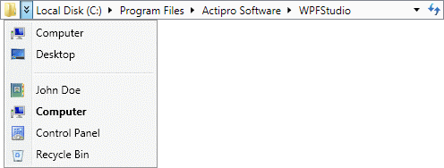

# Overflow

When the width of the [Breadcrumb](xref:ActiproSoftware.Windows.Controls.Navigation.Breadcrumb) control is not large enough to display all of the visible items, any non-selected items will be automatically hidden, or overflowed.

*The Breadcrumb control using the Aero theme with the overflow button visible and open*

## Overflow Rules

[Tail items](tail-items.md), or items below the selected item, will be the first items to be hidden. Hidden tail items can still be accessed through the menu on the last visible item.

Head items, or items above the selected item, will be hidden next. When this occurs, an overflow chevron button appears at the left side of the [Breadcrumb](xref:ActiproSoftware.Windows.Controls.Navigation.Breadcrumb) control. The overflow button shows a menu which provides access to the hidden head items. In addition, the child items of the [RootItem](xref:ActiproSoftware.Windows.Controls.Navigation.Breadcrumb.RootItem) are shown in a separate section at the bottom of this menu.

> [!NOTE]
> See the [Context Menus](context-menus.md) topic for information on how you can customize the menus shown by the `Breadcrumb` control.

After all non-selected items have been overflowed, the selected item will begin to dynamically size smaller as needed.

## Associated Members

The following [Breadcrumb](xref:ActiproSoftware.Windows.Controls.Navigation.Breadcrumb) members are associated with overflowing:

| Member | Description |
|-----|-----|
| [IsOverflowButtonVisible](xref:ActiproSoftware.Windows.Controls.Navigation.Breadcrumb.IsOverflowButtonVisible) Property | Gets a value indicating whether the overflow button is visible. |

The following [BreadcrumbItem](xref:ActiproSoftware.Windows.Controls.Navigation.BreadcrumbItem) members are associated with overflowing:

| Member | Description |
|-----|-----|
| [IsOverflowed](xref:ActiproSoftware.Windows.Controls.Navigation.BreadcrumbItem.IsOverflowed) Property | Gets a value indicating whether this item has been moved to the overflow button because of limited space in the breadcrumb control. |
