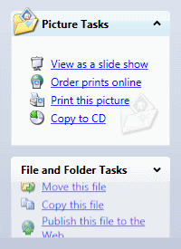

# Expanding/Collapsing Panes

ExplorerBar is a vertical stack of expander pane items.  The pane items inherit the native WPF `Expander` control but are styled by ExplorerBar to have the Windows task bar appearance.

## Animated Expanding/Collapsing Panes

You can expand or collapse expander panes simply by clicking on their headers.

*The ExplorerBar control with its second pane being expanded with animated fade in and slide down*

When expanding, the pane's content slides down and fades in.  When collapsing, the pane's content slides up and fades out.  These affects provide a very pleasing, yet subtle, effect.

## Changing Animation Durations

If your `Expander` items are instances of [AnimatedExpander](xref:@ActiproUIRoot.Controls.AnimatedExpander) (which inherits `Expander`), you can specify the [ExpandDuration](xref:@ActiproUIRoot.Controls.AnimatedExpander.ExpandDuration) and [CollapseDuration](xref:@ActiproUIRoot.Controls.AnimatedExpander.CollapseDuration) times.

## Only Allowing a Single Pane to be Expanded

You can optionally set the [ExplorerBar](xref:@ActiproUIRoot.Controls.Navigation.ExplorerBar).[CanExpandMultiple](xref:@ActiproUIRoot.Controls.Navigation.ExpanderBar.CanExpandMultiple) to `false` to make ExplorerBar only allow one pane to be expanded at a time.  In this mode, if the end user tries to expand another pane, the currently-expanded pane will collapse.

## Overflow

When the combined height of the expander panes exceeds the height of the ExplorerBar, a vertical scrollbar is automatically added, allowing you to scroll to hidden panes.
