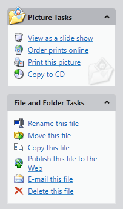

# Overview

Actipro Navigation is a control suite that includes NavigationBar, ExplorerBar, Breadcrumb, and ZoomContentControl controls, along with styles for animated Expander controls.

### NavigationBar

NavigationBar provides a facility for navigating through different panes of data.  This concept was introduced in Outlook, and NavigationBar implements all of the features found in Office.  It has an elegant user interface which uses buttons to control which navigation pane is selected. Panes can display data or simply act as a container for child controls.

*The NavigationBar control*

If screen real estate is available, large buttons can be used for pane selection.  The end-user has the option of using a splitter to move the large buttons into the overflow button tray, which uses smaller buttons. If not all of the buttons can fit in that tray, they flow out into the overflow menu, accessible by the chevron button.

The NavigationBar can also be minimized, so that its selected pane's content can be displayed in a popup by clicking a button.

End user layout customizations can be persisted in XML format and restored later.

### ExplorerBar

Explorer bar is an implementation of the task bar that was introduced in Windows XP's explorer.  It hosts a vertical stack of expandable panes that generally provide task-based information to the end user.

*The ExplorerBar control*

Each expander pane uses smooth animation to fade in and slide down its contents when expanded.  Likewise, when an expander pane is collapsed, its contents fade out and slide back up.  Any content can be placed within each expander pane and the alternate style of pane headers is supported via a simple style setting.

### Breadcrumb

Breadcrumb is an implementation of the breadcrumb that was introduced in Windows Vista's explorer. It can be used to select a single item from hierarchical data, much like a TreeView but requiring less screen real estate.

*The Breadcrumb control in its Aero normal-color theme*

Hierarchical data can be navigated using the buttons and menus available for each item, or the user can manually enter a new path or select an item from the drop-down list. If not all of the items can fit in control, they flow out into an overflow menu, accessible by a chevron button.

The progress of long running operations can be presented to the user via an embedded progress bar in the Breadcrumb control.  In addition, any number of custom action buttons can be added to the right side.

### ZoomContentControl

ZoomContentControl allows any content to be interactively zoomed and scrolled using customizable mouse and keyboard behaviors.  Includes an optional built-in view control pane, which can be used to zoom or pan the content and collapsed when not needed.  Numerous methods, properties, and commands are provided which can be used to programmatically zoom/pan the display.

*The ZoomContentControl control showing some custom content*

## Features

### Breadcrumb Features

- Duplicates all functionality found in the Windows Vista explorer breadcrumb control.
- Multiple built-in themes.
- Allows the [selected item](breadcrumb-features/item-selection.md) to be set using numerous methods.
- Includes an [edit mode](breadcrumb-features/edit-mode.md), which allows the selected path to be modified directly.
- Fully customizable [drop-down list](breadcrumb-features/edit-mode.md), which can contain recent items, favorite items, or any other custom items.
- [Auto-minimizes](breadcrumb-features/auto-minimize.md) any number of non-selected items.
- [Hides](breadcrumb-features/overflow.md) items when the selected trail cannot fit into the current width of the control.
- Integrated [progress bar](breadcrumb-features/progressbar.md), which is displayed in the background.
- Support for [tail items](breadcrumb-features/tail-items.md), which allow for faster navigation down the hierarchy.
- Support for custom [action buttons](breadcrumb-features/action-buttons.md) shown on the right side of the control.
- Support for [HierarchicalDataTemplate](breadcrumb-features/hierarchical-data.md).

### ExplorerBar Features

- Duplicates all functionality found in the Windows XP explorer bar.
- Multiple built-in themes.
- Displays a vertical list of expanders that use [animation to fade and slide](explorerbar-features/expand-collapse.md) when expanding/collapsing.
- Optionally only allow [one expander to be expanded at a time](explorerbar-features/expand-collapse.md).
- [Alternate style](explorerbar-features/headers-and-content.md) can be applied to an individual expander to give it emphasis.
- Place [text and images](explorerbar-features/headers-and-content.md) in expander headers.
- Vertical scrollbar automatically added when expanders exceed container height.

### NavigationBar Features

- Duplicates all functionality found in the Office navigation bar.
- Multiple built-in themes.
- Buttons provide [single-click access to each pane](navigationbar-features/pane-buttons-and-selection.md).
- Buttons can be [collapsed to an overflow area](navigationbar-features/pane-buttons-and-selection.md), allowing for more client area real estate.
- [Entire bar may be minimized](navigationbar-features/minimization.md), with a button that can be clicked to display a popup containing the selected pane's content.
- [Minimize to both left and right sides](navigationbar-features/minimization.md).
- [Customize button](navigationbar-features/customize-button.md) provides access to customization features and hidden buttons.
- Ability to [alter the menu](navigationbar-features/customize-button.md) displayed by the customize button.
- Built-in [Navigation Bar Options](navigationbar-features/options-window.md) dialog for reordering buttons and controlling which buttons are visible.
- [Automated reset button order](navigationbar-features/options-window.md) functionality.
- Support for [large and small image sizes](navigationbar-features/pane-buttons-and-selection.md).
- Ability to [disable specific pane buttons](navigationbar-features/pane-buttons-and-selection.md).
- Optionally [hide pane buttons](navigationbar-features/hiding-pane-buttons.md) to use as a headered container.
- [Persist end user layout customizations](navigationbar-features/layout-serialization.md) to XML.

### ZoomContentControl Features

- Adds [zooming and panning](zoomcontentcontrol-features/view-manipulation.md) capabilities to the native WPF ContentControl.
- Supports [smooth animations](zoomcontentcontrol-features/view-manipulation.md) when zooming and panning.
- Vertical and horizontal [scrollbars](zoomcontentcontrol-features/view-manipulation.md) can be used for panning or hidden.
- [Mouse and keyboard behavior](zoomcontentcontrol-features/input-bindings.md) can be easily customized using standard WPF input bindings.
- Built-in support for [numerous commands](zoomcontentcontrol-features/view-manipulation.md) with associated mouse cursors.
- Exposes several [methods and properties](zoomcontentcontrol-features/view-manipulation.md) that can be used to manipulate the view.
- Includes an optional standard [view control pane](zoomcontentcontrol-features/view-control-pane.md) that can be used to zoom and pan the view.
- Standard view control pane is [collapsable](zoomcontentcontrol-features/view-control-pane.md) or it can be fixed.
- Add [custom buttons](zoomcontentcontrol-features/view-control-pane.md) to the horizontal bar of the view control pane.
- Built-in [styles](zoomcontentcontrol-features/view-control-pane.md) for use with various button controls that match the view control pane look.
- Support for custom [overlay elements](zoomcontentcontrol-features/overlays.md) which can be anchored, but not zoomed.

### Layout, Globalization, and Accessibility Features

- Right-to-left support is fully integrated for languages such as Hebrew or Arabic.
- All text properties use localization attributes, and string resources may be customized.
- Follows the WPF accessibility model for UI automation.

*This product is written in 100% pure C#, and includes detailed documentation and samples.*
