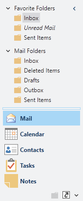

# Header Area

This topic covers the options available for the NavigationBar header area.

*The NavigationBar control with header hidden*

## Hiding the Header Area

The header area can be completely hidden, with the exception of the minimize button, by setting [NavigationBar](xref:@ActiproUIRoot.Controls.Navigation.NavigationBar).[IsHeaderVisible](xref:@ActiproUIRoot.Controls.Navigation.NavigationBar.IsHeaderVisible) to `false`. This mimics the look seen in the Office products, where the minimize button overlays the content area.  The default value for this property is `true`.

## Hiding the Header Content

The header content can be hidden by setting [NavigationBar](xref:@ActiproUIRoot.Controls.Navigation.NavigationBar).[IsHeaderContentVisible](xref:@ActiproUIRoot.Controls.Navigation.NavigationBar.IsHeaderContentVisible) to `false`. This allows the minimize button to be displayed separately from it's content, while still hiding the header text.  The default value for this property is `true`.
