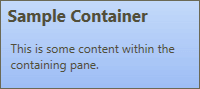

# Hiding Pane Buttons

The [NavigationBar](xref:ActiproSoftware.Windows.Controls.Navigation.NavigationBar) control can optionally hide its pane buttons, allowing it to be used as a simple headered container with the styles that match a "normal" looking NavigationBar.

*A NavigationBar control in the Luna normal-color theme containing a single pane, and with pane buttons hidden*

To achieve this effect, set the [ArePanesVisible](xref:ActiproSoftware.Windows.Controls.Navigation.NavigationBar.ArePanesVisible) to `false`.  Be sure to set [IsMinimizable](xref:ActiproSoftware.Windows.Controls.Navigation.NavigationBar.IsMinimizable) to `false` as well.

If you are using Office 2010 themes, also set the `BorderThickness` propery to `1` (since there is no border by default in those themes) and [IsHeaderContentVisible](xref:ActiproSoftware.Windows.Controls.Navigation.NavigationBar.IsHeaderContentVisible) to `true` (since header content is not displayed by default in those themes).

> [!NOTE]
> The appearance of the [NavigationBar](xref:ActiproSoftware.Windows.Controls.Navigation.NavigationBar) in this mode depends on the theme that is currently active.
