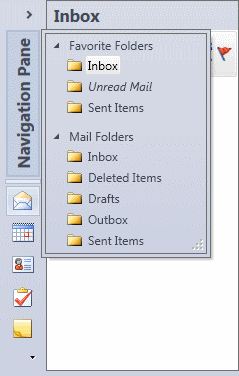

# Minimization

The NavigationBar supports a minimized mode in which it is collapsed to be very narrow.  A button appears in the original content area of the NavigationBar and when clicked, a popup displays containing the content of the currently-selected pane.

*A minimized NavigationBar control with its content popup displayed*

## Related Members

The [NavigationBar](xref:@ActiproUIRoot.Controls.Navigation.NavigationBar) has several members related to minimization:

<table>
<thead>

<tr>
<th>Member</th>
<th>Description</th>
</tr>

</thead>
<tbody>

<tr>
<td>

[Expanded](xref:@ActiproUIRoot.Controls.Navigation.NavigationBar.Expanded) Event

</td>
<td>

Occurs when the [IsMinimized](xref:@ActiproUIRoot.Controls.Navigation.NavigationBar.IsMinimized) property changes to `false`.

</td>
</tr>

<tr>
<td>

[IsMinimizable](xref:@ActiproUIRoot.Controls.Navigation.NavigationBar.IsMinimizable) Property

</td>
<td>

Gets or sets whether the navigation bar can be minimized.  The default value is `true`.

</td>
</tr>

<tr>
<td>

[IsMinimized](xref:@ActiproUIRoot.Controls.Navigation.NavigationBar.IsMinimized) Property

</td>
<td>

Gets or sets whether the navigation bar is currently minimized.  The default value is `false`.

</td>
</tr>

<tr>
<td>

[IsPopupEnabled](xref:@ActiproUIRoot.Controls.Navigation.NavigationBar.IsPopupEnabled) Property

</td>
<td>Gets or sets whether the navigation bar's minimized popup is currently enabled.</td>
</tr>

<tr>
<td>

[IsPopupOpen](xref:@ActiproUIRoot.Controls.Navigation.NavigationBar.IsPopupOpen) Property

</td>
<td>Gets or sets whether the navigation bar's minimized popup is currently displayed.</td>
</tr>

<tr>
<td>

[Minimized](xref:@ActiproUIRoot.Controls.Navigation.NavigationBar.Minimized) Event

</td>
<td>

Occurs when the [IsMinimized](xref:@ActiproUIRoot.Controls.Navigation.NavigationBar.IsMinimized) property changes to `true`.

</td>
</tr>

<tr>
<td>

[MinimizedTitle](xref:@ActiproUIRoot.Controls.Navigation.NavigationBar.MinimizedTitle) Property

</td>
<td>Gets or sets the title of the navigation bar when the navigation bar is minimized.</td>
</tr>

<tr>
<td>

[MinimizesLeftProperty](xref:@ActiproUIRoot.Controls.Navigation.NavigationBar.MinimizesLeftProperty) Property

</td>
<td>

Gets or sets whether the navigation bar minimizes to the left.  The default value is `true`.

Set this property to `false` when docking the navigation bar on the right side of its container.

</td>
</tr>

<tr>
<td>

[PopupClosed](xref:@ActiproUIRoot.Controls.Navigation.NavigationBar.PopupClosed) Event

</td>
<td>

Occurs when the [IsPopupOpen](xref:@ActiproUIRoot.Controls.Navigation.NavigationBar.IsPopupOpen) property changes to `false`.

</td>
</tr>

<tr>
<td>

[PopupOpened](xref:@ActiproUIRoot.Controls.Navigation.NavigationBar.PopupOpened) Event

</td>
<td>

Occurs when the [IsPopupOpen](xref:@ActiproUIRoot.Controls.Navigation.NavigationBar.IsPopupOpen) property changes to `true`.

</td>
</tr>

<tr>
<td>

[PopupResizeMode](xref:@ActiproUIRoot.Controls.Navigation.NavigationBar.PopupResizeMode) Property

</td>
<td>

Gets or sets a [ControlResizeMode](xref:@ActiproUIRoot.Controls.ControlResizeMode) that indicates the type of resizing that the popup performs.

The default value is `ControlResizeMode.Both`.

</td>
</tr>

</tbody>
</table>

The [NavigationPane](xref:@ActiproUIRoot.Controls.Navigation.NavigationPane) has several members related to minimization:

| Member | Description |
|-----|-----|
| [PopupPadding](xref:@ActiproUIRoot.Controls.Navigation.NavigationPane.PopupPadding) Property | Gets or sets the amount of padding added around the pane's content, when displayed in a popup.  The default value is `0,0,0,0`. |

## Preventing Minimization

When the [IsMinimizable](xref:@ActiproUIRoot.Controls.Navigation.NavigationBar.IsMinimizable) property is `false`, no minimize button will be visible in the NavigationBar's header.

## Changing the Popup Resize Mode

The [PopupResizeMode](xref:@ActiproUIRoot.Controls.Navigation.NavigationBar.PopupResizeMode) property lets you configure whether and how the minimized popup can be resized.
