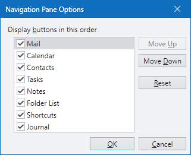

# Options Window

A built-in Options window comes packaged with NavigationBar.

*The NavigationBar control's built-in Options window*

The window offers the end-user the ability to reorder navigation pane buttons by using the Move Up and Move Down buttons.  Navigation pane buttons can also be hidden by unchecking the button items in the list.  The visibility and sort order can be reset back to defaults by clicking the Reset button.

## Showing the Options Window

The default overflow menu has a menu item for displaying the Options window.  This is executed via the [NavigationBarCommands](xref:@ActiproUIRoot.Controls.Navigation.NavigationBarCommands).[ShowOptionsWindow](xref:@ActiproUIRoot.Controls.Navigation.NavigationBarCommands.ShowOptionsWindow) command.

However you can manually show the Options window by calling [NavigationBar](xref:@ActiproUIRoot.Controls.Navigation.NavigationBar).[ShowOptionsWindow](xref:@ActiproUIRoot.Controls.Navigation.NavigationBar.ShowOptionsWindow*).

That method calls [GetOptionsWindow](xref:@ActiproUIRoot.Controls.Navigation.NavigationBar.GetOptionsWindow*) first to get a reference to an Options window instance.  By creating a class that inherits [NavigationBar](xref:@ActiproUIRoot.Controls.Navigation.NavigationBar) you can override that method to return any sort of custom `Window` that you'd like to use for the options.

The [NavigationBar](xref:@ActiproUIRoot.Controls.Navigation.NavigationBar).[Title](xref:@ActiproUIRoot.Controls.Navigation.NavigationBar.Title) property is what determines the title of the navigation bar that is displayed in Options window UI.

## Controlling Reset Button Functionality

The Reset button on the window is used to reset the panes to their original order and active state.  There are a couple properties on [NavigationPane](xref:@ActiproUIRoot.Controls.Navigation.NavigationPane) that the window uses to determine how to do this.

<table>
<thead>

<tr>
<th>Member</th>
<th>Description</th>
</tr>

</thead>
<tbody>

<tr>
<td>

[DefaultSortOrder](xref:@ActiproUIRoot.Controls.Navigation.NavigationPane.DefaultSortOrder) Property

</td>
<td>

Gets or sets the default sort order of the pane, that is used when the pane is reset in the options window.  The default value is `-1`.

Leave the value `-1` to have it auto-configured the first time the options window is displayed.

</td>
</tr>

<tr>
<td>

[DefaultVisibility](xref:@ActiproUIRoot.Controls.Navigation.NavigationPane.DefaultVisibility) Property

</td>
<td>

Gets or sets the default `Visibility` of the pane, that is used when the pane is reset in the options window.  The default value is `Visible`.

This property should match the initial setting of the `Visibility` property for the pane.

</td>
</tr>

</tbody>
</table>
