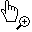
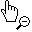

# Input Bindings

The [ZoomContentControl](xref:@ActiproUIRoot.Controls.Navigation.ZoomContentControl) supports interactive zooming and panning through the use of input bindings. This topic covers the default behavior, as well as how to customize the behavior.

## Mouse Gestures

The Windows Presentation Framework (WPF) includes support for defining input bindings on controls, through the `InputBindings` collection. This collection defines various gestures, which, when executed, will raise an associated command.

There are two native WPF gestures that can be used: `MouseGesture` and `KeyboardGesture`. `MouseGesture` encompasses actions like clicking (and double-clicking) mouse buttons, while `KeyboardGesture` captures pressing keys.  Both types support modifier keys, such as <kbd>Ctrl</kbd>, <kbd>Shift</kbd>, etc. This tells the gesture that the specified modifier key must be pressed when the gesture is performed for the associated command to be fired. For example, when using `MouseAction.LeftClick` with a modifier key of `ModifierKeys.Control`, then the associated command is only fired when the user clicks the left mouse button while holding down the <kbd>Ctrl</kbd> key.

The Shared Library adds an additional gesture that can bind mouse wheel actions to a command. [MouseWheelGesture](xref:@ActiproUIRoot.Input.MouseWheelGesture) supports positive or negative changes (i.e., up or down scrolling of the mouse wheel), and can also be used with the [ZoomContentControl](xref:@ActiproUIRoot.Controls.Navigation.ZoomContentControl).

There are several helper types that make defining a gesture easier via XAML, which include `KeyboardBinding`, `MouseBinding`, and [MouseWheelBinding](xref:@ActiproUIRoot.Input.MouseWheelBinding). Using these classes, the `Gesture` property can be set to a simple string value. For example, setting the `MouseBinding.Gesture` property to `"Control+LeftClick"` will automatically create the appropriate `MouseGesture`.

## Default Mouse Behavior

The [ZoomContentControl](xref:@ActiproUIRoot.Controls.Navigation.ZoomContentControl) includes several default input bindings that use `MouseGesture` and [MouseWheelGesture](xref:@ActiproUIRoot.Input.MouseWheelGesture) with one of the commands defined by [ZoomContentControlCommands](xref:@ActiproUIRoot.Controls.Navigation.ZoomContentControlCommands).

The following table lists the default `MouseGesture` bindings and their associated command.

| Gesture | Command |
|-----|-----|
| <kbd>Left Click</kbd> | [StartPanDrag](xref:@ActiproUIRoot.Controls.Navigation.ZoomContentControlCommands.StartPanDrag) |
| <kbd>Ctrl</kbd>+<kbd>Left Click</kbd> | [StartZoomIn](xref:@ActiproUIRoot.Controls.Navigation.ZoomContentControlCommands.StartZoomIn) |
| <kbd>Ctrl</kbd>+<kbd>Shift</kbd>+<kbd>Left Click</kbd> | [StartZoomOut](xref:@ActiproUIRoot.Controls.Navigation.ZoomContentControlCommands.StartZoomOut) |
| <kbd>Shift</kbd>+<kbd>Left Click</kbd> | [StartPanDrag](xref:@ActiproUIRoot.Controls.Navigation.ZoomContentControlCommands.StartPanDrag) |

The following table lists the default [MouseWheelGesture](xref:@ActiproUIRoot.Input.MouseWheelGesture) bindings and their associated command.

| Gesture | Command |
|-----|-----|
| <kbd>Positive Delta</kbd> | [LineUp](xref:@ActiproUIRoot.Controls.Navigation.ZoomContentControlCommands.LineUp) |
| <kbd>Negative Delta</kbd> | [LineDown](xref:@ActiproUIRoot.Controls.Navigation.ZoomContentControlCommands.LineDown) |
| <kbd>Shift</kbd>+<kbd>Positive Delta</kbd> | [LineLeft](xref:@ActiproUIRoot.Controls.Navigation.ZoomContentControlCommands.LineLeft) |
| <kbd>Shift</kbd>+<kbd>Negative Delta</kbd> | [LineRight](xref:@ActiproUIRoot.Controls.Navigation.ZoomContentControlCommands.LineRight) |
| <kbd>Ctrl</kbd>+<kbd>Positive Delta</kbd> | [ZoomInToPoint](xref:@ActiproUIRoot.Controls.Navigation.ZoomContentControlCommands.ZoomInToPoint) |
| <kbd>Ctrl</kbd>+<kbd>Negative Delta</kbd> | [ZoomOutFromPoint](xref:@ActiproUIRoot.Controls.Navigation.ZoomContentControlCommands.ZoomOutFromPoint) |
| <kbd>Ctrl</kbd>+<kbd>Shift</kbd>+<kbd>Positive Delta</kbd> | [ZoomInToPoint](xref:@ActiproUIRoot.Controls.Navigation.ZoomContentControlCommands.ZoomInToPoint) |
| <kbd>Ctrl</kbd>+<kbd>Shift</kbd>+<kbd>Negative Delta</kbd> | [ZoomOutFromPoint](xref:@ActiproUIRoot.Controls.Navigation.ZoomContentControlCommands.ZoomOutFromPoint) |

The default input bindings can be disabled by setting [AreDefaultInputBindingsEnabled](xref:@ActiproUIRoot.Controls.Navigation.ZoomContentControl.AreDefaultInputBindingsEnabled) to `false`. This allows the `InputBindings` to be completely customized from XAML.

## Mouse Cursor

The [ZoomContentControl](xref:@ActiproUIRoot.Controls.Navigation.ZoomContentControl) will automatically update its `Cursor` property based on the specified input bindings. Specifically, it looks for an input binding that uses a `MouseGesture` with a `MouseAction.LeftClick` action and specifies modifier keys that match the current key state.  For example, if the <kbd>Ctrl</kbd> key is currently pressed, then it will search for a `MouseGesture` with a `MouseAction.LeftClick` action and with `ModifierKeys.Control` defined.

If an input binding is found that matches the current state, then the cursor will be updated based on the specified command.  The following table lists the commands and their associated cursor.

| Command | Cursor |
|-----|-----|
| [CenterAndZoomInToPoint](xref:@ActiproUIRoot.Controls.Navigation.ZoomContentControlCommands.CenterAndZoomInToPoint) |  |
| [CenterAndZoomOutFromPoint](xref:@ActiproUIRoot.Controls.Navigation.ZoomContentControlCommands.CenterAndZoomOutFromPoint) |  |
| [CenterToPoint](xref:@ActiproUIRoot.Controls.Navigation.ZoomContentControlCommands.CenterToPoint) |  |
| [ResetView](xref:@ActiproUIRoot.Controls.Navigation.ZoomContentControlCommands.ResetView) | None |
| [StartPanDrag](xref:@ActiproUIRoot.Controls.Navigation.ZoomContentControlCommands.StartPanDrag) |  and  |
| [StartZoomDrag](xref:@ActiproUIRoot.Controls.Navigation.ZoomContentControlCommands.StartZoomDrag) |  |
| [StartZoomIn](xref:@ActiproUIRoot.Controls.Navigation.ZoomContentControlCommands.StartZoomIn) |  |
| [StartZoomOut](xref:@ActiproUIRoot.Controls.Navigation.ZoomContentControlCommands.StartZoomOut) |  |
| [StartZoomToRegion](xref:@ActiproUIRoot.Controls.Navigation.ZoomContentControlCommands.StartZoomToRegion) |  |
| [ZoomIn](xref:@ActiproUIRoot.Controls.Navigation.ZoomContentControlCommands.ZoomIn) |  |
| [ZoomInToPoint](xref:@ActiproUIRoot.Controls.Navigation.ZoomContentControlCommands.ZoomInToPoint) |  |
| [ZoomOut](xref:@ActiproUIRoot.Controls.Navigation.ZoomContentControlCommands.ZoomOut) |  |
| [ZoomOutFromPoint](xref:@ActiproUIRoot.Controls.Navigation.ZoomContentControlCommands.ZoomOutFromPoint) |  |
| [ZoomToFit](xref:@ActiproUIRoot.Controls.Navigation.ZoomContentControlCommands.ZoomToFit) | None |

The mouse cursor can be customized as needed by overriding the [UpdateCursor](xref:@ActiproUIRoot.Controls.Navigation.ZoomContentControl.UpdateCursor*) method.
