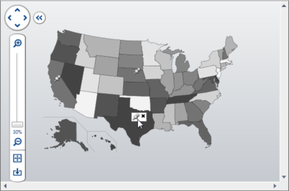

# Overlays

Custom `UIElement` objects can be overlayed on top of the [ZoomContentControl](xref:@ActiproUIRoot.Controls.Navigation.ZoomContentControl) content. These elements can be anchored to a specified point but will not be scaled along with the content.

## Overlay Elements

The [Overlays](xref:@ActiproUIRoot.Controls.Navigation.ZoomContentControl.Overlays) collection specifies the elements that will be placed on top of the content.

## Positioning

The overlay elements are display in a `Canvas` element that is positioned on top of the [ZoomContentControl](xref:@ActiproUIRoot.Controls.Navigation.ZoomContentControl) content. Therefore, the `Canvas.Left`, `Canvas.Top`, `Canvas.Right`, and `Canvas.Bottom` properties can be used to position the overlay elements.

The position values are relative to the content, so the point `0,0` is the top-left corner of the content.

The top-left corner of an overlay element can be anchored by only setting the `Canvas.Left` and `Canvas.Top` properties.  The bottom-left corner of an overlay element can be anchored by only setting the `Canvas.Left` and `Canvas.Bottom` properties.  The same concept applies to the top-right and bottom-right corners.

The visibility of all the overlay elements can be controlled using the [AreOverlaysVisible](xref:@ActiproUIRoot.Controls.Navigation.ZoomContentControl.AreOverlaysVisible) property.
