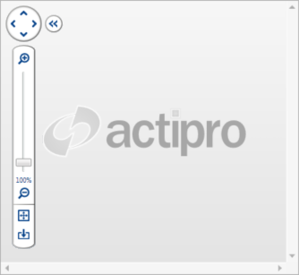

# View Control Pane

The [ZoomContentControl](xref:@ActiproUIRoot.Controls.Navigation.ZoomContentControl) includes a view control pane, which allows the user to manipulate the view. This topic covers the view control pane and its options.

## Showing/Hiding

The view control pane is visible by default, but can be hidden by setting the [IsViewControlPaneVisible](xref:@ActiproUIRoot.Controls.Navigation.ZoomContentControl.IsViewControlPaneVisible) property to `false`.

## Expanding/Collapsing

The view control pane can be collapsed and expanded by clicking the double arrow button. This minimizes the footprint of the view control pane when the user wants to view more of the content.

The [IsViewControlPaneMinimized](xref:@ActiproUIRoot.Controls.Navigation.ZoomContentControl.IsViewControlPaneMinimized) property indicates whether the view control pane is current collapsed, and can be used to programmatically expand/collapse the pane.  Additionally, the [IsViewControlPaneMinimizable](xref:@ActiproUIRoot.Controls.Navigation.ZoomContentControl.IsViewControlPaneMinimizable) property can be used to prevent the view control pane from being interactively collapsed/expanded.

## Showing/Hiding Controls

The various controls included on the view control pane can be shown or hidden individually to achieve a custom look.  The following table lists the various properties used to show or hide the controls.

| Property | Description |
|-----|-----|
| [AreZoomButtonsVisible](xref:@ActiproUIRoot.Controls.Navigation.ZoomContentControl.AreZoomButtonsVisible) | Gets or sets a value indicating whether the zoom buttons (which are located directly above and below the zoom slider) are visible on the view control pane. |
| [IsPanPadVisible](xref:@ActiproUIRoot.Controls.Navigation.ZoomContentControl.IsPanPadVisible) | Gets or sets a value indicating whether the pan pad is visible in the view control pane. |
| [IsResetViewButtonVisible](xref:@ActiproUIRoot.Controls.Navigation.ZoomContentControl.IsResetViewButtonVisible) | Gets or sets a value indicating whether the reset view button is visible in the view control pane. |
| [IsZoomLabelVisible](xref:@ActiproUIRoot.Controls.Navigation.ZoomContentControl.IsZoomLabelVisible) | Gets or sets a value indicating whether the zoom label is visible in the view control pane. |
| [IsZoomSliderVisible](xref:@ActiproUIRoot.Controls.Navigation.ZoomContentControl.IsZoomSliderVisible) | Gets or sets a value indicating whether the zoom slider is visible in the view control pane. |
| [IsZoomToFitButtonVisible](xref:@ActiproUIRoot.Controls.Navigation.ZoomContentControl.IsZoomToFitButtonVisible) | Gets or sets a value indicating whether the zoom-to-fit button is visible in the view control pane. |

## Adding Custom Buttons

Custom elements (including buttons) can be added to the horizontal bar of the view control pane using the [HorizontalItems](xref:@ActiproUIRoot.Controls.Navigation.ZoomContentControl.HorizontalItems) collection.  By default, any elements added will not match the style of the view control pane.  Therefore, several `Style` definitions are provided, which can be used to match the style of the view control pane.

The following table lists various WPF button types and the associated styles.

| Type | Description |
|-----|-----|
| `Button` | [ButtonBaseStyleKey](xref:@ActiproUIRoot.Controls.Navigation.ZoomContentControl.ButtonBaseStyleKey) |
| `RadioButton` | [ButtonBaseStyleKey](xref:@ActiproUIRoot.Controls.Navigation.ZoomContentControl.ButtonBaseStyleKey) |
| `RepeatButton` | [ButtonBaseStyleKey](xref:@ActiproUIRoot.Controls.Navigation.ZoomContentControl.ButtonBaseStyleKey) |
| `Separator` | [HorizontalSeparatorStyleKey](xref:@ActiproUIRoot.Controls.Navigation.ZoomContentControl.HorizontalSeparatorStyleKey) and [VerticalSeparatorStyleKey](xref:@ActiproUIRoot.Controls.Navigation.ZoomContentControl.VerticalSeparatorStyleKey) |
| `ToggleButton` | [ButtonBaseStyleKey](xref:@ActiproUIRoot.Controls.Navigation.ZoomContentControl.ButtonBaseStyleKey) |
