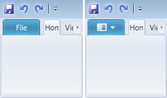

# Application Button Content

Ribbon support several different layout and content styles for the application button.

*The various application button layout/content style options*

## Scenic Style with Text Content

By default, the application button in ribbon will display in Scenic style with the text `File` as its content.  This is a string resource and can be customized by altering the `SRName.UIApplicationButtonLabelText` string resource before the ribbon is created.  The leftmost ribbon in the screenshot shows the default `File` text content.

## Scenic Style with Image Content

Ribbon includes a standard image that can be easily set to the Scenic application button in place of the default `File` text.  To use the built-in application button image, set the [Ribbon](xref:@ActiproUIRoot.Controls.Ribbon.Ribbon).[ApplicationButtonImageSource](xref:@ActiproUIRoot.Controls.Ribbon.Ribbon.ApplicationButtonImageSource) property to:

`ApplicationButtonImageSource="/ActiproSoftware.Ribbon.Wpf;component/Products/Ribbon/Images/ApplicationButtonDefault16.png"`

You could use a 16x16 company logo image source instead if you wish.  The center ribbon in the screenshot shows the built-in image that can be used in a Scenic ribbon.
