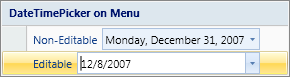

# Using Custom Controls

Actipro Ribbon has been designed so that nearly any control can be used within the [Ribbon](xref:@ActiproUIRoot.Controls.Ribbon.Ribbon) itself, in ribbon menus, or in popups.

For the purposes of this topic, we will use the term "custom control" to mean any non-ribbon control.  This could be a `UserControl`, any native WPF control, or any control from a third-party.


*A custom UserControl used as the content for a PopupButton's popup*

## Custom Controls in the Ribbon

Custom controls can be used in the ribbon simply by including them directly within a [Group](miscellaneous/group.md) or by using them within a [RowPanel](layout/rowpanel.md) or [StackPanel](layout/stackpanel.md).


*A Ribbon that contains a MediaElement control*

> [!NOTE]
> If the custom control is used within a [RowPanel](layout/rowpanel.md) or [StackPanel](layout/stackpanel.md), it must be able to support a small height that is normally associated with standard `Button` or `ComboBox` heights.

Here is some XAML code showing how the screenshot above was created.

```xaml
<ribbon:Group Label="Preview">
	<Border BorderBrush="#000000" BorderThickness="1" Background="#FFFFFF" VerticalAlignment="Center">
		<MediaElement Name="mediaElement" Source="Resources\Videos\Numbers.wmv" 
			Width="80" Height="60" LoadedBehavior="Manual" UnloadedBehavior="Stop" />
	</Border>	
</ribbon:Group>

```

## Custom Controls in Menus

Custom controls can be used in the [Menu](miscellaneous/menu.md) control.



*A Menu containing the DateTimePicker control, which is a non-ribbon control defined in the Shared Library*

When they are added to a [Menu](miscellaneous/menu.md), there are some special attached properties that need to be set to properly lay out the control in relation to the other menu items and give the control an optional external label and image.

See the [Menu](miscellaneous/menu.md) topic for details on how to do this.

Here is some XAML code showing how the screenshot above was created.

```xaml
<ribbon:PopupButton Label="DateTime on Menu" ImageSourceLarge="/Resources/Images/QuickStart32.png">
	<ribbon:Menu>
		<ribbon:Separator Label="DateTimePicker on Menu" />
		<shared:DateTimePicker Value="12/31/2007" 
			ribbon:RibbonControlService.Label="Non-Editable" 
			TodayButtonVisible="True" ClearButtonVisible="True" WeekNumbersVisible="True" 
			ValueConverterParameter="{x:Static shared:DateTimeToStringPattern.LongDate}" />
		<shared:DateTimePicker Value="{x:Static system:DateTime.Now}" IsEditable="True" 
			ribbon:RibbonControlService.Label="Editable" />
	</ribbon:Menu>
</ribbon:PopupButton>
```

## Custom Controls in Popups

The use of custom controls in popups is fully supported.  Popups are used by the [PopupButton](interactive/popupbutton.md), [RibbonGallery](interactive/ribbongallery.md), and [SplitButton](interactive/splitbutton.md) controls.

To use a custom control in a popup, set it to the popup anchor's [PopupContent](xref:@ActiproUIRoot.Controls.Ribbon.Controls.Primitives.PopupButtonBase.PopupContent) property.  In the case of [PopupButton](interactive/popupbutton.md) and [SplitButton](interactive/splitbutton.md), this can be done in XAML by inserting the popup content as a child direcly within the `PopupButton` and `SplitButton` tags.

Here is some XAML code showing the use of a custom color picker `UserControl` within a `PopupButton`.  This code is used in the Document Editor demo and is displayed in the screenshot above.

```xaml
<ribbon:PopupButton ImageSourceLarge="/Resources/Images/ColorPicker32.png" Label="Custom Theme" 
	KeyTipAccessText="C" ScreenTipDescription="Select a completely custom theme color using a color picker.">
	<sample:ColorPicker />										
</ribbon:PopupButton>
```

You also can create complex layouts of popup child controls, meaning that you can support a mix of one or more custom controls with other controls like [Menu](miscellaneous/menu.md) controls.  See the [Working with Popups](working-with-popups.md) topic for more information on all the things that are possible with popups.
