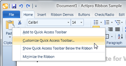
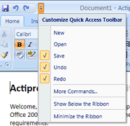
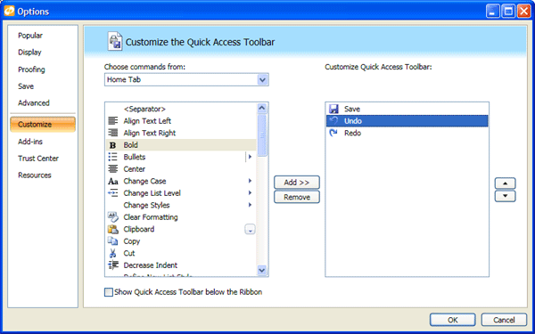

# Customizing the QAT

Actipro Ribbon supports complete run-time customization of the [Quick Access ToolBar](miscellaneous/quickaccesstoolbar.md) (QAT) by the end user via the use of context menus and also Customize QAT dialog windows.

Ribbon has built-in support for all customization capabilities found in Office.  You can even clone an entire [Group](miscellaneous/group.md) and place it in the QAT.

## Quick Tips

Many more details on configuring all aspects of QAT customization at described below but here are some quick tips to get you started.

By default, end-user QAT customization is enabled.  This means that auto-generated context menus for controls that support QAT customization will have items that let them be added to and removed from the QAT.  You can disable this default behavior by setting the [Ribbon](xref:@ActiproUIRoot.Controls.Ribbon.Ribbon).[IsQuickAccessToolBarCustomizationEnabled](xref:@ActiproUIRoot.Controls.Ribbon.Ribbon.IsQuickAccessToolBarCustomizationEnabled) property to `false`.

However, if you keep that `true`, certain control types will be able to be added to or removed from the QAT by default.  Most ribbon controls support this behavior by default and other controls do not.  The [CloneService](xref:@ActiproUIRoot.Controls.Ribbon.UI.CloneService).[CanCloneToQuickAccessToolBarProperty](xref:@ActiproUIRoot.Controls.Ribbon.UI.CloneService.CanCloneToQuickAccessToolBarProperty) attached property can be assigned to any control to configure whether it does support QAT customization.

There are many other QAT customization features and options described in the sections below, including adding common QAT items, displaying a Customize QAT dialog, and more.

## All About Cloning

When controls are added to the QAT, other than at design-time, they are generally added as a clone of another existing control.  The clone is essentially a duplicate deep copy of a control, with all its dependency property and item collections copied.

The [CloneService](xref:@ActiproUIRoot.Controls.Ribbon.UI.CloneService) is the class the provides management and tracking of clones.  All of the built-in QAT customization features described below harness the [CloneService](xref:@ActiproUIRoot.Controls.Ribbon.UI.CloneService) to support modification of the QAT.

### CloneService Important Members

The [CloneService](xref:@ActiproUIRoot.Controls.Ribbon.UI.CloneService) class has some important members that you can use to help track clones if you need them.

| Member | Description |
|-----|-----|
| [CanClone](xref:@ActiproUIRoot.Controls.Ribbon.UI.CloneService.CanClone*) Method | Returns whether the specified `DependencyObject` can be cloned.  This method checks that the object is not a clone itself, and that it either implements `ICloneable` or has a public parameterless constructor. |
| [CreateClone](xref:@ActiproUIRoot.Controls.Ribbon.UI.CloneService.CreateClone*) Method | Creates a clone of the specified `DependencyObject`. |
| [DisposeClone](xref:@ActiproUIRoot.Controls.Ribbon.UI.CloneService.DisposeClone*) Method | Removes all tracked references to the specified clone. |
| [GetClones](xref:@ActiproUIRoot.Controls.Ribbon.UI.CloneService.GetClones*) Method | Returns the collection of objects that have been cloned from the specified `DependencyObject`. |
| [GetCloneSource](xref:@ActiproUIRoot.Controls.Ribbon.UI.CloneService.GetCloneSource*) Method | Returns the original source `DependencyObject` from which the specified `DependencyObject` was cloned. |
| [HasClones](xref:@ActiproUIRoot.Controls.Ribbon.UI.CloneService.HasClones*) Method | Returns whether the specified `DependencyObject` has any clones. |
| [IsAClone](xref:@ActiproUIRoot.Controls.Ribbon.UI.CloneService.IsAClone*) Method | Returns whether the specified `DependencyObject` is a root-level clone of another object. |

### Cloning Events

Several [CloneService](xref:@ActiproUIRoot.Controls.Ribbon.UI.CloneService) attached events occur during the clone creation/disposal lifecycle.

| Member | Description |
|-----|-----|
| [CloneCreatingEvent](xref:@ActiproUIRoot.Controls.Ribbon.UI.CloneService.CloneCreatingEvent) Attached Event | Occurs when a clone creation is first requested.  The original source in the event args is the control to clone.  Set the `Item` of the event arguments to a custom-created clone.  If you do not set the `Item` property, a clone will be automatically created for you and passed back to you in the [CloneCreatedEvent](xref:@ActiproUIRoot.Controls.Ribbon.UI.CloneService.CloneCreatedEvent) event. |
| [CloneCreatedEvent](xref:@ActiproUIRoot.Controls.Ribbon.UI.CloneService.CloneCreatedEvent) Attached Event | Occurs right before a clone is about to be readied for use.  The original source in the event args is the control to clone.  If the `Item` of the event arguments was set in a [CloneCreatingEvent](xref:@ActiproUIRoot.Controls.Ribbon.UI.CloneService.CloneCreatingEvent) handler, that value will still be in the `Item` property.  If it was not set in that other event, a clone that was automatically created will be present in the `Item` property.  You can further customize the clone as needed. |
| [CloneDisposedEvent](xref:@ActiproUIRoot.Controls.Ribbon.UI.CloneService.CloneDisposedEvent) Attached Event | Occurs when a clone is being disposed (tracking by [CloneService](xref:@ActiproUIRoot.Controls.Ribbon.UI.CloneService) is done).  The original source in the event args is the original control that was cloned.  The `Item` of the event arguments is the clone that is no longer being tracked. |

> [!TIP]
> Handlers for the [CloneCreatedEvent](xref:@ActiproUIRoot.Controls.Ribbon.UI.CloneService.CloneCreatedEvent) event are a good place to attach to events on the cloned control if necessary.

## Using the Id Property to Mark Duplicate Controls with the Same Functionality

Controls of the same type and functionality should only be able to be added to the QAT once.  Say you had an **Open** menu item on the application menu but also in a menu for a popup button that appears on the **Home** tab of your ribbon.  In this scenario both menu items perform the same command and should be treated as identical controls for the purposes of dealing with QAT customization.  If you add one of the controls to the QAT (which creates a clone of that control), when you show a context menu for the other control, it should have its **Add to Quick Access Toolbar** menu item disabled.  This can be accomplished via the use of the [Id](xref:@ActiproUIRoot.Controls.Ribbon.Controls.Primitives.ControlBase.Id) property.

The [RibbonControlService](xref:@ActiproUIRoot.Controls.Ribbon.UI.RibbonControlService) defines the attached `Id` property.  It is also defined on all the ribbon control base classes.  The use of the [Id](xref:@ActiproUIRoot.Controls.Ribbon.Controls.Primitives.ControlBase.Id) property is completely optional but in cases where you have multiple instances of controls with the same functionality in your ribbon, it should be used.

In the scenario described above, you could set the Id of both **Open** menu items to `FileOpen`.  When Ribbon examines your controls to determine if they have already been added to the QAT, it will see that both menu items are the same control type (a [Button](interactive/button.md)) and they both have the same Id.  That is how it will determine that they have the same functionality.

> [!IMPORTANT]
> When adding controls to the QAT at design-time or into the [QuickAccessToolBarCommonItems](xref:@ActiproUIRoot.Controls.Ribbon.Ribbon.QuickAccessToolBarCommonItems) collection, it is very important that you assign the [Id](xref:@ActiproUIRoot.Controls.Ribbon.Controls.Primitives.ControlBase.Id) property.

## Determining Which Controls Can Be Cloned to the QAT

The [CloneService](xref:@ActiproUIRoot.Controls.Ribbon.UI.CloneService).[CanCloneToQuickAccessToolBarProperty](xref:@ActiproUIRoot.Controls.Ribbon.UI.CloneService.CanCloneToQuickAccessToolBarProperty) attached property can be assigned to any control to allow it to be added to the QAT by the end user.  This property defaults to `false` in general but for most ribbon controls, it defaults to `true`.  Therefore you probably will never need to worry about setting it.

Controls eligible for cloning to the QAT must also have a [RibbonControlService](xref:@ActiproUIRoot.Controls.Ribbon.UI.RibbonControlService).[LabelProperty](xref:@ActiproUIRoot.Controls.Ribbon.UI.RibbonControlService.LabelProperty) attached property defined.  Note that this property is also more readily available on all ribbon controls via the [Label](xref:@ActiproUIRoot.Controls.Ribbon.Controls.Primitives.ControlBase.Label) property.  The label is used to help represent the control in the Options window's QAT items lists (see below).

## Customizing the QAT Via Context Menus

The fastest way to customize the QAT at run-time is to use context menus on ribbon controls.  If the [Ribbon](xref:@ActiproUIRoot.Controls.Ribbon.Ribbon).[IsQuickAccessToolBarCustomizationEnabled](xref:@ActiproUIRoot.Controls.Ribbon.Ribbon.IsQuickAccessToolBarCustomizationEnabled) property is set to `true`, the default, Ribbon will automatically add appropriate menu items to context menus for ribbon controls.

*A control's context menu showing the Add to Quick Access Toolbar menu item*

Ribbon controls that are not in the QAT will have an `Add to Quick Access Toolbar` menu item.  Clicking an add menu item will create a clone of the control and add it to the QAT.  This functionality is even available for [Group](miscellaneous/group.md) controls.

Ribbon controls that are in the QAT will have a `Remove from Quick Access Toolbar` menu item.  Clicking the remove menu item will remove the control from the QAT, and if it is a clone, will dispose the tracking of the clone.

## Showing Common QAT Items on the QAT's Customize Menu

The QAT's Customize button menu can optionally show a list of common items that can be added to the QAT.  If any are already listed on the QAT, they will appear checked.

*The Quick Access ToolBar's Customize menu, showing some common QAT items*

You may define the template common QAT controls by adding them to the [Ribbon](xref:@ActiproUIRoot.Controls.Ribbon.Ribbon).[QuickAccessToolBarCommonItems](xref:@ActiproUIRoot.Controls.Ribbon.Ribbon.QuickAccessToolBarCommonItems) collection.  The controls in this collection are never directly used, however they will appear in the list of common QAT items in the QAT Customize button's menu.  When an unchecked common QAT control menu item is clicked, a clone of the control will be created and added to the QAT.

It is imperative that the controls defined in the [QuickAccessToolBarCommonItems](xref:@ActiproUIRoot.Controls.Ribbon.Ribbon.QuickAccessToolBarCommonItems) collection have [Id](xref:@ActiproUIRoot.Controls.Ribbon.Controls.Primitives.ControlBase.Id) properties (see info on Id property in a section above) set on them.  For instance, the `Save` button is defined explicitly on the QAT at design-time, but also in the [QuickAccessToolBarCommonItems](xref:@ActiproUIRoot.Controls.Ribbon.Ribbon.QuickAccessToolBarCommonItems) collection, and on the application menu.  All three places should have the [Id](xref:@ActiproUIRoot.Controls.Ribbon.Controls.Primitives.ControlBase.Id) property set to something like `File.Save` so that Ribbon knows they are identical controls in terms of functionality.

## Displaying a 'More Commands'/'Customize Quick Access Toolbar' Item on Auto-Generated Control Context Menus

A `More Commands` menu item can be added to the QAT Customize button's menu and a `Customize Quick Access Toolbar` menu item can be added to any auto-generated ribbon control context menus.

*A control's context menu showing the Customize Quick Access Toolbar menu item*

Set the [Ribbon](xref:@ActiproUIRoot.Controls.Ribbon.Ribbon).[IsCustomizeQuickAccessToolBarMenuItemVisible](xref:@ActiproUIRoot.Controls.Ribbon.Ribbon.IsCustomizeQuickAccessToolBarMenuItemVisible) property to `true` to enable the addition of these menu items.

These menu items all trigger the [RibbonCommands](xref:@ActiproUIRoot.Controls.Ribbon.Input.RibbonCommands).[CustomizeQuickAccessToolBar](xref:@ActiproUIRoot.Controls.Ribbon.Input.RibbonCommands.CustomizeQuickAccessToolBar) command.  Add a handler for that command in your application, and in your handler, show an Options window with its Customize QAT page displayed.

## Implementing an Options Window With Complete QAT Customization Functionality

We've implemented a demo Options window in the Sample Browser's Document Editor QuickStart for Ribbon.  This window uses a `UserControl` in the Sample Browser's Ribbon Common folder called `CustomizeQat`.  The `CustomizeQat` control contains all the functionality needed to get the QAT customization functionality working like in the screenshot below.

*A sample Options window that has complete QAT customization capabilities*

The full source for the window and `UserControl` are in the Sample Browser project.  We encourage you to copy the `CustomizeQat` control to your own project and to modify it as necessary.  But it provides out-of-the-box functionality like what you find in Office.

### Using the CustomizeQat UserControl in Your Application

To use the `CustomizeQat` control in your own application, simply copy it to your project.  Then add it to your project's Options window.  When the Options window is created, be sure to set its `Ribbon` property to an instance of the Ribbon to customize.  This is how the control knows to bind itself to a Ribbon.

When your Options window's `OK` button is pressed, you must call `CustomizeQat.Save` to persist the changes into the Ribbon's QAT.  If the Options window was closed without the `OK` button being pressed, you must call `CustomizeQat.Cancel` to properly dispose any ununsed clones that were created while the customization was occurring.

### CustomizeQat UserControl Implementation Info

Although you generally won't need to change the contents of the `CustomizeQat` control, here is a quick overview of how it works in case you do.

First, a static method on the [RibbonControlCustomizationCategory](xref:@ActiproUIRoot.Controls.Ribbon.Customization.RibbonControlCustomizationCategory) class provides a default list of [RibbonControlCustomizationCategory](xref:@ActiproUIRoot.Controls.Ribbon.Customization.RibbonControlCustomizationCategory) objects.  There is one category for the application menu and one for each the tabs that are defined on the Ribbon.  This list is bound to the `Choose commands from` combobox in the screenshot above.

When a selection is made in that combobox, the listbox below it is populated by binding it to the results of a call to [RibbonControlCustomizationCategory](xref:@ActiproUIRoot.Controls.Ribbon.Customization.RibbonControlCustomizationCategory).[GetControls](xref:@ActiproUIRoot.Controls.Ribbon.Customization.RibbonControlCustomizationCategory.GetControls*).  This method returns a list of all the controls contained within that category's source object (application menu, tab, etc.).  This is a recursively created list so even menu items on ribbon control popups will be included.  The list is a collection of [RibbonControlReference](xref:@ActiproUIRoot.Controls.Ribbon.Customization.RibbonControlReference) objects, which contain references to the source object that they represent.

The list on the right contains the items currently in the QAT.  It also is bound to a list of [RibbonControlReference](xref:@ActiproUIRoot.Controls.Ribbon.Customization.RibbonControlReference) objects that was created by a call to [RibbonControlCustomizationCategory](xref:@ActiproUIRoot.Controls.Ribbon.Customization.RibbonControlCustomizationCategory).[GetQuickAccessToolBarItems](xref:@ActiproUIRoot.Controls.Ribbon.Customization.RibbonControlCustomizationCategory.GetQuickAccessToolBarItems*).

The `Add` button adds a new control clone of the selected item in the available controls list to the QAT items list.  The `Remove` button removes the selected QAT item from the list.  The mover buttons on the right allow you to reorder controls in the QAT items list.

Upon a call to the `CustomizeQat.Save` method, the [RibbonControlCustomizationCategory](xref:@ActiproUIRoot.Controls.Ribbon.Customization.RibbonControlCustomizationCategory).[SetQuickAccessToolBarItems](xref:@ActiproUIRoot.Controls.Ribbon.Customization.RibbonControlCustomizationCategory.SetQuickAccessToolBarItems*) method is executed, which updates the Ribbon's QAT with the items designated in the QAT items list.

## Persisting Customized QAT Items in User Settings

The current items and their order can be persisted to an XML string via a single method call to [Ribbon](xref:@ActiproUIRoot.Controls.Ribbon.Ribbon).[SerializeQuickAccessToolBarItems](xref:@ActiproUIRoot.Controls.Ribbon.Ribbon.SerializeQuickAccessToolBarItems*).  You can save this string to your user settings mechanism before your application closes.

When the user starts up the application again, get the XML string and pass it to [Ribbon](xref:@ActiproUIRoot.Controls.Ribbon.Ribbon).[DeserializeQuickAccessToolBarItems](xref:@ActiproUIRoot.Controls.Ribbon.Ribbon.DeserializeQuickAccessToolBarItems*) to restore the user's QAT customizations.

The [DeserializeQuickAccessToolBarItems](xref:@ActiproUIRoot.Controls.Ribbon.Ribbon.DeserializeQuickAccessToolBarItems*) method returns a collection of `Exception` objects.  Under normal circumstances, this collection will be empty, indicating that there were no problems when deserializing the saved data.  However, if a problem did occur and one or more items could not be reloaded, there will be one related `Exception` entry in this collection for each item that could not be reloaded.  This will help you debug what the problem is while still allowing other items to be successfully loaded.
