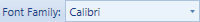
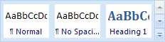

# Overview

> [!IMPORTANT]
> This older Ribbon product will be deprecated in the future in favor of the new ribbon implementation in the [Bars product](../../bars/index.md), which has a much-improved design and appearance, and many of the latest features currently found in Office.  It is recommended to implement new ribbons using the Bars product instead, and to [migrate away from this older Ribbon product](../../conversion/converting-to-v23-1.md) to the newer Bars ribbon when possible.

Actipro Ribbon has a large number of built-in controls that are ready for use.  Some controls are for interactive use by the end user while others are used more for layout purposes.

This portion of the documentation links to the various other help topics that relate to controls: learning the basics, information on the control types, and other miscellaneous information.

## Control Basics

All of the [built-in interactive ribbon controls](interactive/index.md) and several other ribbon controls share some common characteristics and concepts.

See the [Control Basics](control-basics.md) topic for more information on general ribbon control concepts.

## Built-in Interactive Controls

Interactive controls are controls that are located throughout the ribbon user interface and in menus and are the ones that end users primarily interact with.

<table>
<thead>

<tr>
<th>Control Type</th>
<th>Description</th>
</tr>

</thead>
<tbody>

<tr>
<td>

[Button](interactive/button.md)

</td>
<td>

Normal button and checkable button.

</td>
</tr>

<tr>
<td>

[PopupButton](interactive/popupbutton.md)

</td>
<td>

Button that displays a popup when clicked.

</td>
</tr>

<tr>
<td>

[SplitButton](interactive/splitbutton.md)

</td>
<td>

Button that has two clickable areas.  The button portion of the split button acts like a normal button or checkable button.  The drop-down portion of the split button displays a popup.

</td>
</tr>

<tr>
<td>

[CheckBox](interactive/checkbox.md)

</td>
<td>

A checkbox control.

</td>
</tr>

<tr>
<td>

[RadioButton](interactive/radiobutton.md)

</td>
<td>

A radio button control.

</td>
</tr>

<tr>
<td>

[TextBox](interactive/textbox.md)

</td>
<td>

A textbox control.

</td>
</tr>

<tr>
<td>

[ComboBox](interactive/combobox.md)

</td>
<td>

A combobox control.

</td>
</tr>

<tr>
<td>

[FontFamilyComboBox](interactive/fontfamilycombobox.md)

</td>
<td>

A combobox control that allows for selection of a font family.

</td>
</tr>

<tr>
<td>

[FontSizeComboBox](interactive/fontsizecombobox.md)

</td>
<td>

A combobox control that allows for selection of a font size.

</td>
</tr>

<tr>
<td>

[Separator](interactive/separator.md)

</td>
<td>

A separator when used in a menu or as a large item in a group.  Can display text when a label is specified in menus.  Also renders as a normal label when used as a small item in a group.

</td>
</tr>

<tr>
<td>

[RibbonGallery](interactive/ribbongallery.md)

</td>
<td>

A control that allows for the presentation of one or more categories of items within the ribbon.  The items act like buttons and are displayed in a scrollable list that animates when scrolled.

</td>
</tr>

<tr>
<td>

[PopupGallery](interactive/popupgallery.md)

</td>
<td>

A control that allows for the presentation of one or more categories of items within a popup.  The items act like buttons and are displayed in a scrollable list that can be categorized and filtered.

</td>
</tr>

<tr>
<td>

[ColorPickerGallery](interactive/colorpickergallery.md)

</td>
<td>

A control that presents one or more categories of colors within a popup, supports screen tips for colors, and optional auto-generation of lighter/darker shades of colors.

</td>
</tr>

</tbody>
</table>

## Built-in Layout Controls

Layout controls govern where other controls are placed within a [Ribbon](xref:@ActiproUIRoot.Controls.Ribbon.Ribbon).

<table>
<thead>

<tr>
<th>Control Type</th>
<th>Description</th>
</tr>

</thead>
<tbody>

<tr>
<td>

[ButtonGroup](layout/buttongroup.md)

</td>
<td>

A layout control that is most often used as a child item of a [RowPanel](layout/rowpanel.md) or a `StatusBarItem`.  The button group contains one or more child controls and optionally draws a border around them.

</td>
</tr>

<tr>
<td>

[RowPanel](layout/rowpanel.md)

</td>
<td>

A layout control that can be used in a [Group](miscellaneous/group.md) to provide two-row layouts of child controls, which can switch to a three-row variant as available width decreases.

</td>
</tr>

<tr>
<td>

[StackPanel](layout/stackpanel.md)

</td>
<td>

Displays up to three child controls in large variants horizontally and switches to a vertically-stacked layout of smaller control variants as available width decreases.  As available width continues to decrease, child control labels are removed.

</td>
</tr>

</tbody>
</table>

## Built-in Miscellaneous Controls

There are a number of other miscellaneous controls used in the ribbon user interface.

| Control Type | Description |
|-----|-----|
| [ApplicationMenu](miscellaneous/applicationmenu.md) | The application menu displayed when the application button on the ribbon is clicked. |
| [ContextMenu](miscellaneous/contextmenu.md) | A context menu that inherits `ContextMenu` and through use of a contained [Menu](miscellaneous/menu.md) control, allows any ribbon control to be used as child items.  This allows for a consistent presentation throughout your application.  Best of all, since our context menu class inherits `ContextMenu`, it can be used anywhere that a regular `ContextMenu` can. |
| [ContextualTabGroup](miscellaneous/contextualtabgroup.md) | A contextual tab group that contains one or more [Tab](miscellaneous/tab.md) controls and can be displayed based on document context. |
| [Group](miscellaneous/group.md) | A group that can appear on a [Tab](miscellaneous/tab.md). |
| [Menu](miscellaneous/menu.md) | A control that renders its items using templates that have menu item-like functionality. |
| [Mini-ToolBar](miscellaneous/minitoolbar.md) | The mini-toolbar can be displayed semi-transparently after a mouse selection or paired along with a context menu. |
| [QuickAccessToolBar](miscellaneous/quickaccesstoolbar.md) | The quick access toolbar (QAT) that can be displayed above or below the ribbon. |
| [RecentDocumentMenu](miscellaneous/recentdocumentmenu.md) | A control that can be used as the additional content of an [ApplicationMenu](miscellaneous/applicationmenu.md).  It manages a sorted list of recently-opened documents and allows pinning of the documents. |
| [Tab](miscellaneous/tab.md) | A tab within a ribbon.  The tab contains one or more [Group](miscellaneous/group.md) controls. |

## Working with Popups

A number of ribbon controls have popups associated with them.  The popups can contain any sort of content, including a [Menu](miscellaneous/menu.md) of menu items or one or more [custom controls](custom-controls.md).

See the [Working with Popups](working-with-popups.md) topic for more information on all the capabilities of popups.

## Customizing the QAT

Actipro Ribbon supports complete run-time customization of the [Quick Access ToolBar](miscellaneous/quickaccesstoolbar.md) (QAT) by the end user via the use of context menus and also Customize QAT dialog windows.

See the [Customizing the QAT](customizing-the-qat.md) topic for more information on how to get up and running with run-time QAT customization features in your application.

## Using Custom Controls

Actipro Ribbon has been designed so that nearly any control can be used within the [Ribbon](xref:@ActiproUIRoot.Controls.Ribbon.Ribbon) itself, in ribbon menus, or in popups.

See the [Custom Controls](custom-controls.md) topic for more information on adding custom controls to the ribbon user interface.

## Customizing Context Menus

Ribbon allows for the dynamic creation/updating of context menus as well as the same for the [QuickAccessToolBar](miscellaneous/quickaccesstoolbar.md)`Customize` button's menu.

See the [Customizing Context Menus](customizing-context-menus.md) topic for more information on how to dynamically customize context menus.

## Standalone Control Usage

Actipro has created the ribbon controls with WPF control design best practices in mind and so that they can be used outside of the ribbon, in other parts of your application as well.

See the [Standalone Control Usage](standalone-control-usage.md) topic for more details on using ribbon controls outside of the ribbon and even in other windows.

## RibbonWindow

Actipro Ribbon includes a [RibbonWindow](xref:@ActiproUIRoot.Controls.Ribbon.RibbonWindow) class, which is an implementation of the `Window` class that provides a custom window user interface much like that found in Office.

See the [RibbonWindow](ribbonwindow.md) topic for more information on using the `RibbonWindow` class, even without a `Ribbon` control inside of it.
