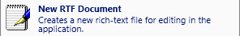
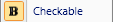
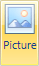

# Button

The [Button](xref:ActiproSoftware.Windows.Controls.Ribbon.Controls.Button) class provides an implementation of normal buttons and checkable buttons.

> [!NOTE]
> See the [Control Basics](../control-basics.md) topic for many implementation details that are common to the built-in controls such as this one.

## Variants

This control supports numerous UI styles (called variants) based on its [Context](xref:ActiproSoftware.Windows.Controls.Ribbon.Controls.Primitives.ControlBase.Context) and [VariantSize](xref:ActiproSoftware.Windows.Controls.Ribbon.Controls.Primitives.ControlBase.VariantSize) property settings.

| Context | Variant Size | Sample UI |
|-----|-----|-----|
| MenuItem | Large |  |
| MenuItem | Medium, Small |  |
| (any other) | Large |  |
| (any other) | Medium |  |
| (any other) | Small |  |
| (any other) | Collapsed |  (also has ImageSourceSmallSize set to 11,11 for this sample) |

## Capabilities

The following table gives an overview of the capabilities of the control.

| Item | Details |
|-----|-----|
| Supports tall size (fills height of [Group](../miscellaneous/group.md)) | Yes. |
| Supports normal size | Yes. |
| Supports use in a [Menu](../miscellaneous/menu.md) | Yes. |
| Base class | [ButtonBase](xref:ActiproSoftware.Windows.Controls.Ribbon.Controls.Primitives.ButtonBase). |
| Child items | None. |
| Has popup | No. |
| Key tip access | Yes.  Set via the [KeyTipAccessText](xref:ActiproSoftware.Windows.Controls.Ribbon.Controls.Primitives.ControlBase.KeyTipAccessText) property. |
| Is key tip scope | No. |
| Click event trigger | When the button is clicked. |
| Supports use outside of Ribbon | Yes. |
| Supports commands | Yes. |
| Supports [ICheckableCommandParameter](xref:ActiproSoftware.Windows.Controls.Ribbon.Input.ICheckableCommandParameter) | Yes.  Controls the checked state of the button. |
| Supports [IValueCommandParameter](xref:ActiproSoftware.Windows.Controls.Ribbon.Input.IValueCommandParameter) | No. |
| Default CommandParameter | [CheckableCommandParameter](xref:ActiproSoftware.Windows.Controls.Ribbon.Input.CheckableCommandParameter). |

## Managing the Checked State

This control is designed to use the WPF [command model](../../command-model/index.md) to maintain the checked state of the control.  By default a [CheckableCommandParameter](xref:ActiproSoftware.Windows.Controls.Ribbon.Input.CheckableCommandParameter) is assigned as the `CommandParameter` of the control.

See the [Interaction with Checkable Controls](../../command-model/checkable-controls.md) topic for detailed information on using this command parameter to manage the checked state.

## Adding a Description for Large Menu Items

Any [ButtonBase](xref:ActiproSoftware.Windows.Controls.Ribbon.Controls.Primitives.ButtonBase)-derived control has a [MenuItemDescription](xref:ActiproSoftware.Windows.Controls.Ribbon.Controls.Primitives.ButtonBase.MenuItemDescription) property.  This property can be set to a string to display an extended description when used in a large menu context, such as in the application menu.

When set, the `Label` of the control will be displayed in bold above the description.  The description will wrap to as many lines as needed to display itself.  This feature is best used on button-based controls that appear on a child menu of a root application menu item.

## Changing the Image Size

In any of the non-large variant sizes, you can set the [ImageSourceSmallSize](xref:ActiproSoftware.Windows.Controls.Ribbon.Controls.Primitives.ButtonBase.ImageSourceSmallSize) property to the specific size image that you'd like to display.  By default, this is `16x16` however you could make it smaller or larger if you have a smaller or larger image.

This functionality is typically used outside of the Ribbon in standalone use of the control.  If you wish to have a smaller control than the default, be sure to set `MinHeight` to `0` as well since the `MinHeight` for the `Medium` and `Small` variants of this control currently ensures the control is the proper height for usage in the Ribbon, per the requirements stated by Microsoft.

## Preventing the Large Variant's Label from Word Wrapping

Sometimes you may have a short couple of words that make up a button's label and you run across a case where instead of the button placing words on two separate lines, you would prefer to have them both on the same line.  Ribbon includes an easy way to accomplish this.

Instead of using a normal space character between the words in your label, use a non-breaking space character like this:

```xaml
<ribbon:Button Label="Data&#160;Set" />
```

## Sample XAML

This code shows how to prototype this control in XAML-only:

```xaml
<ribbon:Button ImageSourceLarge="/Images/SmartArt32.png" 
	ImageSourceSmall="/Images/SmartArt16.png" Label="SmartArt" KeyTipAccessText="M" />
```

This code shows how to prototype this control in in XAML but by also using a ribbon command to set up its user interface:

```xaml
<ribbon:Button Command="ApplicationCommands.Paste" KeyTipAccessText="P" />
```

## Toggle Minimization Button

There is a special built-in button that adds button-based toggle minimization functionality to the Ribbon, as first seen in Office 2010.  This button, implemented by the [ToggleMinimizationButton](xref:ActiproSoftware.Windows.Controls.Ribbon.Controls.ToggleMinimizationButton) class, can be inserted in the [TabPanelItems](xref:ActiproSoftware.Windows.Controls.Ribbon.Ribbon.TabPanelItems) to show up on the right side of the ribbon, in the same row as its tabs.

This code shows how to insert the toggle minimization button into a ribbon.

```xaml
<ribbon:Ribbon>
	...
	<ribbon:Ribbon.TabPanelItems>
		<ribbon:ToggleMinimizationButton />
	</ribbon:Ribbon.TabPanelItems>
	...
</ribbon:Ribbon>
```
