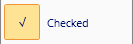
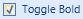

# CheckBox

The [CheckBox](xref:ActiproSoftware.Windows.Controls.Ribbon.Controls.CheckBox) class provides an implementation of checkboxes.

> [!NOTE]
> See the [Control Basics](../control-basics.md) topic for many implementation details that are common to the built-in controls such as this one.

## Variants

This control supports numerous UI styles (called variants) based on its [Context](xref:ActiproSoftware.Windows.Controls.Ribbon.Controls.Primitives.ControlBase.Context) and [VariantSize](xref:ActiproSoftware.Windows.Controls.Ribbon.Controls.Primitives.ControlBase.VariantSize) property settings.

| Context | Variant Size | Sample UI |
|-----|-----|-----|
| MenuItem | Large |  |
| MenuItem | Medium, Small |  |
| (any other) | (any) |  |

## Capabilities

The following table gives an overview of the capabilities of the control.

| Item | Details |
|-----|-----|
| Supports tall size (fills height of [Group](../miscellaneous/group.md)) | No. |
| Supports normal size | Yes. |
| Supports use in a [Menu](../miscellaneous/menu.md) | Yes. |
| Base class | [ButtonBase](xref:ActiproSoftware.Windows.Controls.Ribbon.Controls.Primitives.ButtonBase). |
| Child items | None. |
| Has popup | No. |
| Key tip access | Yes.  Set via the [KeyTipAccessText](xref:ActiproSoftware.Windows.Controls.Ribbon.Controls.Primitives.ControlBase.KeyTipAccessText) property. |
| Is key tip scope | No. |
| Click event trigger | When the checkbox is clicked. |
| Supports use outside of Ribbon | Yes. |
| Supports commands | Yes. |
| Supports [ICheckableCommandParameter](xref:ActiproSoftware.Windows.Controls.Ribbon.Input.ICheckableCommandParameter) | Yes.  Controls the checked state of the checkbox. |
| Supports [IValueCommandParameter](xref:ActiproSoftware.Windows.Controls.Ribbon.Input.IValueCommandParameter) | No. |
| Default CommandParameter | [CheckableCommandParameter](xref:ActiproSoftware.Windows.Controls.Ribbon.Input.CheckableCommandParameter). |

## Managing the Checked State

This control is designed to use the WPF [command model](../../command-model/index.md) to maintain the checked state of the control.  By default a [CheckableCommandParameter](xref:ActiproSoftware.Windows.Controls.Ribbon.Input.CheckableCommandParameter) is assigned as the `CommandParameter` of the control.

See the [Interaction with Checkable Controls](../../command-model/checkable-controls.md) topic for detailed information on using this command parameter to manage the checked state.

In addition you can manage the checked state of this control programmatically by setting the [IsChecked](xref:ActiproSoftware.Windows.Controls.Ribbon.Controls.Primitives.ButtonBase.IsChecked) property.  When no command is set to the control, the control will automatically toggle [IsChecked](xref:ActiproSoftware.Windows.Controls.Ribbon.Controls.Primitives.ButtonBase.IsChecked) when it is clicked.  By default it will toggle between `true` and `false`, but if [IsThreeState](xref:ActiproSoftware.Windows.Controls.Ribbon.Controls.CheckBox.IsThreeState) is `true`, it will also toggle into an indeterminate state.

## Checked State Events

This control exposes three events that can fire when the [IsChecked](xref:ActiproSoftware.Windows.Controls.Ribbon.Controls.Primitives.ButtonBase.IsChecked) property changes value.  Each event fires for a certain value of [IsChecked](xref:ActiproSoftware.Windows.Controls.Ribbon.Controls.Primitives.ButtonBase.IsChecked):

- [Checked](xref:ActiproSoftware.Windows.Controls.Ribbon.Controls.Primitives.ButtonBase.Checked) event

- [Indeterminate](xref:ActiproSoftware.Windows.Controls.Ribbon.Controls.Primitives.ButtonBase.Indeterminate) event

- [Unchecked](xref:ActiproSoftware.Windows.Controls.Ribbon.Controls.Primitives.ButtonBase.Unchecked) event

## Adding a Description for Large Menu Items

Any [ButtonBase](xref:ActiproSoftware.Windows.Controls.Ribbon.Controls.Primitives.ButtonBase)-derived control has a [MenuItemDescription](xref:ActiproSoftware.Windows.Controls.Ribbon.Controls.Primitives.ButtonBase.MenuItemDescription) property.  This property can be set to a string to display an extended description when used in a large menu context, such as in the application menu.

When set, the `Label` of the control will be displayed in bold above the description.  The description will wrap to as many lines as needed to display itself.  This feature is best used on button-based controls that appear on a child menu of a root application menu item.

## Sample XAML

This code shows how to prototype this control in XAML-only:

```xaml
<ribbon:CheckBox Label="Toggle Bold" KeyTipAccessText="B" />
```

This code shows how to prototype this control in in XAML but by also using a ribbon command to set up its user interface:

```xaml
<ribbon:CheckBox Command="EditingCommands.ToggleBold" KeyTipAccessText="B" />
```
