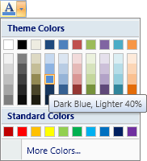

# ColorPickerGallery

The [ColorPickerGallery](xref:ActiproSoftware.Windows.Controls.Ribbon.Controls.ColorPickerGallery) class provides an implementation of color selection galleries that appear within a popup.  Multiple categories of colors can be added, lighter/darker shades of colors can be auto-generated, screen tips can be assigned to items, and optional filtering can be applied.

> [!NOTE]
> See the [Control Basics](../control-basics.md) topic for many implementation details that are common to the built-in controls such as this one.

## Variants

This control supports a single variant although the overall appearance of the gallery may be altered by specifying a different initial column count, the optional use of categorization, and the optional use of filtering.

| Context | Variant Size | Sample UI |
|-----|-----|-----|
| (any) | (any) |  |

## Capabilities

The following table gives an overview of the capabilities of the control.

| Item | Details |
|-----|-----|
| Supports tall size (fills height of [Group](../miscellaneous/group.md)) | No.  Is not for use in the ribbon itself, but rather on popups. |
| Supports normal size | Yes, however the control's normal size can be quite large. |
| Supports use in a [Menu](../miscellaneous/menu.md) | No.  This gallery should be used in a popup but outside of a [Menu](../miscellaneous/menu.md) control.  However one commonly-used technique is to use a native WPF `StackPanel` as the popup content with the `PopupGallery` as one child and a [Menu](../miscellaneous/menu.md) containing menu items above or below the gallery. |
| Base class | [PopupGallery](xref:ActiproSoftware.Windows.Controls.Ribbon.Controls.PopupGallery). |
| Child items | Yes.  The items must be of type `SolidColorBrush` and gallery may be bound to an `ItemsSource` as well. |
| Has popup | No. |
| Key tip access | No. |
| Is key tip scope | Yes. |
| Click event trigger | When an item in the gallery is clicked. |
| Supports use outside of Ribbon | Yes. |
| Supports commands | Yes. |
| Supports [ICheckableCommandParameter](xref:ActiproSoftware.Windows.Controls.Ribbon.Input.ICheckableCommandParameter) | No. |
| Supports [IValueCommandParameter](xref:ActiproSoftware.Windows.Controls.Ribbon.Input.IValueCommandParameter) | Yes.  Controls the selected value of the `PopupGallery` and supports live preview. |
| Default CommandParameter | [BrushValueCommandParameter](xref:ActiproSoftware.Windows.Controls.Ribbon.Input.BrushValueCommandParameter). |

## Items Must Be SolidColorBrushes

The items of this control must be of type `SolidColorBrush`.  This makes it easy to use the selected color directly when you apply it to other controls.  And it also means that attached properties (like for screen tips, categorization and layout behavior) can be be applied to each item.

## Auto-Generating Lighter/Darker Shades of Colors

The gallery can intelligently auto-generate lighter and darker shades of base colors on any colors you like.  When using this feature, there are several requirements.

First, the base colors must be set to the [ColorPickerGallery](xref:ActiproSoftware.Windows.Controls.Ribbon.Controls.ColorPickerGallery).[CategorizedItemsSource](xref:ActiproSoftware.Windows.Controls.Ribbon.Controls.PopupGallery.CategorizedItemsSource) property.  Doing this allows extra colors to be added to the "real" items source that is set to the `ItemsSource` property automatically.

Second, the base color items that need shades generated must have the [ColorPickerGallery](xref:ActiproSoftware.Windows.Controls.Ribbon.Controls.ColorPickerGallery).[LayoutBehaviorProperty](xref:ActiproSoftware.Windows.Controls.Ribbon.Controls.ColorPickerGallery.LayoutBehaviorProperty) attached property set to `Shaded`.  This tells the gallery to generate the array of lighter and darker shades for that base color.

Third, the [ColorPickerGallery](xref:ActiproSoftware.Windows.Controls.Ribbon.Controls.ColorPickerGallery).[InitialColumnCount](xref:ActiproSoftware.Windows.Controls.Ribbon.Controls.PopupGallery.InitialColumnCount) property must be set to the number of base colors that will have auto-generated shades added.  This ensures that the generated items wrap properly within the gallery and appear directly under the proper base color.

After doing those things, you are ready to go.  You can even add other colors that don't require shades, however please place them in a separate category from the category used for the shade base colors.

## Initial Column Display

The [ColorPickerGallery](xref:ActiproSoftware.Windows.Controls.Ribbon.Controls.ColorPickerGallery).[InitialColumnCount](xref:ActiproSoftware.Windows.Controls.Ribbon.Controls.PopupGallery.InitialColumnCount) property is used to specify the initial number of columns that should be displayed when the popup that contains the `PopupGallery` is displayed.

The gallery measures the size of the items for you and determines how wide to ensure the popup is so that the number of columns of items you specify can be displayed.

> [!NOTE]
> If the auto-generation of lighter/darker shades is being used, [InitialColumnCount](xref:ActiproSoftware.Windows.Controls.Ribbon.Controls.PopupGallery.InitialColumnCount) must be set to the number of base colors before a break is inserted for the auto-generated groups of shade colors.  In the screenshot above, the initial column count is `10`.

## Hiding the Selected Value

By default, the [SelectedItem](xref:ActiproSoftware.Windows.Controls.Ribbon.Controls.Primitives.GalleryBase.SelectedItem) will be drawn with a highlight to indicate its selected state to the end user.  However they may be cases where you wish to prevent the end user from seeing any sort of highlighted item in the gallery.  To do this, set the [IsSelectionHighlightVisible](xref:ActiproSoftware.Windows.Controls.Ribbon.Controls.Primitives.GalleryBase.IsSelectionHighlightVisible) property to `false`.

## Processing Item Clicks and Managing the Selected Value

When an item is clicked, the [ItemClick](xref:ActiproSoftware.Windows.Controls.Ribbon.Controls.Primitives.GalleryBase.ItemClick) is raised.  This event passes arguments that specify which item was clicked.  The clicked item becomes the [SelectedItem](xref:ActiproSoftware.Windows.Controls.Ribbon.Controls.Primitives.GalleryBase.SelectedItem) and is passed through as the value to the command for the gallery.

Galleries are designed to support the WPF [command model](../../command-model/index.md) for maintaining the selected value of the control.  By default an [ObjectValueCommandParameter](xref:ActiproSoftware.Windows.Controls.Ribbon.Input.ObjectValueCommandParameter) is assigned as the `CommandParameter` of the control.

See the [Interaction with Value Controls](../../command-model/value-controls.md) topic for detailed information on using this command parameter to manage the control's value (selected item) and support live preview.

If you aren't using commands, you can choose to handle to [SelectedItemChanged](xref:ActiproSoftware.Windows.Controls.Ribbon.Controls.Primitives.GalleryBase.SelectedItemChanged) event to be notified when the [SelectedItem](xref:ActiproSoftware.Windows.Controls.Ribbon.Controls.Primitives.GalleryBase.SelectedItem) property is changed.

## Supporting Live Preview

When the mouse moves over an item, the item becomes the [ActiveItem](xref:ActiproSoftware.Windows.Controls.Ribbon.Controls.Primitives.GalleryBase.ActiveItem).  Many applications use the currently "active" item to supply a live preview to the end user of what would happen if the item was clicked.  Live preview for galleries can be implemented in one of two ways.

If you are using commands, the [Interaction with Value Controls](../../command-model/value-controls.md) topic explains how to support live preview using command can-execute handlers.

Alternatively, if you would rather use events, the [ActiveItemChanged](xref:ActiproSoftware.Windows.Controls.Ribbon.Controls.Primitives.GalleryBase.ActiveItemChanged) event fires whenever the [ActiveItem](xref:ActiproSoftware.Windows.Controls.Ribbon.Controls.Primitives.GalleryBase.ActiveItem) property is changed.

## Categorizing Items

The [PopupGallery](xref:ActiproSoftware.Windows.Controls.Ribbon.Controls.PopupGallery).[CategoryProperty](xref:ActiproSoftware.Windows.Controls.Ribbon.Controls.PopupGallery.CategoryProperty) attached property can be assigned to each item.  If you choose to show categories in your `ColorPickerGallery`, the property values you specify will be used to group the items into categories.  The list style screenshot above shows categories being used.

This sample XAML code shows how to apply the `Category` attached property to an item:

```xaml
<media:SolidColorBrush ribbon:PopupGallery.Category="Standard Colors" Color="#C00000" ribbon:ScreenTipService.ScreenTipHeader="Dark Red" />
<media:SolidColorBrush ribbon:PopupGallery.Category="Standard Colors" Color="#FF0000" ribbon:ScreenTipService.ScreenTipHeader="Red" />
```

By default the categorization feature is disabled in `PopupGallery`.  You can enable it by binding your items to the [CategorizedItemsSource](xref:ActiproSoftware.Windows.Controls.Ribbon.Controls.PopupGallery.CategorizedItemsSource) property instead of the normal `ItemsSource` property.  This tells `ColorPickerGallery` to switch to categorized item mode.

## Categorized Item Filtering

If you have categorization enabled in your `ColorPickerGallery` as described above, you can optionally add filtering capabilities.  The filter is a button at the top of the `ColorPickerGallery` that when clicked, shows a menu of available filters.

There is always an `All` option and then rest of the options are the various category names.  The `All` filter is used by default and does not perform any filtering.  When a specific category is chosen as a filter, only the items in that category are displayed.

Use the [CanFilter](xref:ActiproSoftware.Windows.Controls.Ribbon.Controls.PopupGallery.CanFilter) property to determine whether the filtering UI is available to the end user.  The current category that is being filtered is available via the [FilterCategory](xref:ActiproSoftware.Windows.Controls.Ribbon.Controls.PopupGallery.FilterCategory) property.

## Gallery Item Templates

The default item template for this control is defined as:

```xaml
<DataTemplate>
	<Rectangle Fill="{Binding BindsDirectlyToSource=True}" Width="13" Height="13" />
</DataTemplate>
```

You could define another template with a different size rectangle if you require larger items.

## Item Screen Tips

Screen tips can be attached directly to gallery items via the [ScreenTipService](xref:ActiproSoftware.Windows.Controls.Ribbon.UI.ScreenTipService) attached properties like this:

```xaml
<media:SolidColorBrush Color="#C00000" ribbon:ScreenTipService.ScreenTipHeader="Dark Red" />
```

## Important Members

Since galleries indirectly inherit `ItemsControl`, you should use the `Items` or `ItemsSource` properties to bind the gallery to data.  If you are going to want to use auto-generation of lighter/darker shades of colors then you must use the [CategorizedItemsSource](xref:ActiproSoftware.Windows.Controls.Ribbon.Controls.PopupGallery.CategorizedItemsSource) property.

This table lists the important members of the [PopupGallery](xref:ActiproSoftware.Windows.Controls.Ribbon.Controls.PopupGallery) control, other than the ones inherited from `ItemsControl`.

| Member | Description |
|-----|-----|
| [ActiveItem](xref:ActiproSoftware.Windows.Controls.Ribbon.Controls.Primitives.GalleryBase.ActiveItem) Property | Gets the item that is currently active (being previewed). |
| [ActiveItemChanged](xref:ActiproSoftware.Windows.Controls.Ribbon.Controls.Primitives.GalleryBase.ActiveItemChanged) Event | Occurs when the [ActiveItem](xref:ActiproSoftware.Windows.Controls.Ribbon.Controls.Primitives.GalleryBase.ActiveItem) property is changed. |
| [CanFilter](xref:ActiproSoftware.Windows.Controls.Ribbon.Controls.PopupGallery.CanFilter) Property | Gets or sets whether the gallery can filter categorized items.  The default value is `false`.  This property requires that [CategorizedItemsSource](xref:ActiproSoftware.Windows.Controls.Ribbon.Controls.PopupGallery.CategorizedItemsSource) is not `null` for it to function correctly. |
| [CategorizedItemsSource](xref:ActiproSoftware.Windows.Controls.Ribbon.Controls.PopupGallery.CategorizedItemsSource) Property | Gets or sets the items source to used when categorization of items is desired.  Use this property instead of `ItemsSource` when categorization of items is desired.  By setting this property, the `ItemsSource` will be set to a view that supports categories and the [IsCategorized](xref:ActiproSoftware.Windows.Controls.Ribbon.Controls.PopupGallery.IsCategorized) property will be set to `true`. |
| [CategoryProperty](xref:ActiproSoftware.Windows.Controls.Ribbon.Controls.PopupGallery.CategoryProperty) Attached Property | The text-based attached property that should be applied to items when categorization of items is desired. |
| [CategoryTemplate](xref:ActiproSoftware.Windows.Controls.Ribbon.Controls.PopupGallery.CategoryTemplate) Property | Gets or sets the `DataTemplate` to use for the display of categories.  This template is used when the [IsCategorized](xref:ActiproSoftware.Windows.Controls.Ribbon.Controls.PopupGallery.IsCategorized) property is `true`. |
| [DefaultThemeColors](xref:ActiproSoftware.Windows.Controls.Ribbon.Controls.ColorPickerGallery.DefaultThemeColors) Property | Gets an array of default theme colors.  This array can be used to programmatically build `SolidColorBrush` items for this gallery. |
| [FilterCategory](xref:ActiproSoftware.Windows.Controls.Ribbon.Controls.PopupGallery.FilterCategory) Property | Gets or sets the category of items that is currently being filtered when [CanFilter](xref:ActiproSoftware.Windows.Controls.Ribbon.Controls.PopupGallery.CanFilter) is `true`.  This property does nothing if [CanFilter](xref:ActiproSoftware.Windows.Controls.Ribbon.Controls.PopupGallery.CanFilter) is `false` or [CategorizedItemsSource](xref:ActiproSoftware.Windows.Controls.Ribbon.Controls.PopupGallery.CategorizedItemsSource) is `null`.  When set to `null`, no filtering will be performed and items in all categories will be displayed. |
| [InitialColumnCount](xref:ActiproSoftware.Windows.Controls.Ribbon.Controls.PopupGallery.InitialColumnCount) Property | Gets or sets the initial number of gallery item columns that are displayed when the popup appears.  The default value is `10`. |
| [IsCategorized](xref:ActiproSoftware.Windows.Controls.Ribbon.Controls.PopupGallery.IsCategorized) Property | Gets whether the gallery is currently categorizing its items.  This property will be set to `true` if the [CategorizedItemsSource](xref:ActiproSoftware.Windows.Controls.Ribbon.Controls.PopupGallery.CategorizedItemsSource) property is set to an items source. |
| [IsPreviewEnabled](xref:ActiproSoftware.Windows.Controls.Ribbon.Controls.Primitives.GalleryBase.IsPreviewEnabled) Property | Gets or sets whether preview command notifications are enabled for the items.  The default value is `false` so set it to `true` to enable live preview functionality. |
| [IsSelectionHighlightVisible](xref:ActiproSoftware.Windows.Controls.Ribbon.Controls.Primitives.GalleryBase.IsSelectionHighlightVisible) Property | Gets or sets whether the [SelectedItem](xref:ActiproSoftware.Windows.Controls.Ribbon.Controls.Primitives.GalleryBase.SelectedItem)'s selection highlight is visible for the gallery.  The default value is `true`. |
| [ItemClick](xref:ActiproSoftware.Windows.Controls.Ribbon.Controls.Primitives.GalleryBase.ItemClick) Event | Occurs when an item is clicked. |
| [LayoutBehaviorProperty](xref:ActiproSoftware.Windows.Controls.Ribbon.Controls.ColorPickerGallery.LayoutBehaviorProperty) Attached Property | The attached property of type [ColorPickerGalleryItemLayoutBehavior](xref:ActiproSoftware.Windows.Controls.Ribbon.Controls.ColorPickerGalleryItemLayoutBehavior) that should be applied to items to alter their layout.  Use the `Shaded` option for colors that should have lighter/darker shades added. |
| [SelectedItem](xref:ActiproSoftware.Windows.Controls.Ribbon.Controls.Primitives.GalleryBase.SelectedItem) Property | Gets or sets the item that is currently selected. |
| [SelectedItemChanged](xref:ActiproSoftware.Windows.Controls.Ribbon.Controls.Primitives.GalleryBase.SelectedItemChanged) Event | Occurs when the [SelectedItem](xref:ActiproSoftware.Windows.Controls.Ribbon.Controls.Primitives.GalleryBase.SelectedItem) property is changed. |
| [StandardColors](xref:ActiproSoftware.Windows.Controls.Ribbon.Controls.ColorPickerGallery.StandardColors) Property | Gets an array of standard colors.  This array can be used to programmatically build `SolidColorBrush` items for this gallery. |

## Sample XAML

This sample XAML code shows how to create a foreground color picker similar to the one in Word.

```xaml
<ribbon:ColorPickerGallery InitialColumnCount="10" VerticalScrollBarVisibility="Hidden" HorizontalAlignment="Center">
	<ribbon:PopupGallery.CategorizedItemsSource>
		<x:Array Type="{x:Type media:SolidColorBrush}">
			<media:SolidColorBrush ribbon:PopupGallery.Category="Theme Colors" ribbon:ColorPickerGallery.LayoutBehavior="Shaded" Color="#FFFFFF" ribbon:ScreenTipService.ScreenTipHeader="White" />
			<media:SolidColorBrush ribbon:PopupGallery.Category="Theme Colors" ribbon:ColorPickerGallery.LayoutBehavior="Shaded" Color="#000000" ribbon:ScreenTipService.ScreenTipHeader="Black" />
			<media:SolidColorBrush ribbon:PopupGallery.Category="Theme Colors" ribbon:ColorPickerGallery.LayoutBehavior="Shaded" Color="#EEECE1" ribbon:ScreenTipService.ScreenTipHeader="Tan" />
			<media:SolidColorBrush ribbon:PopupGallery.Category="Theme Colors" ribbon:ColorPickerGallery.LayoutBehavior="Shaded" Color="#1F497D" ribbon:ScreenTipService.ScreenTipHeader="Dark Blue" />
			<media:SolidColorBrush ribbon:PopupGallery.Category="Theme Colors" ribbon:ColorPickerGallery.LayoutBehavior="Shaded" Color="#4F81BD" ribbon:ScreenTipService.ScreenTipHeader="Blue" />
			<media:SolidColorBrush ribbon:PopupGallery.Category="Theme Colors" ribbon:ColorPickerGallery.LayoutBehavior="Shaded" Color="#C0504D" ribbon:ScreenTipService.ScreenTipHeader="Red" />
			<media:SolidColorBrush ribbon:PopupGallery.Category="Theme Colors" ribbon:ColorPickerGallery.LayoutBehavior="Shaded" Color="#9BBB59" ribbon:ScreenTipService.ScreenTipHeader="Olive Green" />
			<media:SolidColorBrush ribbon:PopupGallery.Category="Theme Colors" ribbon:ColorPickerGallery.LayoutBehavior="Shaded" Color="#8064A2" ribbon:ScreenTipService.ScreenTipHeader="Purple" />
			<media:SolidColorBrush ribbon:PopupGallery.Category="Theme Colors" ribbon:ColorPickerGallery.LayoutBehavior="Shaded" Color="#4BACC6" ribbon:ScreenTipService.ScreenTipHeader="Aqua" />
			<media:SolidColorBrush ribbon:PopupGallery.Category="Theme Colors" ribbon:ColorPickerGallery.LayoutBehavior="Shaded" Color="#F79646" ribbon:ScreenTipService.ScreenTipHeader="Orange" />
			<media:SolidColorBrush ribbon:PopupGallery.Category="Standard Colors" Color="#C00000" ribbon:ScreenTipService.ScreenTipHeader="Dark Red" />
			<media:SolidColorBrush ribbon:PopupGallery.Category="Standard Colors" Color="#FF0000" ribbon:ScreenTipService.ScreenTipHeader="Red" />
			<media:SolidColorBrush ribbon:PopupGallery.Category="Standard Colors" Color="#FFC000" ribbon:ScreenTipService.ScreenTipHeader="Orange" />
			<media:SolidColorBrush ribbon:PopupGallery.Category="Standard Colors" Color="#FFFF00" ribbon:ScreenTipService.ScreenTipHeader="Yellow" />
			<media:SolidColorBrush ribbon:PopupGallery.Category="Standard Colors" Color="#92D050" ribbon:ScreenTipService.ScreenTipHeader="Light Green" />
			<media:SolidColorBrush ribbon:PopupGallery.Category="Standard Colors" Color="#00B050" ribbon:ScreenTipService.ScreenTipHeader="Green" />
			<media:SolidColorBrush ribbon:PopupGallery.Category="Standard Colors" Color="#00B0F0" ribbon:ScreenTipService.ScreenTipHeader="Light Blue" />
			<media:SolidColorBrush ribbon:PopupGallery.Category="Standard Colors" Color="#0070C0" ribbon:ScreenTipService.ScreenTipHeader="Blue" />
			<media:SolidColorBrush ribbon:PopupGallery.Category="Standard Colors" Color="#002060" ribbon:ScreenTipService.ScreenTipHeader="Dark Blue" />
			<media:SolidColorBrush ribbon:PopupGallery.Category="Standard Colors" Color="#7030A0" ribbon:ScreenTipService.ScreenTipHeader="Purple" />
		</x:Array>
	</ribbon:PopupGallery.CategorizedItemsSource>
</ribbon:ColorPickerGallery>
```
