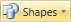
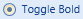
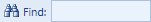
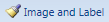

# Overview

Interactive controls are controls that are located throughout the ribbon user interface and in menus and are the ones that end users primarily interact with.

<table>
<thead>

<tr>
<th>Control Type</th>
<th>Description</th>
</tr>

</thead>
<tbody>

<tr>
<td>

[Button](button.md)

</td>
<td>

Normal button and checkable button.

</td>
</tr>

<tr>
<td>

[PopupButton](popupbutton.md)

</td>
<td>

Button that displays a popup when clicked.

</td>
</tr>

<tr>
<td>

[SplitButton](splitbutton.md)

</td>
<td>

Button that has two clickable areas.  The button portion of the split button acts like a normal button or checkable button.  The drop-down portion of the split button displays a popup.

</td>
</tr>

<tr>
<td>

[CheckBox](checkbox.md)

</td>
<td>

A checkbox control.

</td>
</tr>

<tr>
<td>

[RadioButton](radiobutton.md)

</td>
<td>

A radio button control.

</td>
</tr>

<tr>
<td>

[TextBox](textbox.md)

</td>
<td>

A textbox control.

</td>
</tr>

<tr>
<td>

[ComboBox](combobox.md)

</td>
<td>

A combobox control.

</td>
</tr>

<tr>
<td>

[FontFamilyComboBox](fontfamilycombobox.md)

</td>
<td>

A combobox control that allows for selection of a font family.

</td>
</tr>

<tr>
<td>

[FontSizeComboBox](fontsizecombobox.md)

</td>
<td>

A combobox control that allows for selection of a font size.

</td>
</tr>

<tr>
<td>

[Separator](separator.md)

</td>
<td>

A separator when used in a menu or as a large item in a group.  Can display text when a label is specified in menus.  Also renders as a normal label when used as a small item in a group.

</td>
</tr>

<tr>
<td>

[RibbonGallery](ribbongallery.md)

</td>
<td>

A control that allows for the presentation of one or more categories of items within the ribbon.  The items act like buttons and are displayed in a scrollable list that animates when scrolled.

</td>
</tr>

<tr>
<td>

[PopupGallery](popupgallery.md)

</td>
<td>

A control that allows for the presentation of one or more categories of items within a popup.  The items act like buttons and are displayed in a scrollable list that can be categorized and filtered.

</td>
</tr>

</tbody>
</table>
