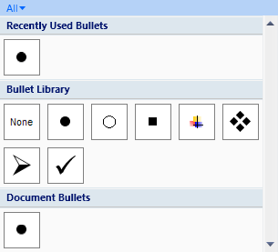

# PopupGallery

The [PopupGallery](xref:@ActiproUIRoot.Controls.Ribbon.Controls.PopupGallery) class provides an implementation of galleries that appear within a popup.  These galleries are controls that allow for the presentation of items visually within the popup for controls such as a [RibbonGallery](ribbongallery.md), [PopupButton](popupbutton.md), or [SplitButton](splitbutton.md).  The items act like buttons and are displayed in a scrollable list that can be optionally categorized and filtered.

The items in the gallery could be any sort of object to which a visual representation can be applied.  For instance, you may wish to provide visual representations of list styles that can be applied to a selection.

The gallery automatically determines the item size and how wide each column is.  You don't need to bother with specifying it yourself.

> [!NOTE]
> See the [Control Basics](../control-basics.md) topic for many implementation details that are common to the built-in controls such as this one.

## Variants

This control supports a single variant although the overall appearance of the gallery may be altered by specifying a different initial column count, the optional use of categorization, and the optional use of filtering.

| Context | Variant Size | Sample UI |
|-----|-----|-----|
| (any) | (any) |  |

## Capabilities

The following table gives an overview of the capabilities of the control.

| Item | Details |
|-----|-----|
| Supports tall size (fills height of [Group](../miscellaneous/group.md)) | No.  Is not for use in the ribbon itself, but rather on popups. |
| Supports normal size | Yes, however the control's normal size can be quite large. |
| Supports use in a [Menu](../miscellaneous/menu.md) | No.  This gallery should be used in a popup but outside of a [Menu](../miscellaneous/menu.md) control.  However, one commonly-used technique is to use a native WPF `StackPanel` as the popup content with the `PopupGallery` as one child and a [Menu](../miscellaneous/menu.md) containing menu items above or below the gallery. |
| Base class | [GalleryBase](xref:@ActiproUIRoot.Controls.Ribbon.Controls.Primitives.GalleryBase). |
| Child items | Yes.  The items may be any object and gallery may be bound to an `ItemsSource` as well. |
| Has popup | No. |
| Key tip access | No. |
| Is key tip scope | Yes. |
| Click event trigger | When an item in the gallery is clicked. |
| Supports use outside of Ribbon | Yes. |
| Supports commands | Yes. |
| Supports [ICheckableCommandParameter](xref:@ActiproUIRoot.Controls.Ribbon.Input.ICheckableCommandParameter) | No. |
| Supports [IValueCommandParameter](xref:@ActiproUIRoot.Controls.Ribbon.Input.IValueCommandParameter) | Yes.  Controls the selected value of the `PopupGallery` and supports live preview. |
| Default CommandParameter | [ObjectValueCommandParameter](xref:@ActiproUIRoot.Controls.Ribbon.Input.ObjectValueCommandParameter). |

## Initial Column Display

The [PopupGallery](xref:@ActiproUIRoot.Controls.Ribbon.Controls.PopupGallery).[InitialColumnCount](xref:@ActiproUIRoot.Controls.Ribbon.Controls.PopupGallery.InitialColumnCount) property is used to specify the initial number of columns that should be displayed when the popup that contains the `PopupGallery` is displayed.

The gallery measures the size of the items for you and determines how wide to ensure the popup is so that the number of columns of items you specify can be displayed.

## Resizing the Containing Popup

When a [PopupGallery](xref:@ActiproUIRoot.Controls.Ribbon.Controls.PopupGallery) is on a popup, it can optionally work with the popup to support resizing.  Once the popup is resized and closed, the next time the popup is displayed, the popup is auto-sized back to its default setting based on the initial column count you specify.  This is a requirement of the [Ribbon UI Design Guidelines](../../ribbonui-guidelines.md).

To enable popup resizing for a control that has a popup with a [PopupGallery](xref:@ActiproUIRoot.Controls.Ribbon.Controls.PopupGallery) on it, set the anchor control's `PopupResizeMode` to a non-`None` value.  Note that the enumeration used by the resize mode property accepts a [ControlResizeMode](xref:@ActiproUIRoot.Controls.ControlResizeMode) however only its `None`, `Vertical`, and `Both` options are supported.

> [!NOTE]
> If you want to ensure that only one column of items is ever displayed no matter what the width of the popup is, set the [UseSingleColumn](xref:@ActiproUIRoot.Controls.Ribbon.Controls.PopupGallery.UseSingleColumn) property to `true`.

## Hiding the Selected Value

By default, the [SelectedItem](xref:@ActiproUIRoot.Controls.Ribbon.Controls.Primitives.GalleryBase.SelectedItem) will be drawn with a highlight to indicate its selected state to the end user.  However, they may be cases where you wish to prevent the end user from seeing any sort of highlighted item in the gallery.  To do this, set the [IsSelectionHighlightVisible](xref:@ActiproUIRoot.Controls.Ribbon.Controls.Primitives.GalleryBase.IsSelectionHighlightVisible) property to `false`.

## Processing Item Clicks and Managing the Selected Value

When an item is clicked, the [ItemClick](xref:@ActiproUIRoot.Controls.Ribbon.Controls.Primitives.GalleryBase.ItemClick) is raised.  This event passes arguments that specify which item was clicked.  The clicked item becomes the [SelectedItem](xref:@ActiproUIRoot.Controls.Ribbon.Controls.Primitives.GalleryBase.SelectedItem) and is passed through as the value to the command for the gallery.

Galleries are designed to support the WPF [command model](../../command-model/index.md) for maintaining the selected value of the control.  By default, an [ObjectValueCommandParameter](xref:@ActiproUIRoot.Controls.Ribbon.Input.ObjectValueCommandParameter) is assigned as the `CommandParameter` of the control.

See the [Interaction with Value Controls](../../command-model/value-controls.md) topic for detailed information on using this command parameter to manage the control's value (selected item) and support live preview.

If you aren't using commands, you can choose to handle to [SelectedItemChanged](xref:@ActiproUIRoot.Controls.Ribbon.Controls.Primitives.GalleryBase.SelectedItemChanged) event to be notified when the [SelectedItem](xref:@ActiproUIRoot.Controls.Ribbon.Controls.Primitives.GalleryBase.SelectedItem) property is changed.

## Supporting Live Preview

When the mouse moves over an item, the item becomes the [ActiveItem](xref:@ActiproUIRoot.Controls.Ribbon.Controls.Primitives.GalleryBase.ActiveItem).  Many applications use the currently "active" item to supply a live preview to the end user of what would happen if the item was clicked.  Live preview for galleries can be implemented in one of two ways.

If you are using commands, the [Interaction with Value Controls](../../command-model/value-controls.md) topic explains how to support live preview using command can-execute handlers.

Alternatively, if you would rather use events, the [ActiveItemChanged](xref:@ActiproUIRoot.Controls.Ribbon.Controls.Primitives.GalleryBase.ActiveItemChanged) event is raised whenever the [ActiveItem](xref:@ActiproUIRoot.Controls.Ribbon.Controls.Primitives.GalleryBase.ActiveItem) property is changed.

## Categorizing Items

The [PopupGallery](xref:@ActiproUIRoot.Controls.Ribbon.Controls.PopupGallery).[CategoryProperty](xref:@ActiproUIRoot.Controls.Ribbon.Controls.PopupGallery.CategoryProperty) attached property can be assigned to each item.  If you choose to show categories in your `PopupGallery`, the property values you specify will be used to group the items into categories.  The list style screenshot above shows categories being used.

This sample XAML code shows how to apply the `Category` attached property to an item:

```xaml
<mediaImaging:BitmapImage ribbon:PopupGallery.Category="Recently Used Bullets" UriSource="/Resources/Images/GalleryBulletsType1.png" />
<mediaImaging:BitmapImage ribbon:PopupGallery.Category="Bullet Library" UriSource="/Resources/Images/GalleryBulletsNone.png" />
```

By default, the categorization feature is disabled in `PopupGallery`.  You can enable it by binding your items to the [CategorizedItemsSource](xref:@ActiproUIRoot.Controls.Ribbon.Controls.PopupGallery.CategorizedItemsSource) property instead of the normal `ItemsSource` property.  This tells `PopupGallery` to switch to categorized item mode.

## Categorized Item Filtering

If you have categorization enabled in your `PopupGallery` as described above, you can optionally add filtering capabilities.  The filter is a button at the top of the `PopupGallery` that when clicked, shows a menu of available filters.

There is always an `All` option and then rest of the options are the various category names.  The `All` filter is used by default and does not perform any filtering.  When a specific category is chosen as a filter, only the items in that category are displayed.

Use the [CanFilter](xref:@ActiproUIRoot.Controls.Ribbon.Controls.PopupGallery.CanFilter) property to determine whether the filtering UI is available to the end user.  The current category that is being filtered is available via the [FilterCategory](xref:@ActiproUIRoot.Controls.Ribbon.Controls.PopupGallery.FilterCategory) property.

## Zooming-In on Mouse Over

Galleries support zooming-in on mouse over functionality.  This means that as the mouse moves over an item, a popup will appear over the item and it can display an alternate template, provided by the [ZoomedInItemTemplate](xref:@ActiproUIRoot.Controls.Ribbon.Controls.Primitives.GalleryBase.ZoomedInItemTemplate) property.

The zoomed-in template should display more detail than the standard item template (from `ItemTemplate`).  Its use is completely optional.  Clicks through the zoomed-in popup are transparent an will affect the item under it.

To enable zooming-in, set the [ZoomedInItemTemplate](xref:@ActiproUIRoot.Controls.Ribbon.Controls.Primitives.GalleryBase.ZoomedInItemTemplate) or [ZoomedInItemTemplateSelector](xref:@ActiproUIRoot.Controls.Ribbon.Controls.Primitives.GalleryBase.ZoomedInItemTemplateSelector) property to a non-`null` value.

## Gallery Item Templates

### Items in a Gallery Must Have the Same Width/Height

The item templates used for galleries can be any width/height however the one rule to which you must adhere is that all items within the same gallery must be the same width and height.  The layout routines rely on this assumption.  Not only that, it makes for a better presentation to the end user.

The best way to ensure this is to explicitly set a width/height on the root element of your item template and the gallery will take care of measuring the additional gallery item border size for you.

### Render Items with Templates or Programmatically

The normal way to render an item is to use the `ItemTemplate` and WPF elements to provide the user interface.  However, sometimes you need more control over what is rendered, and must render the item via code.

In those cases, we've added a [CustomDrawElement](xref:@ActiproUIRoot.Controls.CustomDrawElement) element that can be placed in your item template.  Simply attach to its [CustomDraw](xref:@ActiproUIRoot.Controls.CustomDrawElement.CustomDraw) event and in the event handler, draw the item however you need.

### Item Screen Tips

Screen tips can be attached to gallery items in their item templates via the various [ScreenTipService](xref:@ActiproUIRoot.Controls.Ribbon.UI.ScreenTipService) attached properties.

Alternatively you may use the `ItemContainerStyle` like this to apply them to the container [GalleryItem](xref:@ActiproUIRoot.Controls.Ribbon.Controls.GalleryItem).

```xaml
<ribbon:PopupGallery.ItemContainerStyle>
	<Style TargetType="{x:Type ribbon:GalleryItem}">
		<Setter Property="ribbon:ScreenTipService.ScreenTipHeader" Value="{Binding Path=MyScreenTipProperty}" />
	</Style>
</ribbon:PopupGallery.ItemContainerStyle>
```

## Important Members

Since galleries indirectly inherit `ItemsControl`, you should use the `Items` or `ItemsSource` properties to bind the gallery to data.  Then use the `ItemTemplate` or `ItemTemplateSelector` property to provide templates for the items.

This table lists the important members of the [PopupGallery](xref:@ActiproUIRoot.Controls.Ribbon.Controls.PopupGallery) control, other than the ones inherited from `ItemsControl`.

| Member | Description |
|-----|-----|
| [ActiveItem](xref:@ActiproUIRoot.Controls.Ribbon.Controls.Primitives.GalleryBase.ActiveItem) Property | Gets the item that is currently active (being previewed). |
| [ActiveItemChanged](xref:@ActiproUIRoot.Controls.Ribbon.Controls.Primitives.GalleryBase.ActiveItemChanged) Event | Occurs when the [ActiveItem](xref:@ActiproUIRoot.Controls.Ribbon.Controls.Primitives.GalleryBase.ActiveItem) property is changed. |
| [CanFilter](xref:@ActiproUIRoot.Controls.Ribbon.Controls.PopupGallery.CanFilter) Property | Gets or sets whether the gallery can filter categorized items.  The default value is `false`.  This property requires that [CategorizedItemsSource](xref:@ActiproUIRoot.Controls.Ribbon.Controls.PopupGallery.CategorizedItemsSource) is not `null` for it to function correctly. |
| [CategorizedItemsSource](xref:@ActiproUIRoot.Controls.Ribbon.Controls.PopupGallery.CategorizedItemsSource) Property | Gets or sets the items source to used when categorization of items is desired.  Use this property instead of `ItemsSource` when categorization of items is desired.  By setting this property, the `ItemsSource` will be set to a view that supports categories and the [IsCategorized](xref:@ActiproUIRoot.Controls.Ribbon.Controls.PopupGallery.IsCategorized) property will be set to `true`. |
| [CategoryProperty](xref:@ActiproUIRoot.Controls.Ribbon.Controls.PopupGallery.CategoryProperty) Attached Property | The text-based attached property that should be applied to items when categorization of items is desired. |
| [CategoryTemplate](xref:@ActiproUIRoot.Controls.Ribbon.Controls.PopupGallery.CategoryTemplate) Property | Gets or sets the `DataTemplate` to use for the display of categories.  This template is used when the [IsCategorized](xref:@ActiproUIRoot.Controls.Ribbon.Controls.PopupGallery.IsCategorized) property is `true`. |
| [FilterCategory](xref:@ActiproUIRoot.Controls.Ribbon.Controls.PopupGallery.FilterCategory) Property | Gets or sets the category of items that is currently being filtered when [CanFilter](xref:@ActiproUIRoot.Controls.Ribbon.Controls.PopupGallery.CanFilter) is `true`.  This property does nothing if [CanFilter](xref:@ActiproUIRoot.Controls.Ribbon.Controls.PopupGallery.CanFilter) is `false` or [CategorizedItemsSource](xref:@ActiproUIRoot.Controls.Ribbon.Controls.PopupGallery.CategorizedItemsSource) is `null`.  When set to `null`, no filtering will be performed and items in all categories will be displayed. |
| [InitialColumnCount](xref:@ActiproUIRoot.Controls.Ribbon.Controls.PopupGallery.InitialColumnCount) Property | Gets or sets the initial number of gallery item columns that are displayed when the popup appears.  The default value is `1`. |
| [IsCategorized](xref:@ActiproUIRoot.Controls.Ribbon.Controls.PopupGallery.IsCategorized) Property | Gets whether the gallery is currently categorizing its items.  This property will be set to `true` if the [CategorizedItemsSource](xref:@ActiproUIRoot.Controls.Ribbon.Controls.PopupGallery.CategorizedItemsSource) property is set to an items source. |
| [IsPreviewEnabled](xref:@ActiproUIRoot.Controls.Ribbon.Controls.Primitives.GalleryBase.IsPreviewEnabled) Property | Gets or sets whether preview command notifications are enabled for the items.  The default value is `false` so set it to `true` to enable live preview functionality. |
| [IsSelectionHighlightVisible](xref:@ActiproUIRoot.Controls.Ribbon.Controls.Primitives.GalleryBase.IsSelectionHighlightVisible) Property | Gets or sets whether the [SelectedItem](xref:@ActiproUIRoot.Controls.Ribbon.Controls.Primitives.GalleryBase.SelectedItem)'s selection highlight is visible for the gallery.  The default value is `true`. |
| [ItemClick](xref:@ActiproUIRoot.Controls.Ribbon.Controls.Primitives.GalleryBase.ItemClick) Event | Occurs when an item is clicked. |
| [SelectedItem](xref:@ActiproUIRoot.Controls.Ribbon.Controls.Primitives.GalleryBase.SelectedItem) Property | Gets or sets the item that is currently selected. |
| [SelectedItemChanged](xref:@ActiproUIRoot.Controls.Ribbon.Controls.Primitives.GalleryBase.SelectedItemChanged) Event | Occurs when the [SelectedItem](xref:@ActiproUIRoot.Controls.Ribbon.Controls.Primitives.GalleryBase.SelectedItem) property is changed. |
| [UseSingleColumn](xref:@ActiproUIRoot.Controls.Ribbon.Controls.PopupGallery.UseSingleColumn) Property | Gets or sets whether the gallery's items are displayed in a single column.  The default value is `false`.  When this property is `false`, items will fill in the available space horizontally before wrapping to the next line. |
| [VerticalScrollBarVisibility](xref:@ActiproUIRoot.Controls.Ribbon.Controls.PopupGallery.VerticalScrollBarVisibility) Property | Gets or sets a value that indicates whether a vertical scrollbar should be displayed.  The default value is `Visible`. |
| [ZoomedInItemTemplate](xref:@ActiproUIRoot.Controls.Ribbon.Controls.Primitives.GalleryBase.ZoomedInItemTemplate) Property | Gets or sets the `DataTemplate` that is applied to zoomed-in items.  When this property is specified, a zoom-in effect will be made when hovering over items.  This template supplies an alternate template for the zoomed-in item that can provide more detail than the normal one. |
| [ZoomedInItemTemplateSelector](xref:@ActiproUIRoot.Controls.Ribbon.Controls.Primitives.GalleryBase.ZoomedInItemTemplateSelector) Property | Gets or sets the `DataTemplateSelector` that is used to select a template for zoomed-in items.  When this property is specified, a zoom-in effect will be made when hovering over items.  This template selector supplies an alternate template for the zoomed-in item that can provide more detail than the normal one. |

## Sample XAML

This sample XAML code shows how to create a list styles gallery similar to the one in Word.  Note that in a real application the items would drawn programmatically using [CustomDrawElement](xref:@ActiproUIRoot.Controls.CustomDrawElement) instead of rendering them using pre-defined images.

```xaml
<ribbon:PopupGallery InitialColumnCount="6" CanFilter="True">
	<ribbon:PopupGallery.CategorizedItemsSource>
		<x:Array Type="{x:Type mediaImaging:BitmapImage}">
			<mediaImaging:BitmapImage ribbon:PopupGallery.Category="Recently Used Bullets" UriSource="/Resources/Images/GalleryBulletsType1.png" />
			<mediaImaging:BitmapImage ribbon:PopupGallery.Category="Bullet Library" UriSource="/Resources/Images/GalleryBulletsNone.png" />
			<mediaImaging:BitmapImage ribbon:PopupGallery.Category="Bullet Library" UriSource="/Resources/Images/GalleryBulletsType1.png" />
			<mediaImaging:BitmapImage ribbon:PopupGallery.Category="Bullet Library" UriSource="/Resources/Images/GalleryBulletsType2.png" />
			<mediaImaging:BitmapImage ribbon:PopupGallery.Category="Bullet Library" UriSource="/Resources/Images/GalleryBulletsType3.png" />
			<mediaImaging:BitmapImage ribbon:PopupGallery.Category="Bullet Library" UriSource="/Resources/Images/GalleryBulletsType4.png" />
			<mediaImaging:BitmapImage ribbon:PopupGallery.Category="Bullet Library" UriSource="/Resources/Images/GalleryBulletsType5.png" />
			<mediaImaging:BitmapImage ribbon:PopupGallery.Category="Bullet Library" UriSource="/Resources/Images/GalleryBulletsType6.png" />
			<mediaImaging:BitmapImage ribbon:PopupGallery.Category="Bullet Library" UriSource="/Resources/Images/GalleryBulletsType7.png" />
			<mediaImaging:BitmapImage ribbon:PopupGallery.Category="Document Bullets" UriSource="/Resources/Images/GalleryBulletsType1.png" />
		</x:Array>
	</ribbon:PopupGallery.CategorizedItemsSource>
	<ribbon:PopupGallery.ItemTemplate>
		<DataTemplate>
			<Border Margin="2" BorderBrush="#808080" BorderThickness="1" Background="#FFFFFF" Width="40" Height="40" SnapsToDevicePixels="True">
				<Image Source="{Binding BindsDirectlyToSource=True}" Stretch="None" HorizontalAlignment="Center" VerticalAlignment="Center" SnapsToDevicePixels="True" />
			</Border>
		</DataTemplate>
	</ribbon:PopupGallery.ItemTemplate>
	<ribbon:PopupGallery.ZoomedInItemTemplate>
		<DataTemplate>
			<Border Margin="2" BorderBrush="#808080" BorderThickness="1" Background="#FFFFFF" Width="70" Height="70" SnapsToDevicePixels="True">
				<Image Source="{Binding BindsDirectlyToSource=True}" Stretch="None" HorizontalAlignment="Center" VerticalAlignment="Center" SnapsToDevicePixels="True">
					<Image.LayoutTransform>
						<ScaleTransform ScaleX="2" ScaleY="2" />
					</Image.LayoutTransform>
				</Image>
			</Border>
		</DataTemplate>
	</ribbon:PopupGallery.ZoomedInItemTemplate>
</ribbon:PopupGallery>
```
