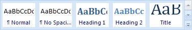
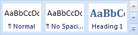
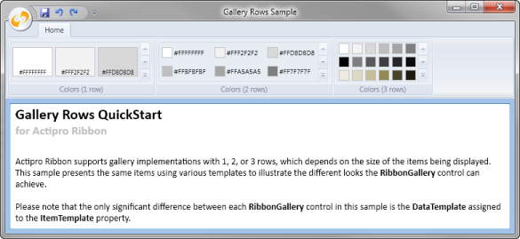

# RibbonGallery

The [RibbonGallery](xref:ActiproSoftware.Windows.Controls.Ribbon.Controls.RibbonGallery) class provides an implementation of in-ribbon galleries.  In-ribbon galleries are controls that allow for the presentation of items visually within a ribbon [Group](../miscellaneous/group.md).  The items act like buttons and are displayed in a scrollable list that animates when scrolled.

The items in the gallery could be any sort of object to which a visual representation can be applied.  For instance, you may wish to provide visual representations of styles that can be applied to a selection.

The gallery automatically determines the item size and how wide each column is.  You don't need to bother with specifying it yourself.

> [!NOTE]
> See the [Control Basics](../control-basics.md) topic for many implementation details that are common to the built-in controls such as this one.

## Variants

This control supports numerous UI styles (called variants) based on its [Context](xref:ActiproSoftware.Windows.Controls.Ribbon.Controls.Primitives.ControlBase.Context) and [VariantSize](xref:ActiproSoftware.Windows.Controls.Ribbon.Controls.Primitives.ControlBase.VariantSize) property settings.

| Context | Variant Size | Sample UI |
|-----|-----|-----|
| (any) | Large |  |
| (any) | Medium |  |
| (any) | Small |  |

## Capabilities

The following table gives an overview of the capabilities of the control.

| Item | Details |
|-----|-----|
| Supports tall size (fills height of [Group](../miscellaneous/group.md)) | Yes. |
| Supports normal size | No. |
| Supports use in a [Menu](../miscellaneous/menu.md) | No. |
| Base class | [GalleryBase](xref:ActiproSoftware.Windows.Controls.Ribbon.Controls.Primitives.GalleryBase). |
| Child items | Yes.  The items may be any object and gallery may be bound to an `ItemsSource` as well. |
| Has popup | Yes.  The popup must contain a [PopupGallery](popupgallery.md) control somewhere on it.  The popup may also contain any other sort of controls that are appropriate, such as a [Menu](../miscellaneous/menu.md) of items related to the gallery. |
| Key tip access | Yes.  Set via the [KeyTipAccessText](xref:ActiproSoftware.Windows.Controls.Ribbon.Controls.Primitives.ItemsControlBase.KeyTipAccessText) property. |
| Is key tip scope | Yes. |
| Click event trigger | When an item in the gallery is clicked. |
| Supports use outside of Ribbon | Yes. |
| Supports commands | Yes. |
| Supports [ICheckableCommandParameter](xref:ActiproSoftware.Windows.Controls.Ribbon.Input.ICheckableCommandParameter) | No. |
| Supports [IValueCommandParameter](xref:ActiproSoftware.Windows.Controls.Ribbon.Input.IValueCommandParameter) | Yes.  Controls the selected value of the `RibbonGallery` and supports live preview. |
| Default CommandParameter | [ObjectValueCommandParameter](xref:ActiproSoftware.Windows.Controls.Ribbon.Input.ObjectValueCommandParameter). |

## Resizing Behavior

In-ribbon galleries mimic the Office gallery resizing behavior exactly.  In-ribbon galleries can be resized in three distinct stages, with each stage corresponding to the current [VariantSize](xref:ActiproSoftware.Windows.Controls.Ribbon.Controls.VariantSize) of the parent [Group](../miscellaneous/group.md).

### Small Variant Size

The first stage occurs when the parent [Group](../miscellaneous/group.md) has a variant size of `Small`.  The `RibbonGallery` will collapse and render like a [PopupButton](popupbutton.md) if its [VariantBehavior](xref:ActiproSoftware.Windows.Controls.Ribbon.Controls.RibbonGallery.VariantBehavior) property permits collapsing (the default).  Clicking on the collapsed button displays a popup with the gallery items on it.

If the `RibbonGallery` is not permitted to be collapsed, it will display the number of columns of items indicated by its [MediumVariantColumnCount](xref:ActiproSoftware.Windows.Controls.Ribbon.Controls.RibbonGallery.MediumVariantColumnCount) property.


*An in-ribbon gallery in a group with a small variant*

### Medium Variant Size

The second stage occurs when the parent [Group](../miscellaneous/group.md) has a variant size of `Medium`.  When in this stage the gallery will display items.  It will show more or less item columns depending on the available space.  The range of item columns that are displayed depend on the [MediumVariantColumnCount](xref:ActiproSoftware.Windows.Controls.Ribbon.Controls.RibbonGallery.MediumVariantColumnCount) and [LargeVariantColumnCount](xref:ActiproSoftware.Windows.Controls.Ribbon.Controls.RibbonGallery.LargeVariantColumnCount) properties.

> [!NOTE]
> Set those two properties to the same value to prevent the gallery from resizing within a `Medium` variant.

When space is limited but a `Medium` variant is active, the number of columns displayed will be [MediumVariantColumnCount](xref:ActiproSoftware.Windows.Controls.Ribbon.Controls.RibbonGallery.MediumVariantColumnCount).  As space increases and while still in a `Medium` variant, the number of columns displayed will grow until [LargeVariantColumnCount](xref:ActiproSoftware.Windows.Controls.Ribbon.Controls.RibbonGallery.LargeVariantColumnCount) is reached.


*An in-ribbon gallery in a group with a medium variant*

### Large Variant Size

The final stage occurs when the parent [Group](../miscellaneous/group.md) has a variant size of `Large`.  If the `RibbonGallery`'s [VariantBehavior](xref:ActiproSoftware.Windows.Controls.Ribbon.Controls.RibbonGallery.VariantBehavior) property permits auto-sizing in the large variant (the default), the number of item columns displayed will increase from [LargeVariantColumnCount](xref:ActiproSoftware.Windows.Controls.Ribbon.Controls.RibbonGallery.LargeVariantColumnCount) until the available space is filled in the ribbon.


*An in-ribbon gallery in a group with a large variant*

### VariantBehavior Settings

As mentioned above, the [VariantBehavior](xref:ActiproSoftware.Windows.Controls.Ribbon.Controls.RibbonGallery.VariantBehavior) property controls how the variants behave when resizing.

This table lists the values of the [RibbonGalleryVariantBehavior](xref:ActiproSoftware.Windows.Controls.Ribbon.Controls.RibbonGalleryVariantBehavior) enumeration.

| Value | Description |
|-----|-----|
| Default | `Small` variants collapse to a [PopupButton](popupbutton.md). `Large` variants auto-expand to fill the ribbon. |
| NoCollapse | `Small` variants do not collapse to a [PopupButton](popupbutton.md). `Large` variants auto-expand to fill the ribbon. |
| NoAutoSize | `Small` variants collapse to a [PopupButton](popupbutton.md). `Large` variants do not auto-expand to fill the ribbon. |
| NoCollapseNoAutoSize | `Small` variants do not collapse to a [PopupButton](popupbutton.md). `Large` variants do not auto-expand to fill the ribbon. |

## Item Rows

The [RibbonGallery](xref:ActiproSoftware.Windows.Controls.Ribbon.Controls.RibbonGallery) automatically determines the number of rows displayed based on its size and the size of the items. There can be anywhere from one to three rows, each of which supports smooth row-by-row scrolling.



*An in-ribbon gallery showing the same items with different sized templates*

## Hiding the Selected Value

By default, the [SelectedItem](xref:ActiproSoftware.Windows.Controls.Ribbon.Controls.Primitives.GalleryBase.SelectedItem) will be drawn with a highlight to indicate its selected state to the end user.  However they may be cases where you wish to prevent the end user from seeing any sort of highlighted item in the gallery.  To do this, set the [IsSelectionHighlightVisible](xref:ActiproSoftware.Windows.Controls.Ribbon.Controls.Primitives.GalleryBase.IsSelectionHighlightVisible) property to `false`.

## Processing Item Clicks and Managing the Selected Value

When an item is clicked, the [ItemClick](xref:ActiproSoftware.Windows.Controls.Ribbon.Controls.Primitives.GalleryBase.ItemClick) is raised.  This event passes arguments that specify which item was clicked.  The clicked item becomes the [SelectedItem](xref:ActiproSoftware.Windows.Controls.Ribbon.Controls.Primitives.GalleryBase.SelectedItem) and is passed through as the value to the command for the gallery.

Galleries are designed to support the WPF [command model](../../command-model/index.md) for maintaining the selected value of the control.  By default an [ObjectValueCommandParameter](xref:ActiproSoftware.Windows.Controls.Ribbon.Input.ObjectValueCommandParameter) is assigned as the `CommandParameter` of the control.

See the [Interaction with Value Controls](../../command-model/value-controls.md) topic for detailed information on using this command parameter to manage the control's value (selected item) and support live preview.

If you aren't using commands, you can choose to handle to [SelectedItemChanged](xref:ActiproSoftware.Windows.Controls.Ribbon.Controls.Primitives.GalleryBase.SelectedItemChanged) event to be notified when the [SelectedItem](xref:ActiproSoftware.Windows.Controls.Ribbon.Controls.Primitives.GalleryBase.SelectedItem) property is changed.

## Supporting Live Preview

When the mouse moves over an item, the item becomes the [ActiveItem](xref:ActiproSoftware.Windows.Controls.Ribbon.Controls.Primitives.GalleryBase.ActiveItem).  Many applications use the currently "active" item to supply a live preview to the end user of what would happen if the item was clicked.  Live preview for galleries can be implemented in one of two ways.

If you are using commands, the [Interaction with Value Controls](../../command-model/value-controls.md) topic explains how to support live preview using command can-execute handlers.

Alternatively, if you would rather use events, the [ActiveItemChanged](xref:ActiproSoftware.Windows.Controls.Ribbon.Controls.Primitives.GalleryBase.ActiveItemChanged) event fires whenever the [ActiveItem](xref:ActiproSoftware.Windows.Controls.Ribbon.Controls.Primitives.GalleryBase.ActiveItem) property is changed.

## Zooming-In on Mouse Over

Galleries support zooming-in on mouse over functionality.  This means that as the mouse moves over an item, a popup will appear over the item and it can display an alternate template, provided by the [ZoomedInItemTemplate](xref:ActiproSoftware.Windows.Controls.Ribbon.Controls.Primitives.GalleryBase.ZoomedInItemTemplate) property.

The zoomed-in template should display more detail than the standard item template (from `ItemTemplate`).  Its use is completely optional.  Clicks through the zoomed-in popup are transparent an will affect the item under it.

To enable zooming-in, set the [ZoomedInItemTemplate](xref:ActiproSoftware.Windows.Controls.Ribbon.Controls.Primitives.GalleryBase.ZoomedInItemTemplate) or [ZoomedInItemTemplateSelector](xref:ActiproSoftware.Windows.Controls.Ribbon.Controls.Primitives.GalleryBase.ZoomedInItemTemplateSelector) property to a non-`null` value.

## Gallery Item Templates

### Items in a Gallery Must Have the Same Width/Height

The item templates used for galleries can be any width/height however the one rule to which you must adhere is that all items within the same gallery must be the same width and height.  The layout routines rely on this assumption.  Not only that, it makes for a better presentation to the end user.

The best way to ensure this is to explicitly set a width/height on the root element of your item template and the gallery will take care of measuring the additional gallery item border size for you.

### Render Items with Templates or Programmatically

The normal way to render an item is to use the `ItemTemplate` and WPF elements to provide the user interface.  However sometimes you need more control over what is rendered, and must render the item via code.

In those cases, we've added a [CustomDrawElement](xref:ActiproSoftware.Windows.Controls.CustomDrawElement) element that can be placed in your item template.  Simply attach to its [CustomDraw](xref:ActiproSoftware.Windows.Controls.CustomDrawElement.CustomDraw) event and in the event handler, draw the item however you need.

### Item Screen Tips

Screen tips can be attached to gallery items in their item templates via the various [ScreenTipService](xref:ActiproSoftware.Windows.Controls.Ribbon.UI.ScreenTipService) attached properties.

Alternatively you may use the `ItemContainerStyle` like this to apply them to the container [GalleryItem](xref:ActiproSoftware.Windows.Controls.Ribbon.Controls.GalleryItem).

```xaml
<ribbon:RibbonGallery.ItemContainerStyle>
	<Style TargetType="{x:Type ribbon:GalleryItem}">
		<Setter Property="ribbon:ScreenTipService.ScreenTipHeader" Value="{Binding Path=MyScreenTipProperty}" />
	</Style>
</ribbon:RibbonGallery.ItemContainerStyle>
```

## Adding Popup Content

Any sort of content may be displayed in the popup for this control.  Simply assign the content to the [PopupContent](xref:ActiproSoftware.Windows.Controls.Ribbon.Controls.RibbonGallery.PopupContent) property.  If the content is not a UI element and needs to be templated, you may use the [PopupContentTemplate](xref:ActiproSoftware.Windows.Controls.Ribbon.Controls.RibbonGallery.PopupContentTemplate) or [PopupContentTemplateSelector](xref:ActiproSoftware.Windows.Controls.Ribbon.Controls.RibbonGallery.PopupContentTemplateSelector) properties to do so.

One requirement of in-ribbon galleries is that they have a [PopupGallery](popupgallery.md) somewhere in their popup that binds to the same items source that the `RibbonGallery` does.

> [!NOTE]
> To properly add multiple controls for use as popup content, use a `Panel` as the [PopupContent](xref:ActiproSoftware.Windows.Controls.Ribbon.Controls.Primitives.PopupButtonBase.PopupContent).  For instance, use a native WPF `StackPanel` to stack a [PopupGallery](popupgallery.md) on top of a [Menu](../miscellaneous/menu.md) of items.  By using techniques like this (also illustrated throughout the sample project), you can create complex layouts of popup content.

See the [Working with Popups](../working-with-popups.md) topic for more detailed information on what you can do with popups.

## Making the Popup Resizable

Since it is assumed that your `RibbonGallery` popup has a [PopupGallery](popupgallery.md) somewhere in its content (a requirement), the popup has a special gripper that can be used by assigning a value to the [PopupResizeMode](xref:ActiproSoftware.Windows.Controls.Ribbon.Controls.RibbonGallery.PopupResizeMode) property.  The default value is `Both`.

## Important Members

Since galleries indirectly inherit `ItemsControl`, you should use the `Items` or `ItemsSource` properties to bind the gallery to data.  Then use the `ItemTemplate` or `ItemTemplateSelector` property to provide templates for the items.

This table lists the important members of the [RibbonGallery](xref:ActiproSoftware.Windows.Controls.Ribbon.Controls.RibbonGallery) control, other than the ones inherited from `ItemsControl`.

| Member | Description |
|-----|-----|
| [ActiveItem](xref:ActiproSoftware.Windows.Controls.Ribbon.Controls.Primitives.GalleryBase.ActiveItem) Property | Gets the item that is currently active (being previewed). |
| [ActiveItemChanged](xref:ActiproSoftware.Windows.Controls.Ribbon.Controls.Primitives.GalleryBase.ActiveItemChanged) Event | Occurs when the [ActiveItem](xref:ActiproSoftware.Windows.Controls.Ribbon.Controls.Primitives.GalleryBase.ActiveItem) property is changed. |
| [ColumnCount](xref:ActiproSoftware.Windows.Controls.Ribbon.Controls.RibbonGallery.ColumnCount) Property | Gets the number of columns that are currently displayed in the in-ribbon gallery. |
| [IsCollapsed](xref:ActiproSoftware.Windows.Controls.Ribbon.Controls.RibbonGallery.IsCollapsed) Property | Gets whether the gallery is collapsed to a popup button.  When collapsed, the gallery items can be viewed in a popup by clicking the button that represents the gallery. |
| [IsPreviewEnabled](xref:ActiproSoftware.Windows.Controls.Ribbon.Controls.Primitives.GalleryBase.IsPreviewEnabled) Property | Gets or sets whether preview command notifications are enabled for the items.  The default value is `false` so set it to `true` to enable live preview functionality. |
| [IsSelectionHighlightVisible](xref:ActiproSoftware.Windows.Controls.Ribbon.Controls.Primitives.GalleryBase.IsSelectionHighlightVisible) Property | Gets or sets whether the [SelectedItem](xref:ActiproSoftware.Windows.Controls.Ribbon.Controls.Primitives.GalleryBase.SelectedItem)'s selection highlight is visible for the gallery.  The default value is `true`. |
| [ItemClick](xref:ActiproSoftware.Windows.Controls.Ribbon.Controls.Primitives.GalleryBase.ItemClick) Event | Occurs when an item is clicked. |
| [LargeVariantColumnCount](xref:ActiproSoftware.Windows.Controls.Ribbon.Controls.RibbonGallery.LargeVariantColumnCount) Property | Gets or sets the maximum number of columns that can be displayed in an in-ribbon gallery when in a [Group](../miscellaneous/group.md) with a `Medium` variant size, which is also the minimum number of columns that can be displayed when in a [Group](../miscellaneous/group.md) with a `Large` variant size. |
| [MediumVariantColumnCount](xref:ActiproSoftware.Windows.Controls.Ribbon.Controls.RibbonGallery.MediumVariantColumnCount) Property | Gets or sets the minimum number of columns that can be displayed in an in-ribbon gallery when in a [Group](../miscellaneous/group.md) with a `Medium` variant size. |
| [PopupContent](xref:ActiproSoftware.Windows.Controls.Ribbon.Controls.RibbonGallery.PopupContent) Property | Gets or sets the content that is displayed on the popup for the gallery.  The content must contain a [PopupGallery](popupgallery.md) somewhere inside of it that binds to the same item list that the `RibbonGallery` does. |
| [PopupResizeMode](xref:ActiproSoftware.Windows.Controls.Ribbon.Controls.RibbonGallery.PopupResizeMode) Property | Gets or sets a [ControlResizeMode](xref:ActiproSoftware.Windows.Controls.ControlResizeMode) that specifies the popup's resizing capabilities. |
| [SelectedItem](xref:ActiproSoftware.Windows.Controls.Ribbon.Controls.Primitives.GalleryBase.SelectedItem) Property | Gets or sets the item that is currently selected. |
| [SelectedItemChanged](xref:ActiproSoftware.Windows.Controls.Ribbon.Controls.Primitives.GalleryBase.SelectedItemChanged) Event | Occurs when the [SelectedItem](xref:ActiproSoftware.Windows.Controls.Ribbon.Controls.Primitives.GalleryBase.SelectedItem) property is changed. |
| [VariantBehavior](xref:ActiproSoftware.Windows.Controls.Ribbon.Controls.RibbonGallery.VariantBehavior) Property | Gets or sets a [RibbonGalleryVariantBehavior](xref:ActiproSoftware.Windows.Controls.Ribbon.Controls.RibbonGalleryVariantBehavior) that specifies how the gallery renders itself based on the current value of the `VariantSize` property. |
| [ZoomedInItemTemplate](xref:ActiproSoftware.Windows.Controls.Ribbon.Controls.Primitives.GalleryBase.ZoomedInItemTemplate) Property | Gets or sets the `DataTemplate` that is applied to zoomed-in items.  When this property is specified, a zoom-in effect will be made when hovering over items.  This template supplies an alternate template for the zoomed-in item that can provide more detail than the normal one. |
| [ZoomedInItemTemplateSelector](xref:ActiproSoftware.Windows.Controls.Ribbon.Controls.Primitives.GalleryBase.ZoomedInItemTemplateSelector) Property | Gets or sets the `DataTemplateSelector` that is used to select a template for zoomed-in items.  When this property is specified, a zoom-in effect will be made when hovering over items.  This template selector supplies an alternate template for the zoomed-in item that can provide more detail than the normal one. |

## Sample XAML

This sample XAML code shows how to create a `Styles` gallery similar to the one in Word.

```xaml
<ribbon:RibbonGallery ImageSourceLarge="/Resources/Images/QuickStyles32.png" Label="Quick Styles" 
	ScreenTipDescription="Format titles, quotes, and other text using the styles in this gallery.">
	<ribbon:RibbonGallery.ItemsSource>
		<x:Array Type="{x:Type mediaImaging:BitmapImage}">
			<mediaImaging:BitmapImage ribbon:ScreenTipService.ScreenTipHeader="Normal" UriSource="/Resources/Images/GalleryStylesNormal.png" />
			<mediaImaging:BitmapImage ribbon:ScreenTipService.ScreenTipHeader="No Spacing" UriSource="/Resources/Images/GalleryStylesNoSpacing.png" />
			<mediaImaging:BitmapImage ribbon:ScreenTipService.ScreenTipHeader="Heading 1" UriSource="/Resources/Images/GalleryStylesHeading1.png" />
			<mediaImaging:BitmapImage ribbon:ScreenTipService.ScreenTipHeader="Heading 2" UriSource="/Resources/Images/GalleryStylesHeading2.png" />
			<mediaImaging:BitmapImage ribbon:ScreenTipService.ScreenTipHeader="Title" UriSource="/Resources/Images/GalleryStylesTitle.png" />
			<mediaImaging:BitmapImage ribbon:ScreenTipService.ScreenTipHeader="Subtitle" UriSource="/Resources/Images/GalleryStylesSubTitle.png" />
			<mediaImaging:BitmapImage ribbon:ScreenTipService.ScreenTipHeader="Subtle Emphasis" UriSource="/Resources/Images/GalleryStylesSubtleEmphasis.png" />
			<mediaImaging:BitmapImage ribbon:ScreenTipService.ScreenTipHeader="Emphasis" UriSource="/Resources/Images/GalleryStylesEmphasis.png" />
			<mediaImaging:BitmapImage ribbon:ScreenTipService.ScreenTipHeader="Intense Emphasis" UriSource="/Resources/Images/GalleryStylesIntenseEmphasis.png" />
			<mediaImaging:BitmapImage ribbon:ScreenTipService.ScreenTipHeader="Strong" UriSource="/Resources/Images/GalleryStylesStrong.png" />
			<mediaImaging:BitmapImage ribbon:ScreenTipService.ScreenTipHeader="Quote" UriSource="/Resources/Images/GalleryStylesQuote.png" />
			<mediaImaging:BitmapImage ribbon:ScreenTipService.ScreenTipHeader="Intense Quote" UriSource="/Resources/Images/GalleryStylesIntenseQuote.png" />
			<mediaImaging:BitmapImage ribbon:ScreenTipService.ScreenTipHeader="Subtle Reference" UriSource="/Resources/Images/GalleryStylesSubtleReference.png" />
			<mediaImaging:BitmapImage ribbon:ScreenTipService.ScreenTipHeader="Intense Reference" UriSource="/Resources/Images/GalleryStylesIntenseReference.png" />
			<mediaImaging:BitmapImage ribbon:ScreenTipService.ScreenTipHeader="Book Title" UriSource="/Resources/Images/GalleryStylesBookTitle.png" />
			<mediaImaging:BitmapImage ribbon:ScreenTipService.ScreenTipHeader="Paragraph" UriSource="/Resources/Images/GalleryStylesListParagraph.png" />
		</x:Array>
	</ribbon:RibbonGallery.ItemsSource>
	<ribbon:RibbonGallery.ItemTemplate>
		<DataTemplate>
			<Image Margin="2" Source="{Binding BindsDirectlyToSource=True}" Stretch="None" />
		</DataTemplate>
	</ribbon:RibbonGallery.ItemTemplate>
	<ribbon:RibbonGallery.PopupContent>
		<StackPanel>
			<ribbon:PopupGallery InitialColumnCount="4"
				ItemTemplate="{Binding RelativeSource={RelativeSource Mode=FindAncestor, AncestorType={x:Type ribbon:RibbonGallery}}, Path=ItemTemplate}"										
				ItemsSource="{Binding RelativeSource={RelativeSource Mode=FindAncestor, AncestorType={x:Type ribbon:RibbonGallery}}, Path=ItemsSource}"
				/>
			<ribbon:Separator />
			<ribbon:Menu>
				<ribbon:Button Label="Save Selection as a New Quick Style..." />
				<ribbon:Button ImageSourceSmall="/Resources/Images/ClearFormatting16.png" Label="Clear Formatting" />
				<ribbon:Button ImageSourceSmall="/Resources/Images/ApplyStyles16.png" Label="Apply Styles..." />
			</ribbon:Menu>
		</StackPanel>
	</ribbon:RibbonGallery.PopupContent>
</ribbon:RibbonGallery>
```
