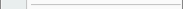
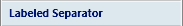
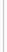

# Separator

The [Separator](xref:@ActiproUIRoot.Controls.Ribbon.Controls.Separator) class provides an implementation of a separator when used in a menu, popup or as a large item in a group.

It can display text when a label is specified in menus and also renders as a normal label when used as a medium/small item in a group.

> [!NOTE]
> See the [Control Basics](../control-basics.md) topic for many implementation details that are common to the built-in controls such as this one.

## Variants

This control supports numerous UI styles (called variants) based on its [Context](xref:@ActiproUIRoot.Controls.Ribbon.Controls.Primitives.ControlBase.Context) and [VariantSize](xref:@ActiproUIRoot.Controls.Ribbon.Controls.Primitives.ControlBase.VariantSize) property settings.

| Context | Variant Size | Sample UI |
|-----|-----|-----|
| MenuItem | Large |  |
| MenuItem | Medium, Small |  (no label) |
| MenuItem | Medium, Small |  (with label) |
| BackstageItem | (any) |  |
| None | Large |  |
| None | Medium, Small |  |
| (any other) | Large |  |
| (any other) | Medium, Small |  (with label) |

## Capabilities

The following table gives an overview of the capabilities of the control.

| Item | Details |
|-----|-----|
| Supports tall size (fills height of [Group](../miscellaneous/group.md)) | Yes. |
| Supports normal size | Yes. |
| Supports use in a [Menu](../miscellaneous/menu.md) | Yes. |
| Base class | [ControlBase](xref:@ActiproUIRoot.Controls.Ribbon.Controls.Primitives.ControlBase). |
| Child items | None. |
| Has popup | No. |
| Key tip access | No. |
| Is key tip scope | No. |
| Click event trigger | None. |
| Supports use outside of Ribbon | Yes. |
| Supports commands | Yes, but for populating the user interface only. |
| Supports [ICheckableCommandParameter](xref:@ActiproUIRoot.Controls.Ribbon.Input.ICheckableCommandParameter) | No. |
| Supports [IValueCommandParameter](xref:@ActiproUIRoot.Controls.Ribbon.Input.IValueCommandParameter) | No. |
| Default CommandParameter | None. |

## Sample XAML

This code shows how to prototype this control in XAML-only:

```xaml
<ribbon:Separator />
```

This code shows how to prototype this control with a label in XAML-only:

```xaml
<ribbon:Separator Label="Options" />
```
