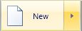
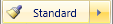
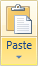
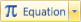
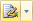
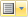

# SplitButton

The [SplitButton](xref:@ActiproUIRoot.Controls.Ribbon.Controls.SplitButton) class provides an implementation of a button that has two clickable areas.  The button portion of the split button acts like a normal button or checkable button.  The drop-down portion of the split button displays a popup.

The popup content is usually a [Menu](../miscellaneous/menu.md), but instead may be any sort of content that you wish, including a `Panel` of mutiple controls or elements.

> [!NOTE]
> See the [Control Basics](../control-basics.md) topic for many implementation details that are common to the built-in controls such as this one.

## Variants

This control supports numerous UI styles (called variants) based on its [Context](xref:@ActiproUIRoot.Controls.Ribbon.Controls.Primitives.ControlBase.Context) and [VariantSize](xref:@ActiproUIRoot.Controls.Ribbon.Controls.Primitives.ControlBase.VariantSize) property settings.

| Context | Variant Size | Sample UI |
|-----|-----|-----|
| MenuItem | Large |  |
| MenuItem | Medium, Small |  |
| (any other) | Large |  |
| (any other) | Medium |  |
| (any other) | Small |  |
| (any other) | Collapsed |  (also has ImageSourceSmallSize set to 11,11 for this sample) |

## Capabilities

The following table gives an overview of the capabilities of the control.

| Item | Details |
|-----|-----|
| Supports tall size (fills height of [Group](../miscellaneous/group.md)) | Yes. |
| Supports normal size | Yes. |
| Supports use in a [Menu](../miscellaneous/menu.md) | Yes. |
| Base class | [PopupButtonBase](xref:@ActiproUIRoot.Controls.Ribbon.Controls.Primitives.PopupButtonBase). |
| Child items | Yes.  Single item set via the [PopupContent](xref:@ActiproUIRoot.Controls.Ribbon.Controls.Primitives.PopupButtonBase.PopupContent) property.  The content may be any object and can be templated if desired.  The most common content is a [Menu](../miscellaneous/menu.md) control. |
| Has popup | Yes. |
| Key tip access | Yes.  Set via the [KeyTipAccessText](xref:@ActiproUIRoot.Controls.Ribbon.Controls.Primitives.ControlBase.KeyTipAccessText) property. |
| Is key tip scope | Yes. |
| Click event trigger | None. |
| Supports use outside of Ribbon | Yes. |
| Supports commands | Yes. |
| Supports [ICheckableCommandParameter](xref:@ActiproUIRoot.Controls.Ribbon.Input.ICheckableCommandParameter) | Yes.  Controls the checked state of the button. |
| Supports [IValueCommandParameter](xref:@ActiproUIRoot.Controls.Ribbon.Input.IValueCommandParameter) | No. |
| Default CommandParameter | [CheckableCommandParameter](xref:@ActiproUIRoot.Controls.Ribbon.Input.CheckableCommandParameter). |

## Managing the Checked State

This control is designed to use the WPF command model to maintain the checked state of the control.  By default, a [CheckableCommandParameter](xref:@ActiproUIRoot.Controls.Ribbon.Input.CheckableCommandParameter) is assigned as the `CommandParameter` of the control.

See the [Command Model](../../command-model/index.md) topic for detailed information on using this command parameter to manage the checked state.

## Adding Popup Content

Any sort of content may be displayed in the popup for this control.  Simply assign the content to the [PopupContent](xref:@ActiproUIRoot.Controls.Ribbon.Controls.Primitives.PopupButtonBase.PopupContent) property.  If the content is not a UI element and needs to be templated, you may use the [PopupContentTemplate](xref:@ActiproUIRoot.Controls.Ribbon.Controls.Primitives.PopupButtonBase.PopupContentTemplate) or [PopupContentTemplateSelector](xref:@ActiproUIRoot.Controls.Ribbon.Controls.Primitives.PopupButtonBase.PopupContentTemplateSelector) properties to do so.

The most common content for a popup is a [Menu](../miscellaneous/menu.md) control, which renders its items as menu items:

```xaml
<ribbon:SplitButton ImageSourceLarge="/Resources/Images/Paste32.png" ImageSourceSmall="/Resources/Images/Paste16.png" Label="Paste" KeyTipAccessText="V">
	<ribbon:Menu>
		<ribbon:Button ImageSourceSmall="/Resources/Images/Paste16.png" Label="Paste" KeyTipAccessText="P" />
		<ribbon:Button ImageSourceSmall="/Resources/Images/PasteSpecial16.png" Label="Paste Special" KeyTipAccessText="S" />
		<ribbon:Button ImageSourceSmall="/Resources/Images/PasteHyperlink16.png" Label="Paste Hyperlink" KeyTipAccessText="H" />
	</ribbon:Menu>
</ribbon:SplitButton>
```

> [!NOTE]
> To properly add multiple controls for use as popup content, use a `Panel` as the [PopupContent](xref:@ActiproUIRoot.Controls.Ribbon.Controls.Primitives.PopupButtonBase.PopupContent).  For instance, use a native WPF `StackPanel` to stack a popup header banner image on top of a [Menu](../miscellaneous/menu.md) of items.  By using techniques like this (also illustrated throughout the sample project), you can create complex layouts of popup content.

See the [Working with Popups](../working-with-popups.md) topic for more detailed information on what you can do with popups.

## Making the Popup Resizable

### With a Contained PopupGallery

The popup has a special gripper that can be used by assigning a value to the [PopupResizeMode](xref:@ActiproUIRoot.Controls.Ribbon.Controls.Primitives.PopupButtonBase.PopupResizeMode) property.  However, the gripper is only intended to work if there is a [PopupGallery](popupgallery.md) control contained somewhere in the popup content since there is special resizing logic needed to handle that scenario.

### Without a Contained PopupGallery

There may be other scenarios where your popup content doesn't include a [PopupGallery](popupgallery.md) control but you still want the popup to be resizable.  In this case, leave the [PopupResizeMode](xref:@ActiproUIRoot.Controls.Ribbon.Controls.Primitives.PopupButtonBase.PopupResizeMode) property its default value of `None` and wrap your popup content with a [ResizableContentControl](xref:@ActiproUIRoot.Controls.ResizableContentControl) (located in the Shared Library).  This will add a gripper to the content allowing for resizing of the popup.

This is very useful if you want to have a control like a native WPF `TextBox` be resizable in a [SplitButton](xref:@ActiproUIRoot.Controls.Ribbon.Controls.SplitButton)'s popup.

Here is some XAML code showing a sample implementation:

```xaml
<ribbon:SplitButton ImageSourceLarge="/Resources/Images/Paste32.png" Label="Popup with Resizable Content">
	<shared:ResizableContentControl MinWidth="250" MinHeight="50" MaxWidth="600" MaxHeight="400">
		<TextBox Text="This popup can be resized." AcceptsReturn="True" 
			BorderThickness="0" HorizontalScrollBarVisibility="Visible" VerticalScrollBarVisibility="Visible" />
	</shared:ResizableContentControl>
</ribbon:SplitButton>
```

## Disabling When Child Items Are All Disabled

One of the ribbon UI design requirements is that when a split button's child items are all disabled, the split button must also be disabled.  Because of the way WPF commands work, the [SplitButton](xref:@ActiproUIRoot.Controls.Ribbon.Controls.SplitButton) control only examines child items if a command is assigned to its [Command](xref:@ActiproUIRoot.Controls.Ribbon.Controls.Primitives.ControlBase.Command) property.  So as long as you have a command set to the [SplitButton](xref:@ActiproUIRoot.Controls.Ribbon.Controls.SplitButton), this functionality will work.  If you need to use a temporary command while prototyping, use `ApplicationCommands.NotACommand`.

If you would like to prevent this automated functionality from occurring, you can set the [AutoDisableWhenPopupContentIsDisabled](xref:@ActiproUIRoot.Controls.Ribbon.Controls.Primitives.PopupButtonBase.AutoDisableWhenPopupContentIsDisabled) to `false`.

## Adding a Description for Large Menu Items

Any [ButtonBase](xref:@ActiproUIRoot.Controls.Ribbon.Controls.Primitives.ButtonBase)-derived control has a [MenuItemDescription](xref:@ActiproUIRoot.Controls.Ribbon.Controls.Primitives.ButtonBase.MenuItemDescription) property.  This property can be set to a string to display an extended description when used in a large menu context, such as in the application menu.

When set, the `Label` of the control will be displayed in bold above the description.  The description will wrap to as many lines as needed to display itself.  This feature is best used on button-based controls that appear on a child menu of a root application menu item.

## Changing the Image Size

In any of the non-large variant sizes, you can set the [ImageSourceSmallSize](xref:@ActiproUIRoot.Controls.Ribbon.Controls.Primitives.ButtonBase.ImageSourceSmallSize) property to the specific size image that you'd like to display.  By default, this is `16x16` however you could make it smaller or larger if you have a smaller or larger image.

This functionality is typically used outside of the Ribbon in standalone use of the control.  If you wish to have a smaller control than the default, be sure to set `MinHeight` to `0` as well since the `MinHeight` for the `Medium` and `Small` variants of this control currently ensures the control is the proper height for usage in the Ribbon, per the requirements stated by Microsoft.

## Preventing the Large Variant's Label from Word Wrapping

Sometimes you may have a short couple of words that make up a button's label and you run across a case where instead of the button placing words on two separate lines, you would prefer to have them both on the same line.  Ribbon includes an easy way to accomplish this.

Instead of using a normal space character between the words in your label, use a non-breaking space character like this:

```xaml
<ribbon:SplitButton Label="Data&#160;Set" />
```

## Sample XAML

This code shows how to prototype this control in XAML-only:

```xaml
<ribbon:SplitButton Label="Bullets" ImageSourceSmall="/Images/Bullets16.png" KeyTipAccessText="U" />
```

This code shows how to prototype this control in XAML but by also using a ribbon command to set up its user interface:

```xaml
<ribbon:SplitButton Command="ApplicationCommands.Paste" KeyTipAccessText="P" />
```
