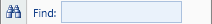

# TextBox

The [TextBox](xref:@ActiproUIRoot.Controls.Ribbon.Controls.TextBox) class provides an implementation of native WPF `TextBox` that has enhanced functionality for use in a ribbon.

> [!NOTE]
> See the [Control Basics](../control-basics.md) topic for many implementation details that are common to the built-in controls such as this one.

## Variants

This control supports numerous UI styles (called variants) based on its [Context](xref:@ActiproUIRoot.Controls.Ribbon.Controls.Primitives.ControlBase.Context) and [VariantSize](xref:@ActiproUIRoot.Controls.Ribbon.Controls.Primitives.ControlBase.VariantSize) property settings.

| Context | Variant Size | Sample UI |
|-----|-----|-----|
| MenuItem | (all) |  |
| (any other) | Medium (when in StackPanel) |  |
| (any other) | (any other) |  |

## Capabilities

The following table gives an overview of the capabilities of the control.

| Item | Details |
|-----|-----|
| Supports tall size (fills height of [Group](../miscellaneous/group.md)) | No.  When in the ribbon, it should be placed in a [StackPanel](../layout/stackpanel.md) that is in a `Medium` variant or smaller. |
| Supports normal size | Yes. |
| Supports use in a [Menu](../miscellaneous/menu.md) | Yes. |
| Base class | [TextBoxBase](xref:@ActiproUIRoot.Controls.Ribbon.Controls.Primitives.TextBoxBase). |
| Child items | No. |
| Has popup | No. |
| Key tip access | Yes.  Set via the [KeyTipAccessText](xref:@ActiproUIRoot.Controls.Ribbon.Controls.Primitives.TextBoxBase.KeyTipAccessText) property. |
| Is key tip scope | No. |
| Click event trigger | When the `Enter` key is pressed while in the control or when the control loses focus and the value is changed. |
| Supports use outside of Ribbon | Yes. |
| Supports commands | Yes. |
| Supports [ICheckableCommandParameter](xref:@ActiproUIRoot.Controls.Ribbon.Input.ICheckableCommandParameter) | No. |
| Supports [IValueCommandParameter](xref:@ActiproUIRoot.Controls.Ribbon.Input.IValueCommandParameter) | Yes.  Controls the value of the `TextBox`. |
| Default CommandParameter | [StringValueCommandParameter](xref:@ActiproUIRoot.Controls.Ribbon.Input.StringValueCommandParameter). |

## Managing the Value

This control is designed to use the WPF [command model](../../command-model/index.md) to maintain the value of the control.  By default an [ObjectValueCommandParameter](xref:@ActiproUIRoot.Controls.Ribbon.Input.ObjectValueCommandParameter) is assigned as the `CommandParameter` of the control.

See the [Interaction with Value Controls](../../command-model/value-controls.md) topic for detailed information on using this command parameter to manage the control's value.

## Layout on the Ribbon and in Menus

It is recommended that when a `TextBox` is used in the ribbon that a specific `Width` be set.  When used within a [StackPanel](../layout/stackpanel.md), controls such as `TextBox` (that don't draw labels inside their bounds like [Button](button.md) controls do) will be lined up and stacked vertically and their optional labels and images will be drawn to the left of them.

When used in a [Menu](../miscellaneous/menu.md), a `MinWidth` should be set on the `TextBox`.  Since the left edge of controls like `TextBox` will vary based on the width of its `Label`, setting a `MinWidth` ensures that the `TextBox` itself will be at least a certain appropriate width and can grow as needed to fill the width of the menu.

## Working with the TextBox

The ribbon `TextBox` indirectly inherits the native WPF `TextBox` control, so anything you can do in the native WPF `TextBox` you can do in the ribbon `TextBox`.

Please see the MSDN documentation on the native WPF `TextBox` for more details on its capabilities.

## Hint Text

Hint text is a faded out blurb of text that appears when a `TextBox` or `ComboBox` is empty.  It usually gives some simple instruction for related to the data that should be input to the control, or a description of that data that should be entered.

The hint text starts out somewhat opaque when there is no content in the control.  If the control gains focus, the hint text becomes slightly more transparent.  If content is entered, the hint text disappears completely.


*The same TextBox in three hint text states... the top TextBox doesn't have focus or content, the middle TextBox has focus but no content, and the bottom TextBox has focus and content*

Transitions between the various hint text states use smooth animations for visual appeal.

This code shows how to set hint text:

```xaml
<ribbon:TextBox Width="100" HintText="Type here" />
```

## Sample XAML

This code shows how to prototype this control in XAML-only:

```xaml
<ribbon:TextBox Width="100" ImageSourceSmall="/Images/Find16.png" Label="Find" KeyTipAccessText="F" />
```

This code shows how to prototype this control in in XAML but by also using a ribbon command to set up its user interface:

```xaml
<ribbon:TextBox Width="100" Command="ApplicationCommands.Find" KeyTipAccessText="F" />
```
