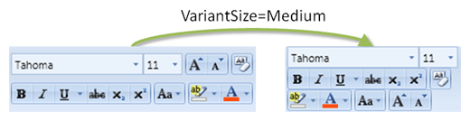

# Overview

> [!IMPORTANT]
> This older Ribbon product will be deprecated in the future in favor of the new ribbon implementation in the [Bars product](../../../bars/index.md), which has a much-improved design and appearance, and many of the latest features currently found in Office.  It is recommended to implement new ribbons using the Bars product instead, and to [migrate away from this older Ribbon product](../../../conversion/converting-to-v23-1.md) to the newer Bars ribbon when possible.

Layout controls govern where other controls are placed within a [Ribbon](xref:@ActiproUIRoot.Controls.Ribbon.Ribbon).

<table>
<thead>

<tr>
<th>Control Type</th>
<th>Description</th>
</tr>

</thead>
<tbody>

<tr>
<td>

[ButtonGroup](buttongroup.md)

</td>
<td>

A layout control that is most often used as a child item of a [RowPanel](rowpanel.md) or a `StatusBarItem`.  The button group contains one or more child controls and optionally draws a border around them.

</td>
</tr>

<tr>
<td>

[RowPanel](rowpanel.md)

</td>
<td>

A layout control that can be used in a [Group](../miscellaneous/group.md) to provide two-row layouts of child controls, which can switch to a three-row variant as available width decreases.

</td>
</tr>

<tr>
<td>

[StackPanel](stackpanel.md)

</td>
<td>

Displays up to three child controls in large variants horizontally and switches to a vertically-stacked layout of smaller control variants as available width decreases.  As available width continues to decrease, child control labels are removed.

</td>
</tr>

</tbody>
</table>
