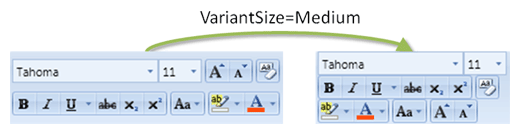

# RowPanel

The [RowPanel](xref:@ActiproUIRoot.Controls.Ribbon.Controls.RowPanel) is a layout control that displays child controls in somewhat of a toolbar-ish style and is involved in providing alternate layouts of child controls for [ribbon resizing](../../layout-features/ribbon-resizing.md).

## Variants

This control supports two variants: two- and three- row display of items.  The parent [Group](../miscellaneous/group.md) determines which variant to use based on the available width.



*A demonstration of row panel variants*

## Resizing Behavior

By default, `RowPanel` displays two rows of child controls.  As the parent group's size decreases, the `RowPanel` can shift to a three row layout that uses less overall width.  This normally occurs when the parent group changes to a `Medium`[VariantSize](xref:@ActiproUIRoot.Controls.Ribbon.Controls.VariantSize), however you have control over where this change occurs via the [ThreeRowVariantSize](xref:@ActiproUIRoot.Controls.Ribbon.Controls.RowPanel.ThreeRowVariantSize) property.

The [ribbon resizing](../../layout-features/ribbon-resizing.md) topic discusses in detail how and when group variants change and how the variant size updates `RowPanel`.

### Two-Row Variants

When in the two-row variant, the items are layed out in the same order that they are defined in the `RowPanel`. `RowPanel` uses complex logic to determine where to split up items between the two rows so that the minimum total width is used.

### Three-Row Variants

When in the three-row variant, the items are layed out in the order specified by the [RowPanel](xref:@ActiproUIRoot.Controls.Ribbon.Controls.RowPanel).[ThreeRowItemSortOrder](xref:@ActiproUIRoot.Controls.Ribbon.Controls.RowPanel.ThreeRowItemSortOrder) property.  This property is an integer collection where there is one entry for each item in the `RowPanel`.  Each entry points to the index of the item within the `RowPanel`'s `Children` collection.

As an example say there were three items in a `RowPanel` and the `ThreeRowItemSortOrder` was set to `1,2,0`.  This means that the first item (index 0) in `Children` collection (which is displayed first in the two-row variant) should be displayed in the bottom row of the three-row variant.  The second item (index 1) in the `Children` collection will appear on the top row and the third item in the `Children` collection will appear in the middle row.

Just like in the two-row variant, `RowPanel` uses complex logic to determine where to split up items between the three rows so that the minimum total width is used.

### Configuring Sort Orders in the Designer

Both the two- and three-row variant item sort orders can be configured visually using the task pane for `RowPanel` in the [designer](../../designer-interaction.md).

## Child Controls

`RowPanel` can contain any child control however [ButtonGroup](buttongroup.md) controls are most often its direct children since those controls have the capability of grouping controls together.  This feature is especially useful when the [ButtonGroup](buttongroup.md) contains items like [Button](../interactive/button.md) controls since a border is drawn around the group.

## Sample XAML

This code shows how to reproduce a row panel that shifts its appearance when the variant size changes.

```xaml
<ribbon:RowPanel ThreeRowItemSortOrder="0,1,4,5,6,2,3">
	<ribbon:ButtonGroup>
		<ribbon:SplitButton ImageSourceSmall="/Resources/Images/Bullets16.png" Label="Bullets" KeyTipAccessText="U" />
		<ribbon:SplitButton ImageSourceSmall="/Resources/Images/Numbering16.png" Label="Numbering" KeyTipAccessText="N" />
		<ribbon:PopupButton ImageSourceSmall="/Resources/Images/MultilevelList16.png" Label="Multilevel List" KeyTipAccessText="M" />
	</ribbon:ButtonGroup>
	<ribbon:ButtonGroup>
		<ribbon:Button ImageSourceSmall="/Resources/Images/DecreaseIndent16.png" Label="Decrease Indent" KeyTipAccessText="AO" />
		<ribbon:Button ImageSourceSmall="/Resources/Images/IncreaseIndent16.png" Label="Increase Indent" KeyTipAccessText="AI" />
	</ribbon:ButtonGroup>
	<ribbon:ButtonGroup>
		<ribbon:Button ImageSourceSmall="/Resources/Images/Sort16.png" Label="Sort" KeyTipAccessText="SO" />
	</ribbon:ButtonGroup>
	<ribbon:ButtonGroup>
		<ribbon:Button ImageSourceSmall="/Resources/Images/ToggleSymbols16.png" Label="Show/Hide Symbols" KeyTipAccessText="8" />
	</ribbon:ButtonGroup>
	<ribbon:ButtonGroup>
		<ribbon:Button ImageSourceSmall="/Resources/Images/AlignTextLeft16.png" Label="Align Text Left" KeyTipAccessText="AL" />
		<ribbon:Button ImageSourceSmall="/Resources/Images/AlignTextCenter16.png" Label="Center" KeyTipAccessText="AC" />
		<ribbon:Button ImageSourceSmall="/Resources/Images/AlignTextRight16.png" Label="Align Text Right" KeyTipAccessText="AR" />
		<ribbon:Button ImageSourceSmall="/Resources/Images/AlignTextJustify16.png" Label="Justify" KeyTipAccessText="AJ" />
	</ribbon:ButtonGroup>
	<ribbon:ButtonGroup>
		<ribbon:PopupButton ImageSourceSmall="/Resources/Images/LineSpacing16.png" Label="Line Spacing" KeyTipAccessText="K" />
	</ribbon:ButtonGroup>
	<ribbon:ButtonGroup>
		<ribbon:SplitButton ImageSourceSmall="/Resources/Images/Shading16.png" Label="Shading" KeyTipAccessText="H" />
		<ribbon:SplitButton ImageSourceSmall="/Resources/Images/OutsideBorders16.png" Label="Outside Borders" KeyTipAccessText="B" />
	</ribbon:ButtonGroup>						
</ribbon:RowPanel>
```
