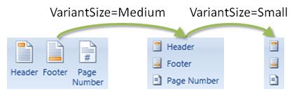

# StackPanel

The [StackPanel](xref:@ActiproUIRoot.Controls.Ribbon.Controls.StackPanel) is a layout control that is heavily involved in providing alternate layouts of child controls for [ribbon resizing](../../layout-features/ribbon-resizing.md).

## Variants

This control supports three variants.  The parent [Group](../miscellaneous/group.md) determines which variant to use based on the available width.



*A demonstration of stack panel variants*

## Resizing Behavior

By default, `StackPanel` displays up to three child controls horizontally using a `Large`[VariantSize](xref:@ActiproUIRoot.Controls.Ribbon.Controls.VariantSize).  As the group size decreases, the panel shifts to a vertical stack of its children using `Medium` variants.  For buttons and many other child controls, the control's label is still visible in this variant.  As the group size decreases further, the panel removes the labels from the child items.  This behavior can be completely overridden to meet your own requirements.

The [ribbon resizing](../../layout-features/ribbon-resizing.md) topic discusses in detail how and when group variants change and how the variant size updates `StackPanel`.

## Item Variant Behavior

As previously mentioned, the layout of the panel's child items can be set up to depend on the variant size of the parent [Group](xref:@ActiproUIRoot.Controls.Ribbon.Controls.Group).

The [StackPanel](xref:@ActiproUIRoot.Controls.Ribbon.Controls.StackPanel).[ItemVariantBehavior](xref:@ActiproUIRoot.Controls.Ribbon.Controls.StackPanel.ItemVariantBehavior) property determines how the `StackPanel` reacts to parent group variant size changes (which in turn sets the `StackPanel`'s own `VariantSize` property).  It accepts a value of type [StackPanelItemVariantBehavior](xref:@ActiproUIRoot.Controls.Ribbon.Controls.StackPanelItemVariantBehavior) whose values are defined as:

| Value | Description |
|-----|-----|
| Default | Child controls use a `Large` variant size when the `VariantSize` of the `StackPanel` is `Large`.  They change to a `Medium` variant size when the `VariantSize` of the `StackPanel` is `Medium`.  They change to a `Small` variant size when the `VariantSize` of the `StackPanel` is `Small`.  This option provides the largest number of variants for child controls. |
| LargeThenMediumWhenMedium | Child controls use a `Large` variant size when the `VariantSize` of the `StackPanel` is `Large`.  They change to a `Medium` variant size when the `VariantSize` of the `StackPanel` is `Medium` or `Small`. |
| LargeThenMediumWhenSmall | Child controls use a `Large` variant size when the `VariantSize` of the `StackPanel` is `Large` or `Medium`.  They change to a `Medium` variant size when the `VariantSize` of the `StackPanel` is `Small`. |
| LargeThenSmallWhenMedium | Child controls use a `Large` variant size when the `VariantSize` of the `StackPanel` is `Large`.  They change to a `Small` variant size when the `VariantSize` of the `StackPanel` is `Medium` or `Small`. |
| LargeThenSmallWhenSmall | Child controls use a `Large` variant size when the `VariantSize` of the `StackPanel` is `Large` or `Medium`.  They change to a `Small` variant size when the `VariantSize` of the `StackPanel` is `Small`. |
| MediumThenSmallWhenMedium | Child controls use a `Medium` variant size when the `VariantSize` of the `StackPanel` is `Large`.  They change to a `Small` variant size when the `VariantSize` of the `StackPanel` is `Medium` or `Small`. |
| MediumThenSmallWhenSmall | Child controls use a `Medium` variant size when the `VariantSize` of the `StackPanel` is `Large` or `Medium`.  They change to a `Small` variant size when the `VariantSize` of the `StackPanel` is `Small`. |
| AlwaysLarge | Child controls always use a `Large` variant size no matter what the `VariantSize` of the `StackPanel` is.  This option is the same as not using a `StackPanel` to encapsulate the child controls. |
| AlwaysMedium | Child controls always use a `Medium` variant size no matter what the `VariantSize` of the `StackPanel` is. |
| AlwaysSmall | Child controls always use a `Small` variant size no matter what the `VariantSize` of the `StackPanel` is. |

So say for instance you wanted to have your stack panel always show medium variant-sized items (with labels) but never want to let them collapse the labels.  This code accomplishes that requirement:

```xaml
<ribbon:StackPanel ItemVariantBehavior="AlwaysMedium">
	<ribbon:PopupButton ImageSourceSmall="/Resources/Images/QuickParts16.png" Label="Quick Parts" KeyTipAccessText="Q" />
	<ribbon:PopupButton ImageSourceSmall="/Resources/Images/WordArt16.png" Label="WordArt" KeyTipAccessText="W" />
	<ribbon:PopupButton ImageSourceSmall="/Resources/Images/DropCap16.png" Label="Drop Cap" KeyTipAccessText="RC" />
</ribbon:StackPanel>
```

## Row Alignments

Stack panels normally show three child controls however when there is only one or two child controls, you have a choice as to how the controls are aligned vertically.  You can either align them to the top or to the center.

The [RowAlignment](xref:@ActiproUIRoot.Controls.Ribbon.Controls.StackPanel.RowAlignment) property takes a [StackPanelRowAlignment](xref:@ActiproUIRoot.Controls.Ribbon.Controls.StackPanelRowAlignment) that indicates which layout style to use.

## Horizontal Item Alignment

When stack panels show items in a vertical layout, the items will by default align to the left side of the control.

The [HorizontalContentAlignment](xref:@ActiproUIRoot.Controls.Ribbon.Controls.StackPanel.HorizontalContentAlignment) property can be set to `Stretch` to have the items all align to be the same width.

## Layout Samples

It's very easy by using the properties described above to create some interesting layouts for child controls, even if you aren't concerned with [ribbon resizing](../../layout-features/ribbon-resizing.md).


*Some sample stack panel layouts*

### Sample 1

The first section in the screenshot above was created using this code for four stack panels:

```xaml
<ribbon:StackPanel ItemVariantBehavior="AlwaysSmall" RowAlignment="Center">
	<ribbon:Button Command="EditingCommands.AlignLeft" />
	<ribbon:Button Command="EditingCommands.ToggleBold" />
</ribbon:StackPanel>
<ribbon:StackPanel ItemVariantBehavior="AlwaysSmall" RowAlignment="Center">
	<ribbon:Button Command="EditingCommands.AlignCenter" />
	<ribbon:Button Command="EditingCommands.ToggleItalic" />
</ribbon:StackPanel>
<ribbon:StackPanel ItemVariantBehavior="AlwaysSmall" RowAlignment="Center">
	<ribbon:Button Command="EditingCommands.AlignRight" />
	<ribbon:Button Command="EditingCommands.ToggleUnderline" />
</ribbon:StackPanel>
<ribbon:StackPanel ItemVariantBehavior="AlwaysSmall" RowAlignment="Center">
	<ribbon:Button Command="EditingCommands.AlignJustify" />
	<ribbon:Button Command="sample:ApplicationCommands.ToggleStrikethrough" />
</ribbon:StackPanel>
```

These `StackPanel` items will always use a `Small` (no label) variant, no matter what the variant size of the parent group is.

### Sample 2

The second section in the screenshot above was created using this code:

```xaml
<ribbon:StackPanel ItemVariantBehavior="MediumThenSmallWhenSmall" RowAlignment="Center">
	<ribbon:Button ImageSourceSmall="/Resources/Images/DecreaseIndent16.png" Label="Decrease Indent" />
	<ribbon:Button ImageSourceSmall="/Resources/Images/IncreaseIndent16.png" Label="Increase Indent" />
</ribbon:StackPanel>
```

This `StackPanel`'s items will start off in a `Medium` variant and then remove the labels when the group changes to a `Small` variant size.  The items are aligned to the center.

### Sample 3

The third section in the screenshot above was created using this code:

```xaml
<ribbon:StackPanel ItemVariantBehavior="MediumThenSmallWhenMedium">
	<ribbon:Button ImageSourceSmall="/Resources/Images/DecreaseIndent16.png" Label="Decrease Indent" />
	<ribbon:Button ImageSourceSmall="/Resources/Images/IncreaseIndent16.png" Label="Increase Indent" />
</ribbon:StackPanel>
```

This `StackPanel`'s items will start off in a `Medium` variant and then remove the labels when the group changes to a `Small` variant size.  The items are aligned to the top (the default).

### Sample 4

The fourth section in the screenshot above was created using this code:

```xaml
<ribbon:StackPanel>
	<ribbon:Button ImageSourceLarge="/Resources/Images/Header32.png" ImageSourceSmall="/Resources/Images/Header16.png" Label="Header"/>
	<ribbon:Button ImageSourceLarge="/Resources/Images/Footer32.png" ImageSourceSmall="/Resources/Images/Footer16.png" Label="Footer" />
	<ribbon:Button ImageSourceLarge="/Resources/Images/PageNumber32.png" ImageSourceSmall="/Resources/Images/PageNumber16.png" Label="Page Number" />
</ribbon:StackPanel>
```

This `StackPanel`'s items will start off layed out horizontally in a `Large` variant.  They will switch to a vertical stack of `Medium` variant sizes when available width decreases.  Finally, as available width decreases more, they will shift to a `Small` variant by removing their labels.
