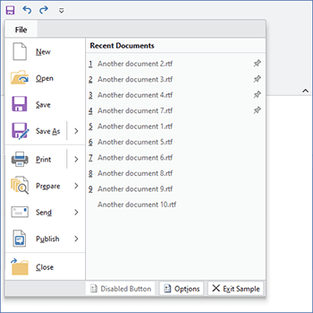

# Backstage / ApplicationMenu

The ribbon's application menu is displayed by clicking the large button in the upper left hand side of the ribbon.  The application menu should generally be populated by application-wide menu items such as new, open, save file operations as well as other operations such as printing.  Both the newer Backstage and traditional application menu styles are available.

## Backstage Application Menu

The Backstage application menu was introduced in Office 2010 and is a large popup that occupies the entire Window when open, overlaying all content.


*A Backstage application menu with styled buttons*

The Backstage is organized such that buttons and tabs appear on the left side (the header area) and the selected tab's content appears on the right side (the content area).

### Defining a Backstage

The Backstage application menu may be defined in XAML by setting a [Backstage](xref:@ActiproUIRoot.Controls.Ribbon.Controls.Backstage) control to the [Ribbon](xref:@ActiproUIRoot.Controls.Ribbon.Ribbon).[ApplicationMenu](xref:@ActiproUIRoot.Controls.Ribbon.Ribbon.ApplicationMenu) property.

This code sample shows how to define a Backstage application menu for a ribbon.  Combine it with the code in the following sections to define your buttons and tabs.

```xaml
<ribbon:Ribbon>
	<ribbon:Ribbon.ApplicationMenu>
		<ribbon:Backstage>
			<ribbon:Button Label="Save" ImageSourceSmall="/Resources/Images/Save16.png" KeyTipAccessText="S" />
			<!-- More buttons above tabs go here -->

			<!-- Optional RecentDocumentMenu goes here -->

			<ribbon:BackstageTab Header="Info" KeyTipAccessText="I">
				<!-- Info tab content goes here -->
			</ribbon:BackstageTab>
			<!-- More tabs go here -->

			<!-- More buttons below tabs go here -->
			<ribbon:Button Label="Exit" ImageSourceSmall="/Resources/Images/CloseTab16.png" KeyTipAccessText="X" />
		</ribbon:Backstage>
	</ribbon:Ribbon.ApplicationMenu>
</ribbon:Ribbon>
```

### Key Tip Access

The [Backstage](xref:@ActiproUIRoot.Controls.Ribbon.Controls.Backstage).[KeyTipAccessText](xref:@ActiproUIRoot.Controls.Ribbon.Controls.Backstage.KeyTipAccessText) property can be set to define the key tip access text for the application button.  It defaults to `F`, allowing the <kbd>Alt</kbd>+<kbd>F</kbd> key combination to open the application menu.

### Defining Backstage Items

The [Backstage](xref:@ActiproUIRoot.Controls.Ribbon.Controls.Backstage) control can contain these types of controls, which appear vertically in its header area: [Button](../interactive/button.md), [BackstageTab](xref:@ActiproUIRoot.Controls.Ribbon.Controls.BackstageTab), [Separator](xref:@ActiproUIRoot.Controls.Ribbon.Controls.Separator), and [RecentDocumentMenu](recentdocumentmenu.md).

Controls will appear in the order in which they are defined in the [Backstage](xref:@ActiproUIRoot.Controls.Ribbon.Controls.Backstage).  This allows you to freely intermix the order of buttons, tabs and any recent document menu.

[Button](../interactive/button.md) controls generally appear at the top and bottom of the Backstage header area.  They are often set to the most common application commands such as `Save`, that can be easily executed with one click.

[BackstageTab](xref:@ActiproUIRoot.Controls.Ribbon.Controls.BackstageTab) controls can be added when there are multiple configuration possibilities or there is data that needs to be displayed.  For instance, an `Info` tab may provide information and statistics about the current document.  A `Recent` tab might show a [RecentDocumentMenu](recentdocumentmenu.md) with its `VariantSize` property set to `Large`, allowing for recent documents to be selected.  A `New` tab might show multiple options for creating new documents.

The header of the [BackstageTab](xref:@ActiproUIRoot.Controls.Ribbon.Controls.BackstageTab) is what is rendered in the Backstage header area.  This is typically just a string.  The tab's content is what is displayed in the Backstage content area when the tab is selected.

If you wish to add recent document buttons to your Backstage header, a [RecentDocumentMenu](recentdocumentmenu.md) control can be added.  The template for this control when in the Backstage header will render a separator followed by buttons for each of the filtered documents specified by the menu's [RecentDocumentManager](xref:@ActiproUIRoot.DocumentManagement.RecentDocumentManager).  It is a good idea to insert a [Separator](xref:@ActiproUIRoot.Controls.Ribbon.Controls.Separator) before the [RecentDocumentManager](xref:@ActiproUIRoot.DocumentManagement.RecentDocumentManager).

### Auto-Selecting a Tab When Backstage Opens

The [Ribbon](xref:@ActiproUIRoot.Controls.Ribbon.Ribbon).[IsApplicationMenuOpen](xref:@ActiproUIRoot.Controls.Ribbon.Ribbon.IsApplicationMenuOpen) property gets or sets whether the application menu is currently open.  A related [Ribbon](xref:@ActiproUIRoot.Controls.Ribbon.Ribbon).[IsApplicationMenuOpenChanged](xref:@ActiproUIRoot.Controls.Ribbon.Ribbon.IsApplicationMenuOpenChanged) event is raised whenever that property changes.  This is an ideal place to initialize Backstage so that a certain tab is always selected when it opens.

The event handler for the [Ribbon](xref:@ActiproUIRoot.Controls.Ribbon.Ribbon).[IsApplicationMenuOpenChanged](xref:@ActiproUIRoot.Controls.Ribbon.Ribbon.IsApplicationMenuOpenChanged) event can check to see if the application menu is being opened and if so, ensure the [Backstage](xref:@ActiproUIRoot.Controls.Ribbon.Controls.Backstage).`SelectedItem` property is set to the desired tab.

### TaskTabControl

The [TaskTabControl](xref:@ActiproUIRoot.Controls.Ribbon.Controls.TaskTabControl) is a styled version of a native WPF `TabControl` that renders its tabs on the left side.  The selected tab's content appears on the right side.  This tab control is ideal for use on a [BackstageTab](xref:@ActiproUIRoot.Controls.Ribbon.Controls.BackstageTab) since it provides a secondary level of tabs.  It can be used external to Backstage as well.


*A TaskTabControl with Separators and a Button on the selected tab*

The items of a [TaskTabControl](xref:@ActiproUIRoot.Controls.Ribbon.Controls.TaskTabControl) can be either [Separator](xref:@ActiproUIRoot.Controls.Ribbon.Controls.Separator) or [TaskTabItem](xref:@ActiproUIRoot.Controls.Ribbon.Controls.TaskTabItem) controls.  Separators should have their [Label](xref:@ActiproUIRoot.Controls.Ribbon.Controls.Primitives.ControlBase.Label) properties set, and they will appear as group headers for the tab items. [TaskTabItem](xref:@ActiproUIRoot.Controls.Ribbon.Controls.TaskTabItem) tab headers can be any content, but to render similarly to Office, they should show an image and a text label.

### Button and PopupButton Styles

The Backstage content area can show large silver buttons.  Both the [Button](../interactive/button.md) and [PopupButton](../interactive/popupbutton.md) controls have a special template that kicks in if their [ControlBase](xref:@ActiproUIRoot.Controls.Ribbon.Controls.Primitives.ControlBase).[Context](xref:@ActiproUIRoot.Controls.Ribbon.Controls.Primitives.ControlBase.Context) is set to `BackstageItem` and their [ControlBase](xref:@ActiproUIRoot.Controls.Ribbon.Controls.Primitives.ControlBase).[VariantSize](xref:@ActiproUIRoot.Controls.Ribbon.Controls.Primitives.ControlBase.VariantSize) is set to `Large`

Use of those properties can trigger the style of buttons found in Office's Backstage, and as seen above.

### Separator Styles

The Backstage content area can labeled separators.  The [Separator](../interactive/separator.md) controls has a special template for use on Backstage that activates if their [ControlBase](xref:@ActiproUIRoot.Controls.Ribbon.Controls.Primitives.ControlBase).[Context](xref:@ActiproUIRoot.Controls.Ribbon.Controls.Primitives.ControlBase.Context) is set to `BackstageItem`.

Use of those properties can trigger the style of labeled separators found in Office's Backstage, and as seen above.

### Preventing Backstage from Closing

The [Backstage](xref:@ActiproUIRoot.Controls.Ribbon.Controls.Backstage).[CanClose](xref:@ActiproUIRoot.Controls.Ribbon.Controls.Backstage.CanClose) property can be set to `false` which prevents the Backstage from closing by hiding the close button and blocking <kbd>Esc</kbd> from closing Backstage.

This is useful in scenarios where you are starting up an application and wish to block end user access to the main window until they create a new document or open a document.  These or other actions can be presented on a non-closable Backstage.

## Traditional Application Menu

The traditional application menu is a medium-sized popup that appears when the ribbon's application button is clicked.  The left side of the popup contains application-wide menu items.



*A traditional application menu with a RecentDocumentMenu control on it*

A section at the bottom of the application menu can used for footer buttons.  Generally items such as application options and application exiting are displayed there.

Any content can be placed on the right side of the application menu as well.  Generally a [RecentDocumentMenu](recentdocumentmenu.md) control is used there.

### Defining an Application Menu

The application menu may be defined in XAML by setting an [ApplicationMenu](xref:@ActiproUIRoot.Controls.Ribbon.Controls.ApplicationMenu) control to the [Ribbon](xref:@ActiproUIRoot.Controls.Ribbon.Ribbon).[ApplicationMenu](xref:@ActiproUIRoot.Controls.Ribbon.Ribbon.ApplicationMenu) property.

This code sample shows how to define an application menu for a ribbon.  Combine it with the code in the following sections to define your application menu and its items.

```xaml
<ribbon:Ribbon>
	<ribbon:Ribbon.ApplicationMenu>
		<ribbon:ApplicationMenu>
			<!-- Items go here -->
		</ribbon:ApplicationMenu>
	</ribbon:Ribbon.ApplicationMenu>
</ribbon:Ribbon>
```

### Key Tip Access

The [ApplicationMenu](xref:@ActiproUIRoot.Controls.Ribbon.Controls.ApplicationMenu).[KeyTipAccessText](xref:@ActiproUIRoot.Controls.Ribbon.Controls.Primitives.ItemsControlBase.KeyTipAccessText) property can be set to define the key tip access text for the application button.  It defaults to `F`, allowing the <kbd>Alt</kbd>+<kbd>F</kbd> key combination to open the application menu.

### Defining Menu Items

Menu items that appear on the left side of the application menu are defined via the [ApplicationMenu](xref:@ActiproUIRoot.Controls.Ribbon.Controls.ApplicationMenu)'s `Items` collection.

Control types that should be used here include: [Button](../interactive/button.md), [PopupButton](../interactive/popupbutton.md), [SplitButton](../interactive/splitbutton.md), and [Separator](../interactive/separator.md).

This code defines the root items for a typical application menu.  Note that some of the items have commands already tied to them and others are prototyped using XAML.

```xaml
<ribbon:ApplicationMenu>
	<ribbon:SplitButton Command="ApplicationCommands.New" KeyTipAccessText="N" />
	<ribbon:Button Command="ApplicationCommands.Open" KeyTipAccessText="O" />
	<ribbon:Button Command="ApplicationCommands.Save" KeyTipAccessText="S" />
	<ribbon:SplitButton ImageSourceLarge="/Images/SaveAs32.png" Label="Save As" KeyTipAccessText="A" />
	<ribbon:Separator />
	<ribbon:SplitButton ImageSourceLarge="/Images/Print32.png" Label="Print" KeyTipAccessText="P" />
	<ribbon:MenuButton ImageSourceLarge="/Images/Prepare32.png" Label="Prepare" KeyTipAccessText="E" />
	<ribbon:MenuButton ImageSourceLarge="/Images/Send32.png" Label="Send" KeyTipAccessText="D" />
	<ribbon:MenuButton ImageSourceLarge="/Images/Publish32.png" Label="Publish" KeyTipAccessText="U" />
	<ribbon:Separator />
	<ribbon:Button Command="ApplicationCommands.Close" KeyTipAccessText="C" />
</ribbon:ApplicationMenu>
```

### Defining Footer Buttons

Footer buttons that appear on the bottom of the application menu are defined via the [ApplicationMenu](xref:@ActiproUIRoot.Controls.Ribbon.Controls.ApplicationMenu).[FooterButtons](xref:@ActiproUIRoot.Controls.Ribbon.Controls.ApplicationMenu.FooterButtons) collection.  This collection accepts any [Button](xref:@ActiproUIRoot.Controls.Ribbon.Controls.Button).

This code defines the footer buttons for a typical application menu.  Note that buttons in this example are tied to commands defined in the sample project.

```xaml
<ribbon:ApplicationMenu>
	<ribbon:ApplicationMenu.FooterButtons>
		<ribbon:Button Command="sample:ApplicationCommands.ApplicationOptions" KeyTipAccessText="I" />
		<ribbon:Button Command="sample:ApplicationCommands.ApplicationExit" KeyTipAccessText="X" />
	</ribbon:ApplicationMenu.FooterButtons>
</ribbon:ApplicationMenu>
```

### Defining Additional Content (Right Side)

Any control may be set to the [ApplicationMenu](xref:@ActiproUIRoot.Controls.Ribbon.Controls.ApplicationMenu).[AdditionalContent](xref:@ActiproUIRoot.Controls.Ribbon.Controls.ApplicationMenu.AdditionalContent) property to be displayed in the right side of the application menu.

This code defines a simple `TextBlock` as content for the right side of the application menu.

```xaml
<ribbon:ApplicationMenu>
	<ribbon:ApplicationMenu.AdditionalContent>
		<TextBlock>My content here...</TextBlock>
	</ribbon:ApplicationMenu.AdditionalContent>
</ribbon:ApplicationMenu>
```

You can create your own complex custom control to fill this space.  However, keep in mind that per the Microsoft requirements, you are not permitted to use vertical scrollbars in this area.

Many applications will want to place our [RecentDocumentMenu](recentdocumentmenu.md) control into the application menu's additional content.  This control displays a list of recently-opened documents that can be maintained in code-behind and supports pinning of the documents so that they don't fall off the list when newer documents are opened.

This code defines a [RecentDocumentMenu](recentdocumentmenu.md) as the application menu's additional content.

```xaml
<ribbon:ApplicationMenu>
	<ribbon:ApplicationMenu.AdditionalContent>
		<ribbon:RecentDocumentMenu>
			<shared:RecentDocumentManager x:Name="recentDocManager" />
		</ribbon:RecentDocumentMenu>
	</ribbon:ApplicationMenu.AdditionalContent>
</ribbon:ApplicationMenu>
```

## Completely Hiding the Application Button

Although it usually isn't recommended, you can optionally hide the application button completely, blocking access to the application menu by the end user.


*A ribbon with its application button hidden*

To do this, set the [Ribbon](xref:@ActiproUIRoot.Controls.Ribbon.Ribbon).[IsApplicationButtonVisible](xref:@ActiproUIRoot.Controls.Ribbon.Ribbon.IsApplicationButtonVisible) property to `false`.

When in this mode, the QAT and tabs slide over to fill the space that was previously occupied by the application button.
