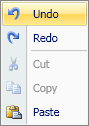

# ContextMenu

The [ContextMenu](xref:@ActiproUIRoot.Controls.Ribbon.Controls.ContextMenu) class provides functionality for supporting a [Menu](menu.md) of ribbon control items in a standard context menu.

Many of the interactive ribbon controls are capable of being hosted in a context menu, via use within a [Menu](menu.md).



*A sample ribbon context menu used for an edit control*

## Compatibility with Native WPF ContextMenu

Since the ribbon [ContextMenu](xref:@ActiproUIRoot.Controls.Ribbon.Controls.ContextMenu) class inherits the native WPF `ContextMenu` class, the ribbon [ContextMenu](xref:@ActiproUIRoot.Controls.Ribbon.Controls.ContextMenu) may be used anywhere that a regular context menu can be used.

We recommend using the ribbon [ContextMenu](xref:@ActiproUIRoot.Controls.Ribbon.Controls.ContextMenu) on any windows that have a ribbon user interfaceso that the UI experience is consistent for end users.

## Using Menu as a ContextMenu Child

The [Menu](menu.md) control should be used as the direct child of a ribbon [ContextMenu](xref:@ActiproUIRoot.Controls.Ribbon.Controls.ContextMenu).  Then add ribbon controls that support menus as children of the [Menu](menu.md).

The [Menu](menu.md) topic discusses which controls are best used within that control.  Also, see the sample XAML below that shows how the [ContextMenu](xref:@ActiproUIRoot.Controls.Ribbon.Controls.ContextMenu) in the screenshot above was created.

## Keeping the ContextMenu Displayed When an Item is Clicked

Each [ButtonBase](xref:@ActiproUIRoot.Controls.Ribbon.Controls.Primitives.ButtonBase) defines a [StaysOpenOnClick](xref:@ActiproUIRoot.Controls.Ribbon.Controls.Primitives.ButtonBase.StaysOpenOnClick) property that governs whether the containing menu closes when the menu item is clicked.

The default value for this property is `false` but can optionally be set to `true`.

## Sample XAML

This code sample shows how to easily define a context menu for a `RichTextBox` in XAML.

```xaml
<RichTextBox>
	<RichTextBox.ContextMenu>
		<ribbon:ContextMenu>
			<ribbon:Menu>
				<ribbon:Button Command="ApplicationCommands.Undo" />
				<ribbon:Button Command="ApplicationCommands.Redo" />
				<ribbon:Separator />
				<ribbon:Button Command="ApplicationCommands.Cut" />
				<ribbon:Button Command="ApplicationCommands.Copy" />
				<ribbon:Button Command="ApplicationCommands.Paste" />
			</ribbon:Menu>
		</ribbon:ContextMenu>
	</RichTextBox.ContextMenu>
</RichTextBox>
```

## Keyboard Shortcut Display

Each [ButtonBase](xref:@ActiproUIRoot.Controls.Ribbon.Controls.Primitives.ButtonBase) defines a [InputGestureText](xref:@ActiproUIRoot.Controls.Ribbon.Controls.Primitives.ButtonBase.InputGestureText) property that indicates the keyboard shortcut text to display when in a small menu item context.

If a command assigned to a menu item has a `KeyGesture`, its text will be used by default.  However, you can override this value or set a custom one when not using a command by setting the [InputGestureText](xref:@ActiproUIRoot.Controls.Ribbon.Controls.Primitives.ButtonBase.InputGestureText) property directly.

## Adding Access Keys to Menu Items

When any sort of ribbon button ([Button](xref:@ActiproUIRoot.Controls.Ribbon.Controls.Button), [PopupButton](xref:@ActiproUIRoot.Controls.Ribbon.Controls.PopupButton), etc.) is used in a [ContextMenu](xref:@ActiproUIRoot.Controls.Ribbon.Controls.ContextMenu) as a menu item, an underline will appear under a character in the menu item's label if the control's [KeyTipAccessText](xref:@ActiproUIRoot.Controls.Ribbon.Controls.Primitives.ControlBase.KeyTipAccessText) property has been set to a single alpha/numeric character and that character appears within the control's label.  While the context menu is displayed the access key can be typed to execute the default action on the control.

For instance, a `Paste`[Button](xref:@ActiproUIRoot.Controls.Ribbon.Controls.Button) that had a label of `Paste` and a `KeyTipAccessText` of `P` would have the `P` in `Paste` underlined.
