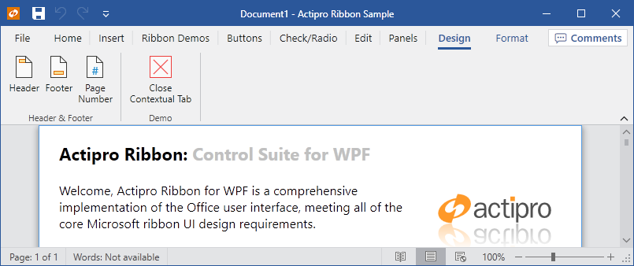

# ContextualTabGroup

The controls used most often in an application are always available on the Ribbon.  However, sometimes a specific object is selected in the document (such as a picture, table, or chart) that requires additional controls for proper interaction with the object.  This is where contextual tabs come in since they contain the controls that relate to the selected object.

Contextual tabs are the same as normal tabs except that they are contained by a [ContextualTabGroup](xref:@ActiproUIRoot.Controls.Ribbon.Controls.ContextualTabGroup) and are only displayed when the parent [ContextualTabGroup](xref:@ActiproUIRoot.Controls.Ribbon.Controls.ContextualTabGroup) is active.



*Contextual tab groups displayed for a selection in the document*

Since contextual tabs are typically more important to the end user while they are displayed (because they relate to the current context in the document), the tabs themselves scale down after the "normal" tabs do, thus keeping them more visible longer when the ribbon's width decreases.

## Defining a Contextual Tab Group

Contextual tab groups are defined in the [Ribbon](xref:@ActiproUIRoot.Controls.Ribbon.Ribbon).[ContextualTabGroups](xref:@ActiproUIRoot.Controls.Ribbon.Ribbon.ContextualTabGroups) collection.  Each [ContextualTabGroup](xref:@ActiproUIRoot.Controls.Ribbon.Controls.ContextualTabGroup) can contain one or more [Tab](tab.md) controls.

This code sample shows how to define a contextual tab group for a ribbon.

```xaml
<ribbon:ContextualTabGroup Label="Header &amp; Footer Tools">
	<ribbon:Tab Label="Design">
		<ribbon:Group ImageSourceSmall="/Images/Header16.png" Label="Header &amp; Footer" KeyTipAccessText="ZH">
			<ribbon:Group.Variants>
				<ribbon:GroupVariant Priority="50" Size="Medium" />
				<ribbon:GroupVariant Priority="130" Size="Collapsed" />
			</ribbon:Group.Variants>					
			<ribbon:StackPanel>
				<ribbon:Button ImageSourceLarge="/Images/Header32.png" 
					ImageSourceSmall="/Images/Header16.png" Label="Header" KeyTipAccessText="H" />
				<ribbon:Button ImageSourceLarge="/Images/Footer32.png" 
					ImageSourceSmall="/Images/Footer16.png" Label="Footer" KeyTipAccessText="O" />
				<ribbon:Button ImageSourceLarge="/Images/PageNumber32.png" 
					ImageSourceSmall="/Images/PageNumber16.png" Label="Page Number" KeyTipAccessText="NU" />
			</ribbon:StackPanel>					
		</ribbon:Group>
		<ribbon:Group Label="Demo">
			<ribbon:Button ImageSourceLarge="/Images/CloseTab32.png" Label="Close Contextual Tab" />
		</ribbon:Group>
	</ribbon:Tab>
</ribbon:ContextualTabGroup>
```

## Showing / Hiding a ContextualTabGroup

When a [ContextualTabGroup](xref:@ActiproUIRoot.Controls.Ribbon.Controls.ContextualTabGroup) is activated, all of its child [Tab](tab.md) controls are displayed.  Likewise, deactivating a [ContextualTabGroup](xref:@ActiproUIRoot.Controls.Ribbon.Controls.ContextualTabGroup) hides all of its child tabs.

The [ContextualTabGroup](xref:@ActiproUIRoot.Controls.Ribbon.Controls.ContextualTabGroup).[IsActive](xref:@ActiproUIRoot.Controls.Ribbon.Controls.ContextualTabGroup.IsActive) property controls whether a contextual tab group and its tabs are visible.  Set it to `true` to display a contextual tab group.  This code displays a contextual tab group:

```csharp
ribbon.ContextualTabGroups["Header & Footer Tools"].IsActive = true;
```

In some cases (please see the Contextual Tabs notes at the bottom of the [Microsoft Ribbon UI Design Guidelines](../../ribbonui-guidelines.md) topic for details) when a contextual tab group is activated, its first tab should be selected.  This code can accomplish the selection of the first tab in the contextual tab group after the contextual tab group has been activated:

```csharp
ribbon.SelectedTab = (Tab)contextualTabGroup.Items[0];
```

The [ContextualTabGroup](xref:@ActiproUIRoot.Controls.Ribbon.Controls.ContextualTabGroup).[IsActiveChanged](xref:@ActiproUIRoot.Controls.Ribbon.Controls.ContextualTabGroup.IsActiveChanged) event is raised when the value of the [IsActive](xref:@ActiproUIRoot.Controls.Ribbon.Controls.ContextualTabGroup.IsActive) property changes.
