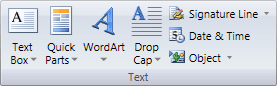
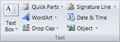
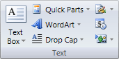
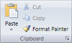

# Group

The [Group](xref:@ActiproUIRoot.Controls.Ribbon.Controls.Group) control is an integral part of the ribbon user interface.  It is used to group multiple controls together on a ribbon and provides a label for them at the bottom.

> [!NOTE]
> See the [Control Basics](../control-basics.md) topic for many implementation details that are common to the built-in controls such as this one.

## Variants

Each group can have up to four variants for its layout: `Large`, `Medium`, `Small`, and `Collapsed`.  You have total control how each variant adjusts the layout of its child controls to use less total width when a smaller [VariantSize](xref:@ActiproUIRoot.Controls.Ribbon.Controls.VariantSize) is used.

> [!NOTE]
> Group variants and how they affect child controls is explained in great detail in the [ribbon resizing](../../layout-features/ribbon-resizing.md) topic.

One of the most powerful features of Actipro Ribbon is the ability to easily create prioritized child control layout changes as the available ribbon width decreases.  You won't find anything that matches its robust design anywhere else.

Here is a demonstration of how a single group can change the layout of its child controls as available width decreases.

| Variant Size | Sample UI |
|-----|-----|
| Large |  |
| Medium |  |
| Small |  |
| Collapsed |  (Acts like a [PopupButton](../interactive/popupbutton.md) that displays the expanded `Group` in a popup when clicked) |

## Dialog Launchers

If a command has been assigned to the [Group](xref:@ActiproUIRoot.Controls.Ribbon.Controls.Group) via its [Command](xref:@ActiproUIRoot.Controls.Ribbon.Controls.Primitives.ControlBase.Command) property then a dialog launcher button will be displayed next its label at the bottom of the group.  The expanded group screenshot above shows an example of a dialog launcher button.

*A group with a dialog launcher button*

Dialog launcher buttons should be used to display dialogs that contain advanced functionality related to the group that is not available within the ribbon control.

## Key Tip Access

The [Group](xref:@ActiproUIRoot.Controls.Ribbon.Controls.Group).[KeyTipAccessText](xref:@ActiproUIRoot.Controls.Ribbon.Controls.Primitives.ControlBase.KeyTipAccessText) property can be set to define the key tip access text for the group when it is in a collapsed state.  Generally group key tip access text starts with a `Z` followed by another letter.  For instance, the `Clipboard` group's collapsed key tip text may be `ZC`.

The key tip access text for a dialog launcher button (if any) can be set by the [Group](xref:@ActiproUIRoot.Controls.Ribbon.Controls.Group).[DialogLauncherKeyTipAccessText](xref:@ActiproUIRoot.Controls.Ribbon.Controls.Group.DialogLauncherKeyTipAccessText) property.

## Diabling Mouse Hover Animation When Remoting

Sometimes it is beneficial to disable group mouse hover animation when running an application remotely via RDP or Citrix.  The attached [ThemeProperties](xref:@ActiproUIRoot.Themes.ThemeProperties).`AreAnimationsEnabled` property can be set on a [Group](xref:@ActiproUIRoot.Controls.Ribbon.Controls.Group) instance to disable mouse hover animation for that group.

If you are using system or Office 2010 themes, this property can be set via an implicit style in your applicationr resources that targets the [Group](xref:@ActiproUIRoot.Controls.Ribbon.Controls.Group) control instead of on each [Group](xref:@ActiproUIRoot.Controls.Ribbon.Controls.Group) instance itself.
